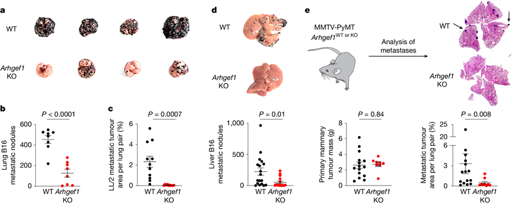

# 2024-2025 学年春学期肿瘤生物学期末回忆卷

> **名词解释含英文题目，其余题目为中文** · **闭卷**  
> **原卷 54 题，作答 52 题** · **2 小时**

!!! info "回忆卷说明"

    本页依据考后回忆整理，不提供参考答案。

    现有回忆记录了 46 道题；“—”表示该处未能回忆完整。

---

## 一、单项选择题（40 分） {: .exam-section .exam-section--choice }

*原卷共 40 题，每题 4 个选项，每题 1 分；现有回忆记录第 1—30、39—40 题。*

1. 以下哪个**不是**转化细胞的特征？

    **A.** 有接触抑制  
    **B.** —  
    **C.** —  
    **D.** —

2. 哪个**不是**完全良性的肿瘤细胞在转化向肿瘤细胞的过程中出现的特征？

    **A.** 核大小和形态的改变  
    **B.** 核染色变浅  
    **C.** 核质比增大  
    **D.** 细胞质出现癌症相关转化

3. 肿瘤的单克隆性可以通过下列哪个实验来证明？

    **A.** Ames 实验  
    **B.** G6PD 酶电泳检测  
    **C.** Southern  
    **D.** 转染

4. RSV 证明了什么？

    **A.** 癌症由遗传因素引起  
    **B.** 化学诱变致癌  
    **C.** 病毒可以直接让细胞致癌  
    **D.** —

5. 费城染色体特征是什么？

    **A.** 9-22 号染色体易位  
    **B.** 17 号染色体缺失  
    **C.** 8 号染色体重复  
    **D.** X 染色体异常

6. Myc 基因**不能**通过以下哪个方式激活？

    **A.** 基因扩增  
    **B.** 前病毒插入  
    **C.** 染色体易位  
    **D.** 点突变

7. 费城染色体融合基因表达在哪个染色体？

    **A.** 9  
    **B.** 22  
    **C.** 17  
    **D.** X

8. 下列哪种细胞**没有**接触抑制？

    **A.** 红细胞  
    **B.** 转化细胞  
    **C.** 干细胞  
    **D.** —

9. 以下关于 p53 哪个说法是**错误**的？

    **A.** p53 的表达会在 DNA 损伤的时候高度上升  
    **B.** p53 的翻译后修饰，对它的活性调节非常非常重要  
    **C.** 不是所有翻译后修饰都是可逆的  
    **D.** p53 是一个转录因子

10. 以下关于 p53 的说法哪个是正确的？

    **A.** —  
    **B.** —  
    **C.** MDM2 只介导 p53 泛素化  
    **D.** p53 以四聚体工作

11. 以下关于翻译后修饰哪个是**错误**的？

    **A.** 翻译后修饰一个蛋白可以修饰多个位点  
    **B.** 不是所有翻译后修饰都是可逆的  
    **C.** 同一蛋白质不同位点发生翻译后修饰后可以发生 crosstalk  
    **D.** 一个位点可以有多个不同的修饰

12. 基因组不稳定性，哪个是**错误**的？

    **A.** 靶向基因组不稳定性的抗肿瘤治疗（具体表述回忆不完整）  
    **B.** —  
    **C.** 染色体不稳定性主要发生在 S 期  
    **D.** 是家族性出现的第一个 hall mark

13. 关于错配修复哪个说法**不正确**？

    **A.** 错配修复基因缺陷可能引发林奇综合征  
    **B.** 通过甲基化来识别  
    **C.** 错配修复基因突变是免疫疗法是否起效的分子标志  
    **D.** —

14. DNA 损伤修复以下说法正确的是：

    **A.** —  
    **B.** 烷基化没有直接的识别并且修复的酶  
    **C.** BER 修复要先产生一个 AP  
    **D.** —

15. 下列说法**错误**的是：

    **A.** UV 损伤只能通过 NER 修复  
    **B.** —  
    **C.** NER 不止能修复 UV 损伤  
    **D.** UV 照射主要会产生双链断裂

16. 肿瘤相关成纤维细胞，以下说法正确的是：

    **A.** 不能由肿瘤细胞产生  
    **B.** 不全是促进肿瘤进展  
    **C.** 标志物相关表述回忆不完整  
    **D.** 可以产生很多的胶原，重塑胞外基质

17. 肿瘤相关毛细血管，以下说法正确的是：

    **A.** 肿瘤相关毛细血管相对于正常组织，会更加杂乱无章  
    **B.** 肿瘤相关毛细血管结构比正常的毛细血管更加紧密，使药物递送出现困难  
    **C.** 主要标志物：—  
    **D.** —

18. 下列哪个转录因子会抑制向上皮细胞样的转化？

    **A.** —  
    **B.** Snail  
    **C.** CDK  
    **D.** p53

19. 关于 CAR-T 疗法**错误**的是：

    **A.** —  
    **B.** CAR-T 可以治愈由免疫系统引起的恶性肿瘤  
    **C.** 减毒的分枝杆状菌不可以用来治膀胱癌  
    **D.** —

20. 下列哪个药物**不是**肿瘤的化疗药物？

    **A.** 阿霉素  
    **B.** 紫杉醇  
    **C.** —  
    **D.** 奥沙利铂

21. Ras 的主要功能是什么？

    **A.** 受体酪氨酸激酶的配体  
    **B.** GTP 酶  
    **C.** 直接磷酸化 MAPK  
    **D.** —

22. 下列哪一个**不是** Ras 下游的信号通路？

    **A.** Raf-MEK-ERK  
    **B.** PI3K/AKT  
    **C.** GEF  
    **D.** JAK-STAT

23. AKT/PKB 下游的转录因子是哪一个？

    **A.** NF-κB  
    **B.** ERK  
    **C.** mTOR  
    **D.** Smad

24. 下列哪一个通路**不是**通过 JAK-STAT 信号通路起作用的？

    **A.** 表皮生长因子受体  
    **B.** 血小板生成素受体  
    **C.** —  
    **D.** 乙酰胆碱毒蕈碱型受体

25. 关于免疫系统下列说法错误的是：

    **A.** 分固有免疫和特异性免疫  
    **B.** —  
    **C.** —  
    **D.** 固有免疫分成细胞免疫和体液免疫

26. 下列哪个**不是**针对肿瘤的免疫疗法？

    **A.** 减少树突状细胞的抗原呈递  
    **B.** 激活杀伤肿瘤的 T 细胞  
    **C.** 抑制免疫检查点  
    **D.** 下调调节性 T 细胞表达

27. 关于治疗窗哪个说法**不正确**？

    **A.** 肿瘤化疗药物治疗窗窄  
    **B.** 治疗窗是指产生药效而不出现不可接受毒性的浓度范围  
    **C.** —  
    **D.** 治疗窗很窄的药物疗效差

28. 哪种细胞介导胶原生成？

    **A.** 基质细胞  
    **B.** 内皮细胞  
    **C.** 成纤维细胞  
    **D.** —

29. 下列哪个**不是**肿瘤治疗主要疗法？

    **A.** 中子疗法  
    **B.** 放疗  
    **C.** 化疗  
    **D.** 手术

30. 发育中哪个事件与 EMT 无关？

    **A.** 原肠胚形成  
    **B.** 受精  
    **C.** 体节分化  
    **D.** 神经嵴细胞

<ol start="39" class="exam-question-list exam-question-list--choice" markdown="block">
<li markdown="block">

哪种因子介导血管生成？

**A.** 成纤维细胞生长因子  
**B.** 神经生长因子  
**C.** 血管内皮生长因子（VEGF）  
**D.** 表皮生长因子（EGF）

</li>
<li markdown="block">

下列关于整联素的说法，哪一个是**错误**的？

**A.** 整联素可以识别不同的胞外基质  
**B.** 整联素是异源二聚体，由一个 $\alpha$ 和一个 $\beta$ 构成，有的时候也可以是两个 $\alpha$ 或两个 $\beta$  
**C.** 整联素介导细胞和胞外基质连接  
**D.** 整联素可以介导细胞骨架的重塑，介导癌症相关的信号通路和—的重塑

</li>
</ol>

---

## 二、名词解释（18 分） {: .exam-section .exam-section--short }

*共 6 题，每题 3 分。*

1. **原癌基因：**

2. **SOS 反应：**

3. **P-糖蛋白：**

4. **Angiogenesis：**

5. **免疫检查点：**

6. **致癌突变：**

---

## 三、简答题（42 分） {: .exam-section .exam-section--short }

*共 8 题，从中选择 6 题作答，每题 7 分。*

1. 列举并解释肿瘤单克隆发育的三大证据。

2. 化学致癌物如何通过 Ames 实验检验其致突变性？

3. 简述 p53 和细胞衰老、细胞死亡的关系。

4. 纳米药物 CPX-351（Vyxeos）治疗急性髓性白血病效果优于小分子药物阿糖胞苷和柔红霉素联用可能的原因。

5. 嵌合抗原受体（Chimeric Antigen Receptor，CAR-T）细胞治疗癌症的工作原理是什么？

6. 2025 年 3 月，《Nature》杂志发表一篇论文，讲述研究人员发现 Rho GTP 酶 Arhgrf1 全身敲除小鼠可抑制尾静脉或脾移植的 B16、LL/2 肿瘤的肺转移、肝转移及另一处转移（—）。请设计两种不同的实验证明转移抑瘤作用特异性依赖于 T（CD3+）细胞。

    {: .exam-figure }

7. 写出至少两种异常的生长因子受体激活发挥类似癌蛋白功能的主要方式。

8. 写出 3 种生长因子受体及其信号通路传导特点。
