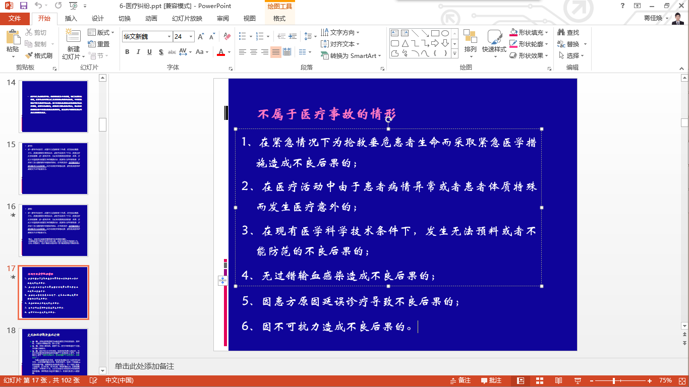

# 2014-2015 学年法医学回忆卷

<!--
source-attribution
贡献者：谷雨桦（上传）。
原始出处：基础医学family钉钉群文件《法医学历年卷.docx》。
资料性质：旧卷回忆资料。
整理说明：保留原回忆中的判断、答案与病例括注；第 23 题附图为原材料随附课件截图。
来源记录：RESOURCE-AUDIT-R13-20260909。
-->

原材料未注明课程号和开课学期，与本站当前课程是否一致尚未核实。

!!! info "回忆卷说明"

    本页依据考后回忆整理；“—”表示该处未记录。原材料未保留字母的选项按现有记录顺序补排，单个片段列为 A，仅用于阅读，不代表原卷字母、顺序或已核实答案。部分记录只保留考查内容，并非完整题干。原回忆中的判断、答案及病例括注均按原材料保留。

---

## 一、名词解释 {: .exam-section .exam-section--short }

1. 安乐死

2. 司法鉴定

3. 法医人类学

4. 医疗纠纷

5. 尸斑

6. 水性肺气肿

7. 缢死

8. 挤压综合征

9. 毒物

10. DNA fingerprint

## 二、单项选择题 {: .exam-section .exam-section--choice }

1. 现存最早的、宋慈写的系统古代法医学著作是？

    **A.** 《洗冤集录》

2. 不是腐败（putrefaction）征象的是？

    **A.** 尸绿（greenish discoloration on cadaver）  
    **B.** 死后循环（cadaveric circulation）  
    **C.** 泡沫器官（foaming organ）  
    **D.** 腐败巨人观（bloated cadaver）  
    **E.** —

    ??? note "原回忆记录"

        还有一个不是的，忘了怎么拼了……

3. 法医病理学的首要目的是什么？

    **A.** 确定死因

4. 精神损伤与伤残的评定机构是？

    **A.** 精神鉴定机构？要不要和公安、法院一起？不知道。

5. 医疗事故的分级标准一级乙等是怎么样的？

    ??? note "原回忆记录"

        P160

6. 精神病人发作间歇作案负何种刑事责任？

    **A.** 负“全部”而非“限定”刑事责任。

7. 假死的检查不是？

    **A.** 脑电图

8. 机械性窒息的直接死因是？

9. 不属于早期死后变化的是？

    **A.** 泥炭鞣尸

10. 早期死后尸体的法医学意义不包括哪些？

11. 哪个不是保存型尸体变化？

12. 属于钝器伤的是？

13. 属于锐器伤的是？

14. 中空性皮下出血？

    **A.** 棍棒伤

15. hyoid fracture（舌骨骨折）是？

    **A.** strangulation by ligature

    ??? note "原回忆记录"

        原回忆称试卷上拼作 legature。

16. 新月形挫伤提示？

    **A.** 扼死

17. 电流损伤的征象？

    **A.** 电流斑

18. 有关砷化物中毒后错误的是？

    **A.** 开棺验尸无价值

19. 民事行为能力有哪些？亲子鉴定的原理：

    !!! info "原记录"

        原材料将这两个片段记在同一个第 19 条下。

20. 司法鉴定的目的？

21. STR 的特点？

    **A.** 重复序列串联短

22. STR 和 VNTR、SNP、RFLP 的关系？

23. 属于医疗事故的？

    **A.** 药物不良反应

    !!! info "随附课件"

        原材料在此处附有“不属于医疗事故的情形”课件截图；“药物不良反应”按原回忆记录保留。

    {: .exam-figure }

## 三、简答题 {: .exam-section .exam-section--short }

1. 作为医生你应熟悉的法律法规有哪些？适用范围是什么？

2. 氰化物中毒机理。

3. 亲子鉴定的原理。

4. 机械性窒息的种类。

5. 生前溺死征象？

## 四、案例分析（10 分） {: .exam-section .exam-section--analysis }

死者，男，40 余岁，妻子诉其近期精神异常（可能为伪造病史）。妻子出差 7 天，回来发现丈夫不见了，厕所上方钢管悬挂尼龙绳套，有小方板凳倒在地上。三天后在小河里找到尸体。

**外观：**

衣着整齐，纽扣不少。衣服上沾有水藻和淤泥。

喉结上方有两道硬索痕（勒沟数目不能完全反映绳圈数目），一道索环呈闭锁状，另外一道前方与索环重叠，后方渐淡不明显。舌骨骨折，勒沟处皮下组织与肌层出血。

尸斑浅紫红色，位于腰背部下部和下肢外侧。

角膜高度浑浊（提示死亡 48 h 以上）。尸僵完全缓解（提示死亡 3 天后）。

额头有 4 cm × 1 cm 伤痕，手指端、髂部、身体外侧擦伤。

心外膜有针点大小出血点。

心脏内抽出暗红色血液（暗红色血液提示窒息死亡）。

肺内有少量泡沫样液体。肺部分水肿部分气肿。

脑水肿。

**病理：**

肺内小部分查得有硅藻。骨髓、肾脏等器官检查为阴性。

**问题：**死亡原因？死亡方式？并作合理解释。
