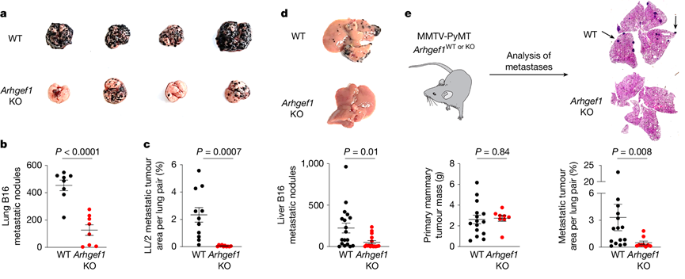

<h1 style = "color: black">
<b>
$2024$ - $2025$ 学年 肿瘤生物学 期末测试
</b>
</h1>

基础医学专业课 回忆卷

本卷除名词解释部分题目为全中文，共配置 54 道题目，需作答 52 道。满分 100 分，时间 2 小时

---

### 一、单项选择题（$40$ 分）

*共40题，每题四个选项，每题1分*

1. 以下哪个**不是**转化细胞的特征：  
  **A.** 有接触抑制  
  **B.**  
  **C.**  
  **D.**  
 

1. 哪个**不是**完全良性的肿瘤细胞在转化向肿瘤细胞的过程中出现的特征：  
  **A.** 核大小和形态的改变  
  **B.** 核染色变浅  
  **C.** 核质比增大  
  **D.** 细胞质出现癌症相关转化  
 

1. 肿瘤的单克隆性可以通过下列哪个实验来证明：  
  **A.** $\text{Ames}$ 实验  
  **B.** $\text{G6PD}$ 酶电泳检测  
  **C.** $\text{Southern}$  
  **D.** 转染  
 

1. $\text{RSV}$ 证明了什么：  
  **A.** 癌症由遗传因素引起  
  **B.** 化学诱变致癌  
  **C.** 病毒可以直接让细胞致癌  
  **D.**  
 

1. 费城染色体特征是什么：  
  **A.** $9-22$ 号染色体易位  
  **B.** $17$ 号染色体缺失  
  **C.** $8$ 号染色体重复  
  **D.** $\text{X}$ 染色体异常  
 

1. $\text{Myc}$ 基因**不能**通过以下哪个方式激活：  
  **A.** 基因扩增  
  **B.** 前病毒插入  
  **C.** 染色体易位  
  **D.** 点突变  
 

1. 费城染色体融合基因表达在哪个染色体：  
  **A.** $9$  
  **B.** $22$  
  **C.** $17$  
  **D.** $\text{X}$  
 

1. 下列哪种细胞**没有**接触抑制：  
  **A.** 红细胞  
  **B.** 转化细胞  
  **C.** 干细胞  
  **D.**  
 

1. 以下关于 $\text{p53}$ 哪个说法是**错误**的：  
  **A.** $\text{p53}$ 的表达会在 $\text{DNA}$ 损伤的时候高度上升  
  **B.** $\text{p53}$ 的翻译后修饰，对它的活性调节非常非常重要  
  **C.** 不是所有翻译后修饰都是可逆的  
  **D.** $\text{p53}$ 是一个转录因子  
 

1.  以下关于 $\text{p53}$ 的说法哪个是正确的：  
  **A.**  
  **B.**  
  **C.** $\text{MDM2}$ 只介导 $\text{p53}$ 泛素化  
  **D.** $\text{p53}$ 以四聚体工作  
 

1.  以下关于翻译后修饰哪个是**错误**的：  
  **A.** 翻译后修饰一个蛋白可以修饰多个位点  
  **B.** 不是所有翻译后修饰都是可逆的  
  **C.** 同一蛋白质不同位点发生翻译后修饰后可以发生 $\text{crosstalk}$  
  **D.** 一个位点可以有多个不同的修饰  
 

1. 基因组不稳定性，哪个是**错误**的：  
  **A.** 靶向基因组不稳定性的抗肿瘤治疗（记不清楚具体表述）  
  **B.**  
  **C.** 染色体不稳定性主要发生在 $\text{S}$ 期  
  **D.** 是家族性出现的第一个 $\text{hall mark}$  
 

1.  关于错配修复哪个说法**不正确**：  
  **A.** 错配修复基因缺陷可能引发林奇综合征  
  **B.** 通过甲基化来识别  
  **C.** 错配修复基因突变是免疫疗法是否起效的分子标志  
  **D.**  
 

1. $\text{DNA}$ 损伤修复以下说法正确的是：  
  **A.**  
  **B.** 烷基化没有直接的识别并且修复的酶  
  **C.** $\text{BAR}$ 修复要先产生一个 $\text{AP}$  
  **D.**  
 

1. 下列说法**错误**的是：  
  **A.** $\text{UV}$ 损伤只能通过 $\text{NER}$ 修复  
  **B.**  
  **C.** $\text{NER}$ 不止能修复 $\text{UV}$ 损伤  
  **D.** $\text{UV}$ 照射主要会产生双链断裂  
 

1. 肿瘤相关成纤维细胞，以下说法正确的是：  
  **A.** 不能由肿瘤细胞产生  
  **B.** 不全是促进肿瘤进展  
  **C.** 它的标志物有什么东西  
  **D.** 可以产生很多的胶原，重塑胞外基质  
 

1. 肿瘤相关毛细血管，以下说法正确的是：  
  **A.** 肿瘤相关毛细血管相对于正常组织，会更加杂乱无章  
  **B.** 肿瘤相关毛细血管结构比正常的毛细血管更加紧密，使药物递送出现困难  
  **C.** 主要的标志物有：（忘了）  
  **D.**  
 

1. 下列哪个转录因子会抑制向上皮细胞样的转化：  
  **A.**  
  **B.** $\text{Snail}$  
  **C.** $\text{CDK}$  
  **D.** $\text{p53}$  
 

1. 关于 $\text{CAR-T}$ 疗法**错误**的是：  
  **A.**  
  **B.** $\text{CAR-T}$ 可以治愈由免疫系统引起的恶性肿瘤  
  **C.** 减毒的分枝杆状菌不可以用来治膀胱癌  
  **D.**  
 

1. 下列哪个药物**不是**肿瘤的化疗药物：  
  **A.** 阿霉素  
  **B.** 紫杉醇  
  **C.**  
  **D.** 奥沙利铂  
 

1. $\text{Ras}$ 的主要功能是什么：  
  **A.** 受体酪氨酸激酶的配体  
  **B.** $\text{GTP}$ 酶  
  **C.** 直接磷酸化 $\text{MAPK}$  
  **D.**  
 

1. 下列哪一个**不是** $\text{Ras}$ 下游的信号通路：  
  **A.** $\text{Raf-MEK-ERK}$  
  **B.** $\text{PI3K/AKT}$  
  **C.** $\text{GEF}$  
  **D.** $\text{JAK-STAT}$  
 

1. $\text{ART/PK3}$ 下游的转录因子是哪一个：  
  **A.** $\text{NF-κ}$  
  **B.** $\text{ERK}$  
  **C.** $\text{mTOR}$  
  **D.** $\text{Smad}$  
 

1. 下列哪一个通路**不是**通过 $\text{JAK-STAT}$ 信号通路起作用的：  
  **A.** 表皮生长因子受体  
  **B.** 血小板生成素受体  
  **C.**  
  **D.** 乙酰胆碱毒性碱型受体  
 

1. 关于免疫系统下列说法错误的是：  
  **A.** 分固有免疫和特异性免疫  
  **B.**  
  **C.**  
  **D.** 固有免疫分成细胞免疫和体液免疫  
 

1. 下列哪个**不是**针对肿瘤的免疫疗法：  
  **A.** 减少树突状细胞的抗原呈递  
  **B.** 激活杀伤肿瘤的 $\text{T}$ 细胞  
  **C.** 抑制免疫检查点  
  **D.** 下调调节性 $\text{T}$ 细胞表达  
 

1. 关于治疗窗哪个说法**不正确**：  
  **A.** 肿瘤化疗药物治疗窗窄  
  **B.** 治疗窗是指产生药效而不出现不可接受毒性的浓度范围  
  **C.**  
  **D.** 治疗窗很窄的药物疗效差  
 

1. 哪种细胞介导胶原生成：  
  **A.** 基质细胞  
  **B.** 内皮细胞  
  **C.** 成纤维细胞  
  **D.**  
 

1. 下列哪个**不是**肿瘤治疗主要疗法：  
  **A.** 中子疗法  
  **B.** 放疗  
  **C.** 化疗  
  **D.** 手术  
 

1. 发育中哪个事件与 $\text{EMT}$ 无关：  
  **A.** 原肠胚形成  
  **B.** 受精  
  **C.** 体节分化  
  **D.** 神经嵴细胞  

<ol>

<li value = "39">
哪种因子介导血管生成： 
<b>A.</b> 成纤维细胞生长因子 
<b>B.</b> 神经生长因子 
<b>C.</b> 血管内皮生长因子 ( $\text{VEGF}$ ) 
<b>D.</b> 表皮生长因子 ( $\text{EGF}$ ) 
 
<li value = "40">

下列关于整联素的说法，哪一个是<b>错误</b>的： 
<b>A.</b> 整联素可以识别不同的胞外基质 
<b>B.</b> 整联素是异源二聚体，由一个 $\alpha$ 和一个 $\beta$ 构成，有的时候也可以是两个 $\alpha$ 或两个 $\beta$ 
<b>C.</b> 整联素介导细胞和胞外基质连接 
<b>D.</b> 整联素可以介导细胞骨架的重塑，介导癌症相关的信号通路和什么的重塑 
</li>

</ol>

---

### 二、名词解释（$18$ 分）
*共 6 题，每题 3 分*
<ol>

<li style="font-weight: bold;">
原癌基因：
</li>
 
<li style="font-weight: bold;">

$\text{SOS}$ 反应：
</li>
 
<li style="font-weight: bold;">

$\text{P-}$糖蛋白：
</li>
 
<li style="font-weight: bold;">

$\text{Angiogenesis}$：
</li>
 
<li style="font-weight: bold;">
免疫检查点：
</li>
 
<li style="font-weight: bold;">
致癌突变：
</li>

</ol>

---

### 三、简答题（$42$ 分）
*共 8 题，从中选择 6 道题目作答，每道 7 分*

1. 列举并解释肿瘤单克隆发育的三大证据
    
     
    
2. 化学致癌物如何通过 $\text{Ames}$ 实验检验其致突变性
    
     
    
3. 简述 $\text{p53}$ 和细胞衰老、细胞死亡的关系
    
     
    
4. 纳米药物 $\text{CPX-351 (Vyxeos)}$ 治疗急性髓性白血病效果优于小分子药物阿糖胞苷和柔红霉素联用可能的原因
    
     
    
5. 嵌合抗原受体 $\text{(Chimeric Antigen Receptor) CAR-T}$ 细胞治疗癌症的工作原理是什么
    
     
    
6. $2025$ 年 $3$ 月，《$\text{Nature}$》杂志发表一篇论文，讲述研究人员发现 $\text{Rho GTP}$ 酶 $\text{Arhgrf1}$ 全身敲除小鼠可抑制尾静脉或脾移植的 $\text{B16、LL/2}$ 肿瘤的肺转移和肝转移，以及（还有一个转移忘了）。请你设计两种不同的实验证明转移抑瘤作用特异性依赖于 $\text{T (CD3+)}$ 细胞
    
    
    
     
    
1. 写出至少两种异常的生长因子受体激活发挥类似癌蛋白功能的主要方式
    
     
    
8. 写出 $3$ 种生长因子受体及其信号通路传导特点
    
      
    
---

> <b>`致谢：`</b>
> 
> + 本回忆卷为结合高世晨学姐、彭于哲学姐的回忆，使用黄浩旸学长的 $\text{Markdown}$ 模板而制作，感谢他们的付出！
>
> 祝用到这份回忆卷的你考试顺利！！

