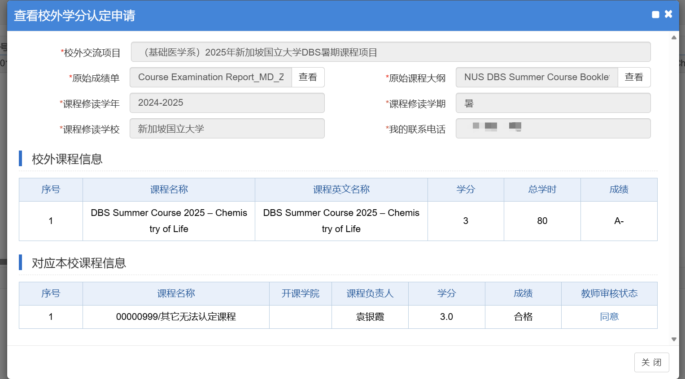

### 对外交流申请

我所知道的对外交流一共有几种
- 学院发通知（会提前半年左右）招募同学，同学填写报名表选拔（如果报名人数较多），随后走教务网流程
- 学校直接在教务网、对外交流服务平台等网站招募同学，随后拉钉钉群选拔，然后走教务网流程

### 教务网流程

以下内容均在**本科教学管理信息平台（zdbk）**的“对外交流”栏目中

1. 交流生交流项目申请
  寻找合适的或对应的项目申请，简单填写信息即可

2. 交流生交流手续办理
  已成功申请项目的同学需多次完善这个栏目的内容，可以回国后再填写，但需保存好部分证明。这部分需要的材料如下：
  - 护照/通行证
  - 签证/签注
  - 邀请信
  - 保险单据
  - “平安留学”在线课程学习截图
  - 个人学习计划
  - 出入境证明
  - 往返登机牌/车票
  - 成绩单/修读证明（可选）
  - 交流总结

3. 出入境交流审批申请
  本栏目也可以回国之后再申请。只需要注意经费的填写，需要问清楚负责老师，通常校级经费院级经费各5000元

### 回国报销

通常老师会直接下拨经费到个人（即有项目号），只需按照以下步骤申请即可）

浙江大学计财处-网上预约报账-网上报账业务-申请报销单

- 业务大类-因公出国（境）
- 项目号-点击 ">"图标，选择一个项目（由老师分配）
- 附件张数
  - 出入境记录（1张）。支付宝搜索“出入境记录”，查询结果并打印
  - 邀请函（1张）
  - 出入境审批表（2张，签字盖章）
  - 学费支付记录（需要自己和另一位同学签名）（1张）
  - recepit（发票）（1张）
  - 护照及身份证复印件（可选）（2张）
  - 登机牌、车票等凭证（如果学费无法覆盖报销额度）

不断点击下一步，填写要求的所有内容，根据实际情况填写，如果学费可以覆盖报销额度，则直接在“其他费用”选择人民币，填写报销单最大额度

不断点击下一步，直到需要准备的材料页面，全部不需要

预约任意日期报销，如果紫金港实在没有就选别的校区，都一样的

如果是医学院的对外交流，需到医学院综合楼801找老师给报销单和出入境审批表盖章

准备好所有材料后去紫金港东6计财处二楼212-3，放到门口篮子里，如果觉得不清楚有没有少东西可以去问里面的老师

### 第四课堂学分认定

详见《[本科培养方案中第四课堂的修读方式与认定操作](https://ugrs.zju.edu.cn/dwjlfwpt/2025/0925/c42881a3085718/page.htm)》

这里提供序号2的操作方法

- zdbk-对外交流-校外学分认定申请
- 如图所示填写

如此便不用再上国际化课程即可满足四课分要求

[1] [本科生对外交流服务平台](https://ugrs.zju.edu.cn/dwjlfwpt/main.htm)

> 此处分享一个我对外交流的经历 *DBS Summer Course 2025 – Chemistry of Life*