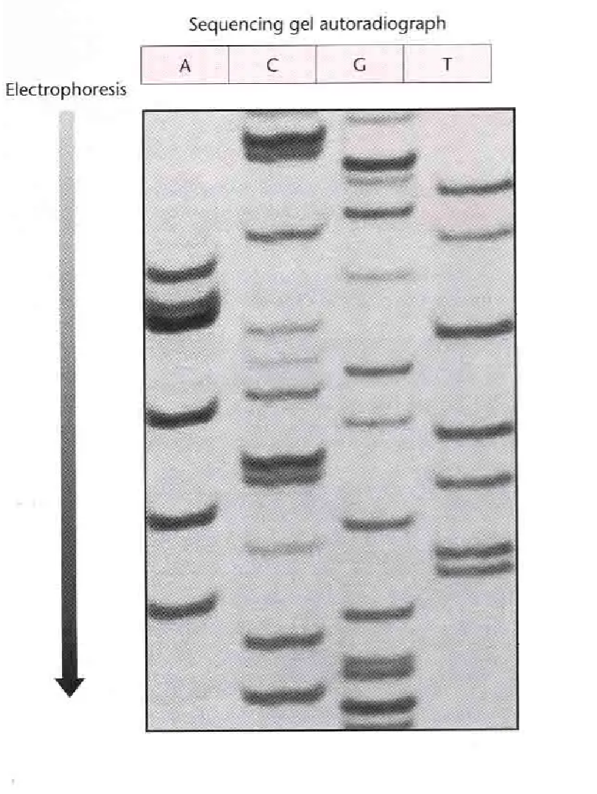

# 2024-2025 学年冬学期基础医学科学研究技能Ⅰ期末回忆卷

> **全中文** · **闭卷**

!!! info "回忆卷说明"

    选择题的实际顺序未能回忆，以下题号为整理序号。选项字母按现有记录顺序补排，仅用于阅读，不代表原卷顺序。

---

## 一、选择题（45 分） {: .exam-section .exam-section--choice }

*原卷共 15 题，每题 5 个选项*

1. 体外长期保存活细胞的方法。

    **A.** 液氮冻存  

2. 细胞计数板四个角每个大格的体积。

    **A.** $0.1~\mathrm{mm^3}$  

3. 封闭的目的是什么？

    **A.** 减少非特异性结合  

4. 哪个不是Ⅱ型限制性核酸内切酶的识别序列？

    **A.** 类似于 ATGGTA 的序列  

5. PCR 反应体系中哪个成分用于延伸？

    **A.** DNA 聚合酶  

6. Western blot 中哪一步用于检测目标蛋白？

    **A.** 抗体孵育  

7. 质粒小提实验中，Solution I 在使用前应加入什么？

    **A.** RNase  

8. PCR 产物纯化时，SPW Wash Buffer 第一次使用前应加入什么？

    **A.** 无水乙醇  

9. 关于提纯一种含有较多带负电氨基酸的蛋白质的说法，错误的是：

    **A.** 可以使用组氨酸标签亲和层析  
    **B.** —  
    **C.** 降低 pH 使蛋白带负电，用阳离子交换柱分离  
    **D.** 调高 pH 使蛋白带负电，用阴离子交换柱分离

10. 有关电泳的说法，正确的是：

    **A.** 配制 1% 的 $50~\mathrm{mL}$ 琼脂糖凝胶要称量 $5~\mathrm{g}$ 琼脂糖  
    **B.** 不需要点 DNA marker  
    **C.** PCR 产物鉴定上样不用加缓冲液  
    **D.** DNA 从正极向负极移动  
    **E.** 电泳刚开始时会出现气泡

11. 有关细菌转染实验的说法，错误的是：

    **A.** RNA 可以稳定地转染到细菌中  

12. 细胞转染实验中，为什么转染完成后要弃去转染试剂？

    **A.** 防止对细胞造成毒副作用  

13. 动物细胞培养的条件。

    **A.** $37~\mathrm{℃}$，$5\%~\mathrm{CO_2}$  

14. 下列说法错误的是：

    **A.** 聚丙烯酰胺凝胶的孔隙要比琼脂糖凝胶大得多，更适合分离蛋白质  

---

## 二、排序题（25 分） {: .exam-section .exam-section--analysis }

*共 5 题。*

1. **DH5α 细菌转化实验**

    **A.** 取感受态 BL21，冰上解冻  
    **B.** 感受态细胞中加入质粒  
    **C.** 共孵育 $30~\mathrm{min}$  
    **D.** 热击 $90~\mathrm{s}$，冰上冷却 $2~\mathrm{min}$  
    **E.** 加入液体培养基，$37~\mathrm{℃}$ 振荡培养 $45~\mathrm{min}$

    !!! info "原卷如此"

        题目写作“DH5α 细菌转化实验”，选项中写作“感受态 BL21”。

2. **质粒小提**

    **A.** 离心细胞  
    **B.** 重悬、裂解、中和  
    **C.** 离心取上清过柱  
    **D.** 洗涤  
    **E.** 洗脱质粒

3. **排阻色谱**

    蛋白 A 约 $20~\mathrm{kDa}$，抗体约 $90~\mathrm{kDa}$，二者形成蛋白 A—抗体复合物。判断各组分经排阻色谱分离的先后顺序。

4. **分子克隆**

    **A.** PCR 产物提取  
    **B.** PCR  
    **C.** 模板提取  
    **D.** 产物和质粒连接  
    **E.** 质粒测序、生物信息学分析  
    **F.** 筛选、提取质粒  
    **G.** 连接产物导入细菌

5. **细胞传代**

    **A.** 用液体培养基吹下细胞  
    **B.** 取一皿细胞，在显微镜下观察生长情况  
    **C.** 用 PBS 洗涤三次  
    **D.** 加入胰酶  
    **E.** 将细胞悬液接种到新的培养瓶

---

## 三、计算题（15 分） {: .exam-section .exam-section--analysis }

*共 3 题。*

1. 某基因的 cDNA 长度为 $1503~\mathrm{bp}$，氨基酸平均分子量为 $110~\mathrm{Da}$，计算该基因表达产物的分子量。

2. 使用浓度为 $5~\mathrm{mg/mL}$ 的原液，配制 $250~\mathrm{mL}$、$0.5~\mathrm{mg/mL}$ 的溶液，计算所需原液的体积。

3. 细胞计数时共有 200 个细胞，其中 70 个被染成蓝色，计算细胞活力百分比。

---

## 四、分析题（15 分） {: .exam-section .exam-section--analysis }

*共 3 题。*

1. 根据下图所示的桑格测序结果，写出 DNA 序列。

    {: .exam-figure }

2. 研究人员发现了一种新蛋白 CasX，将其导入 HeLa 细胞，现需检测其是否表达，但市面上没有这种蛋白的特异性抗体。研究人员将 CasX 基因与表达 GFP 的基因连接后导入 HeLa 细胞。请写出检测该蛋白的 Western blot 实验步骤。

3. 细胞划痕实验为什么要弃去原来的培养基？为什么要使用无血清培养液？
