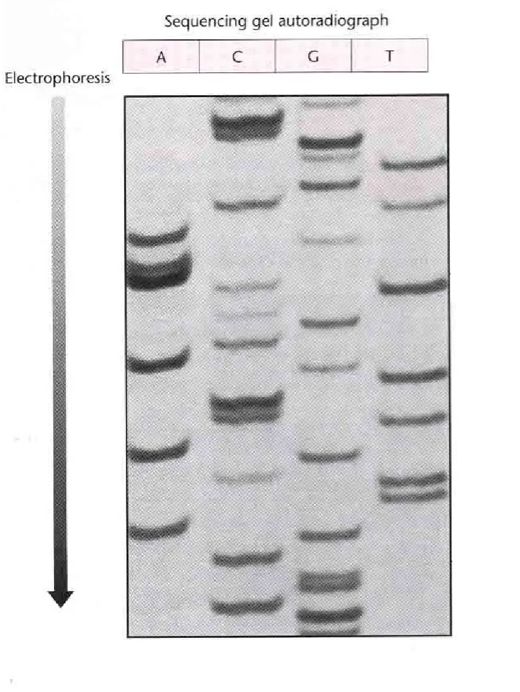

<h1 style="color: black">
<b>2024 - 2025 学年 基础医学科学研究技能Ⅰ 期末测试</b>
</h1>

基础医学专业课 回忆卷 
本卷为全中文，闭卷。包含选择题、排序题、计算题和分析题，满分 100 分

---

> 本页由原 DOCX 回忆卷转换而来，保留原有题目、回忆答案和说明，没有补写缺失内容。选择题题号并非实际出题顺序。

### 一、选择题（45 分）

*原文件注明共 15 道，每题有 5 个选项；现有回忆内容实际记录了 14 道，以下按原文件保留。*

1. 体外长期保存活细胞的方法  
**回忆记录：** 液氮冻存  
 

2. 细胞计数板四个角每个大格的体积  
**回忆记录：** 0.1 mm³  
 

3. 封闭的目的是什么  
**回忆记录：** 减少非特异性结合  
 

4. 哪个不是Ⅱ型限制性核酸内切酶的识别序列  
**回忆记录：** 类似于 ATGGTA 这样的序列  
 

5. PCR 反应体系哪个成分用于延伸  
**回忆记录：** DNA 聚合酶  
 

6. Western blot 中哪一步是检测目标蛋白  
**回忆记录：** 抗体孵育  
 

7. 质粒小提实验中 solution I 在使用前应加入什么  
**回忆记录：** RNase  
 

8. PCR 产物纯化 SPW Wash Buffer 第一次使用前应加入什么  
**回忆记录：** 无水乙醇  
 

9. 关于提纯一种含有较多带负电氨基酸的蛋白质的说法，错误的是  
**A.** 可以使用组氨酸标签亲和层析  
**C.** 降低 pH 使蛋白带负电，用阳离子交换柱分离  
**D.** 调高 pH 使蛋白带负电，用阴离子交换柱分离  
 

10. 有关电泳的说法，正确的是  
**A.** 配制 1% 的 50 mL 琼脂糖凝胶要称量 5 g 琼脂糖  
**B.** 不需要点 DNA marker  
**C.** PCR 产物鉴定上样不用加缓冲液  
**D.** DNA 从正极向负极移动  
**E.** 电泳刚开始时会出现气泡  
 

11. 有关细菌转染实验的说法，错误的是  
**回忆记录：** RNA 可以稳定地转染到细菌中  
 

12. 细胞转染实验中为什么转染完成后要弃去转染试剂  
**回忆记录：** 防止对细胞造成毒副作用  
 

13. 动物细胞培养的条件  
**回忆记录：** 37 ℃，5% CO₂  
 

14. 说法错误的是  
**回忆记录：** 聚丙烯酰胺凝胶的孔隙要比琼脂糖凝胶大得多，更适合分离蛋白质  
 

---

### 二、排序题（25 分）

*共 5 道。*

1. **DH5α 细菌转化实验**  
**A.** 取感受态 BL21，冰上解冻  
**B.** 感受态细胞中加入质粒  
**C.** 共孵育 30 min  
**D.** 热击 90 s，冰上冷却 2 min  
**E.** 加入液体培养基，37 ℃ 振荡培养 45 min  

    > 原文件备注：不太懂为什么 DH5α 要取 BL21，但确实是这么写的。

 

2. **质粒小提**  
**A.** 离心细胞  
**B.** 重悬、裂解、中和  
**C.** 离心取上清过柱  
**D.** 洗涤  
**E.** 洗脱质粒  
 

3. **排阻色谱**  
情景题：大意是有蛋白 A 约 20 kDa，抗体约 90 kDa，形成蛋白 A—抗体复合物，要求判断排阻色谱分离出的顺序。  
 

4. **分子克隆**  
**A.** PCR 产物提取  
**B.** PCR  
**C.** 模板提取  
**D.** 产物和质粒连接  
**E.** 质粒测序、生物信息学分析  
**F.** 筛选、提取质粒  
**G.** 连接产物导入细菌  
 

5. **细胞传代**  
**A.** 用液体培养基吹下细胞  
**B.** 取一皿细胞，在显微镜下观察生长情况  
**C.** 用 PBS 洗涤三次  
**D.** 加入胰酶  
**E.** 将细胞悬液接种到新的培养瓶  
 

---

### 三、计算题（15 分）

*共 3 道。*

1. 有某基因的 cDNA 为 1503 bp，氨基酸平均分子量为 110 Dalton，请算出该基因表达产物的分子量。  
 

2. 配制某 0.5 mg/mL 的溶液 250 mL，该溶液的原液为 5 mg/mL，请算出需要原液的体积。  
 

3. 细胞计数时有 200 个细胞，其中 70 个被染成蓝色，请算出细胞活力百分比。  
 

---

### 四、分析题（15 分）

*共 3 道。*

1. 桑格测序法给了类似下图的结果，要求写出 DNA 序列。  

    {: style="display: block; margin: 1rem auto; max-width: 70%; height: auto;"}

 

2. 研究人员发现了一种新蛋白 CasX，将其导入 HeLa 细胞，现需检测其是否表达，但市面上没有这种蛋白的特异性抗体。于是，他把这个蛋白的基因和表达 GFP 的基因连接在一起导入 HeLa。请写出检测该蛋白的 Western blot 步骤。  
 

3. 细胞划痕实验为什么要弃去原来的培养基？为什么要用无血清培养液？  
 
