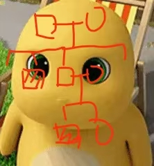

# 2024-2025 学年冬学期遗传与发育Ⅰ期末回忆卷

> **题目绝大多数为英文，少数为中文**  
> **考前通知允许携带一本非专业词典**

!!! info "回忆卷说明"

    原卷共有 40 道单项选择题，原记录保留了其中 27 道。第 1—5 题保留原有顺序；第 6—27 题使用整理序号，不代表原卷题序。

---

## 一、单项选择题（60 分） {: .exam-section .exam-section--choice }

*原卷共 40 题；原记录保留 27 题。*

1. The first step of gene expression is:

    **A.** Replication  
    **B.** Transcription  
    **C.** Translation  
    **D.** 都不是

2. 一段关于孟德尔遗传的叙述中，孟德尔所说的“Character”用现代术语表示为：

    **A.** Gene  
    **B.** Genome  
    **C.** Allele  
    **D.** Locus

3. Homologous recombination 发生在 meiosis 的哪个时期？

    **A.** Prophase I  
    **B.** Metaphase I  
    **C.** Prophase II  
    **D.** Metaphase II

4. Homologous recombination 发生在哪里？

    **A.** Sister chromatids at the same centromere  
    **B.** Sister chromatids attached not at the same centromere  
    **C.** X chromosome and Y chromosome

5. 关于 SNPs 的说法。

    **C.** 发生在非编码区的没有功能

6. AD 患者父母最常见的基因型。

7. Cystic fibrosis 的特征和遗传模式。

8. 与 cystic fibrosis 有关的说法：

    **B.** 影响患者的存活  
    **C.** 同婚会造成 $\frac{1}{2}$ 的患病  
    **D.** 是氯离子载体蛋白发生突变

9. 以下哪个是终止密码子？

    选项为四个密码子，具体内容未能回忆。

10. 蛋白质检测的方法。

    **A.** Northern blot  
    **B.** RT-qPCR  
    **C.** Southern blot  
    **D.** Immunofluorescence

11. Protein DNA 合成检测的方法。

    **A.** RT-qPCR  
    **D.** Co-IP

12. 人类基因组计划的目标。

    **A.** 测定人所有染色体的序列  
    **B.** 基因定位

13. 有关 Hox 基因的说法。

    **A.** 是一系列功能相似的基因  
    **C.** 只在果蝇中

14. 存在于 RNA 中的碱基是什么？

    选项为 A、G、C、T、U 的英文名称。

15. 有关 junk DNA 的说法。

16. 人类基因组概述。

    **A.** 人和人基因组相似程度 99.9%  
    **B.** 人和黑猩猩基因组相似程度  
    **C.** 人的基因中只有约 1.5% 编码蛋白质，其他是非编码 DNA  
    **D.** Y 染色体是最短的，上面的基因是最少的

17. 孟德尔遗传定律不适用于什么？

    **D.** Mitochondrial disease

18. 关于 mitochondrial disease 的说法。

    **A.** 只能由母亲遗传  
    **B.** 不遵循孟德尔遗传定律

19. 早期胚胎发育的关键节点。

    **A—D.** 四个英文术语，具体内容未能回忆  
    **E.** 以上都是

20. 与基因距离有关。

21. 以下谁没有获得第 82 届诺贝尔奖？

    **A.** Paul Berg  
    **B.** Walter Gilbert  
    **C.** William（其余姓名未能回忆）  
    **D.** Frederick Sanger

22. Proband 与箭头所指对象是几级亲属？

    选项为一、二、三、四级。

    {: .exam-figure }

23. 有关 homologous 的说法。

    **A.** 人的前肢和海豹的前肢不是同源器官  
    **C.** 鸟的翅膀和蝙蝠的翅膀不是同源器官  
    **D.** 同源器官是形态相似、来自共同祖先的器官

24. 核小体由几个组蛋白构成？

    **A.** 1  
    **B.** 4  
    **C.** 8  
    **D.** 10

25. 一个密码子的碱基突变使其变成终止密码子；另一个密码子的碱基突变使其编码另一种氨基酸。两者分别属于什么突变？

    选项为 nonsense mutation、missense mutation、silent mutation 的两两组合。

26. 关于组蛋白乙酰化的说法。

27. 关于 CpG 等内容的说法。

---

## 二、名词解释（16 分） {: .exam-section .exam-section--short }

*共 8 题。*

1. French flag model

2. Homologous

3. Anticipation

4. Pedigree

5. Centimorgan

6. Mendel’s law of segregation

7. CRISPR

8. Heterochromatin

---

## 三、简答题（24 分） {: .exam-section .exam-section--short }

*共 4 题。*

1. Nucleosome 的组成和作用。

2. Commonalities and differences between Barr body and polar body.

3. 胚胎发育过程中的关键节点。

4. 某同学计划研究 A 基因增强子与启动子之间的距离对表达的影响，于是改变 Y 基因增强子和启动子之间的距离，并测定 mRNA 表达量，得到如下结果。请简要说明可能的原因。

    {: .exam-figure }
