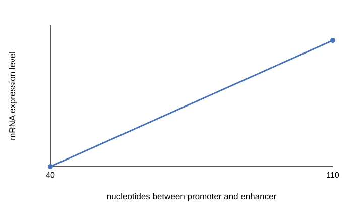

<h1 id="2024-2025-i">2024-2025 学年冬学期遗传与发育Ⅰ期末回忆</h1>

<h2 id="40-60">一、单项选择（40 题，共 60 分）</h2>

<ol>
<li>

The first step of gene expression is

A. Replication 
B. Transcription 
C. Translation 
D. 都不是

</li>
<li>

一长串叙述，孟德尔所说的“character”的更现代的说法是

A. gene 
B. genome 
C. allelic 
D. locas

</li>
<li>

介绍了 Homologous recombination，问发生在 meiosis 的哪个时期

A. Prophase I 
B. Metaphase I 
C. Prophase II 
D. Metaphase II

</li>
<li>

Homologous Recombination 发生在哪里

A. Sister chromatids at the same centromere 
B. Sister chromatids attached not at the same centromere 
C. X chromosome and Y chromosome

</li>
<li>

介绍了 SNPs，与其相关的说法

只记得一个选项 C. 发生在非编码区的没有功能

</li>
</ol>

以下为乱序，序号不是题目实际序号。

<ol>
<li>

AD 患者父母最常见的基因型

</li>
<li>

Cystic Fibrosis 特征和遗传模式

</li>
<li>

与 Cystic Fibrosis 有关的说法

B. 影响患者的存活 
C. 同婚会造成 ½ 的患病 
D. 是氯离子载体蛋白发生突变

</li>
<li>

以下哪个是终止密码子

给了四个密码子。

</li>
<li>

蛋白质检测的方法

A. Northern blot 
B. RT-qPCR 
C. Southern blot 
D. Immunofluorescence

</li>
<li>

Protein DNA 合成检测的方法

A. RT-qPCR 
D. Co-IP

</li>
<li>

人类基因组计划的目标

A. 测定人所有染色体的序列 
B. 基因定位

</li>
<li>

有关 Hox 基因的说法

A. 是一系列功能相似的基因 
C. 只在果蝇中

</li>
<li>

存在于 RNA 中的碱基是什么

给了 AGCTU 的英文名。

</li>
<li>

有关 Junk DNA 的说法

</li>
<li>

人类基因组概述

A. 人和人基因组相似程度 99.9% 
B. 人和黑猩猩基因组相似程度 
C. 人的基因中只有约 1.5% 编码蛋白质，其他是非编码 DNA 
D. Y 染色体是最短的，上面的基因是最少的

</li>
<li>

孟德尔遗传定律不适用于什么

D. mitochondrial disease

</li>
<li>

关于 mitochondrial disease 的说法

A. 只能由母亲遗传 
B. 不遵循于孟德尔遗传定律

</li>
<li>

早期胚胎发育的关键节点

给了四个英文单词。 
E. 以上都是

</li>
<li>

与基因距离有关

</li>
<li>

以下谁没有获得第 82 届诺贝尔奖

A. Paul Berg 
B. Walter Gilbert 
C. William 
D. Frederick Sanger

</li>
<li>

Proband 与箭头指的是几级亲属

选项给了一、二、三、四级。

</li>
<li>

Homologous 有关

A. 人的前肢和海豹的前肢不是同源器官 
C. 鸟的翅膀和蝙蝠的翅膀不是同源器官 
D. 同源器官是形态相似，来自共同祖先的器官

</li>
<li>

核小体由几个组蛋白构成

A. 1 
B. 4 
C. 8 
D. 10

</li>
<li>

有个密码子的碱基突变使密码子变成终止密码子，有个密码子的碱基突变使变成了另一种氨基酸，问分别是什么突变

选项为 Nonsense Mutation、Missense Mutation、Silent Mutation 的两两组合。

</li>
<li>

关于组蛋白乙酰化的说法

</li>
<li>

关于 CpG 等的说法

</li>
</ol>

<h2 id="8-16">二、名词解释（8 题，共 16 分）</h2>

<ol>
<li>French flag model</li>
<li>Homologous</li>
<li>Anticipation</li>
<li>Pedigree</li>
<li>Centimorgan</li>
<li>Mendel’s law of segregation</li>
<li>CRISPR</li>
<li>Heterochromatin</li>
</ol>

<h2 id="4-24">三、简答题（4 题，共 24 分）</h2>

<ol>
<li>Nucleosome 的组成和作用。</li>
<li>Common and difference between Barr body and Polar body。</li>
<li>胚胎发育过程中的关键点。</li>
<li>

一道情景题，大意是某同学打算研究 A 基因增强子与启动子之间的距离对表达的影响，于是该同学改变 Y 基因增强子和启动子之间的距离测定 mRNA 的表达量，得到了如下结果，请你简要说明可能的原因。

</li>
</ol>

<h2 id="_1">回忆者补充</h2>

题目绝大多是英文，只有几道是中文。

考前老师说可以带一本字典，但不能太专业相关，考前会检查，实际没查。

单知识上说难度不大，但我是丈育，所以不会，所以题目只记了一点，全靠小伙伴们补充。

说来可笑，我学这门课最多的时候居然是回忆这份卷子的时候。

特别感谢 23 基础的 YZjj、JRjj、MJjj、PJgg、GCgg，为这份回忆卷的形成提供了极大帮助。

  
<h2 id="__comments">评论</h2>
  

  

