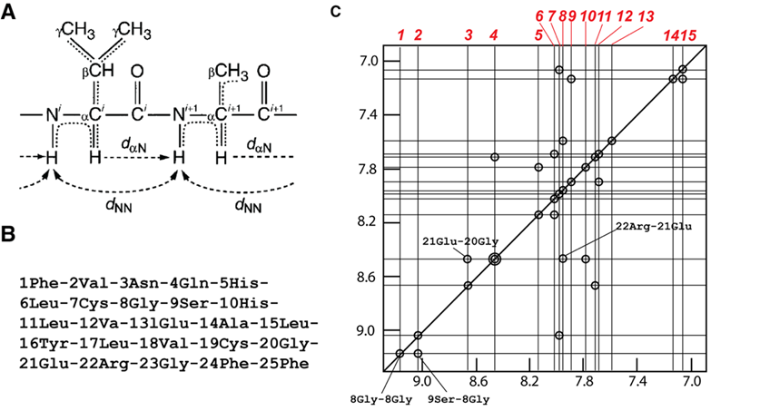

# 2022-2023 学年春学期医学生物物理学期末回忆卷

> **全中文** · **2 小时**
>

!!! info "回忆卷说明"

    本页依据考后回忆整理，不提供参考答案。

    部分选择题只保留了题干或少量选项；案例分析题中的图示以现有题图为准。

---

## 一、选择题（20 分） {: .exam-section .exam-section--choice }
*共 20 题，每题五个选项，个别题目为多选，每题 1 分。以下为能够回忆的部分。*

1. 虚拟筛选不可用于：

1. 以下哪项不属于蛋白质的二级结构：

    **A.** $\alpha - $ 螺旋  
    **B.** 平行 $\beta - $ 片层  
    **C.** 反平行 $\beta - $ 片层  
    **D.** $\beta - $ 桶状结构  
    **E.** —

1. 二十面体病毒的结构特征：

1. 钾离子通道蛋白对钾离子的特异选择性主要依赖于：

    **A.** 氨基酸链的特异选择位点  
    **B.** 配位氧原子与钾离子的配位距离

1. 有关跨膜运输的描述

1. 通道蛋白英文缩写与通道类型匹配的是：

1. 与机体不能进行核苷酸切除修复导致疾病有关

1. 与帕金森致病蛋白有关

1. 以下哪些蛋白与线粒体运动有关

1. 与线粒体融合关键基因有哪些：

---

## 二、简答题（30 分） {: .exam-section .exam-section--short }
*共 6 题，每题 5 分。*

1. 根据提供的计算生物学蛋白质二级结构分析序列图，定性描述该蛋白的结构特征。

2. 蛋白质结构生物学在医学中的应用

1. 超氧化物歧化酶的作用

1. 单体和六聚体解旋酶之间的区别

1. 核磁共振的基本原理

1. 基因编码的荧光探针的概念及与化学探针的区别

---

## 三、问答题（20 分） {: .exam-section .exam-section--analysis }
*共 2 题，每题 10 分。*

1. 阐述冷冻电镜凸透镜成像过程和傅立叶变换的关系。

2. 单分子力谱操控技术有哪四种？列举一种，介绍其操控分子间作用力的原理。

---

## 四、案例分析题（30 分） {: .exam-section .exam-section--analysis }
*共 2 题，每题 15 分。*

1. 根据 $\text{FRET}$ 荧光信号图推断化合物。

    !!! note "题图说明"

        原记录未保留本题的具体化合物信息和题图。

2. 图（$\text{A}$）是某多肽中第 $\text{i}$ 号和第 $\text{i+1}$ 号氨基酸；图（$\text{B}$）是人源胰岛素 $\text{B}$ 链的序列；图（$\text{C}$）是人源胰岛素 $\text{B}$ 链 $\mathrm{^1H} \text{-} \mathrm{^1H}\text{ 2D NOESY}$ 核磁谱在 $\text{7.0 – 9.2 ppm}$ 间的部分。每个对角线峰和交叉峰均用圆圈标识，重叠的峰以同心圆标记，部分峰对应的氨基酸已经标识，每个峰对应的化学位移在横轴上从左至右用红色数字 $\text{1-15}$ 标记。

    已知，多肽中氨基酸的 $\mathrm{NH}$、$\mathrm{C_\alpha H}$ 和侧链 $\mathrm{CH}$ 的化学位移范围大约分别为 $\text{5.7 – 10 ppm}$、$\text{3.3 – 5.7 ppm}$ 和小于 $\text{3.3 ppm}$，请回答：

    （1）$\mathrm{^1H}\text{-}\mathrm{^1H}\text{ 2D COSY}$ 和 $\text{NOESY}$ 分别使用图（$\text{A}$）中哪些 $\text{H}$ 原子的耦合信号？（以 $\mathrm{CH^i}$、$\mathrm{C_\alpha H_i}$、$\mathrm{NH_i}$ 等形式书写）

    （$2$）图（$\text{C}$）中的 $\mathrm{^1H}\text{-}\mathrm{^1H}\text{ 2D NOESY}$ 核磁谱使用了第（$1$）问中的哪种耦合信号？

    （3）请利用图（$\text{C}$）中已标记的氨基酸信息，将红色数字 $1-15$ 对应的化学位移与图（$\text{B}$）序列中的氨基酸对应起来。

    {: .exam-figure }

    | 1 | 2 | 3 | 4 | 5 | 6 | 7 | 8 | 9 | 10 | 11 | 12 | 13 | 14 | 15 |
    | :--: | -- | -- | -- | -- | -- | -- | -- | -- | -- | -- | -- | -- | -- | -- |
    | $\text{8 Gly}$ | | | | | | | | | | | | | | |
