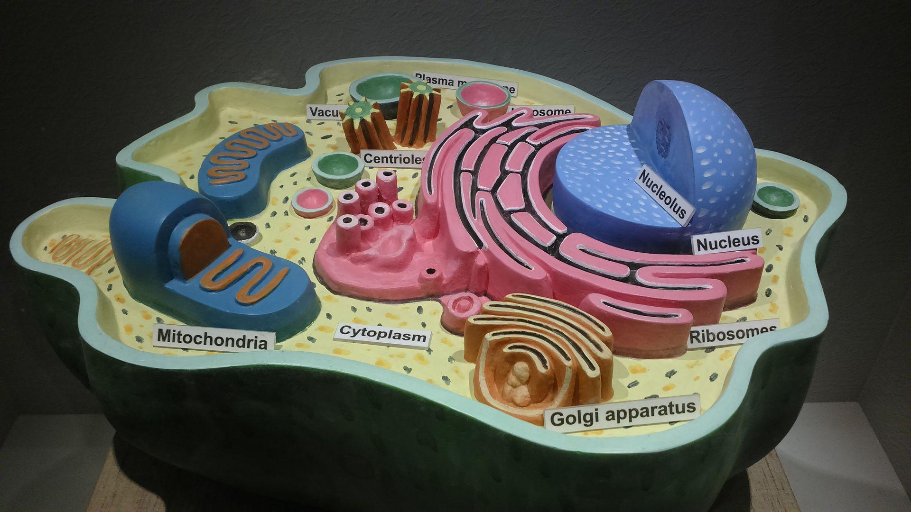

# 2024-2025 学年春学期医学生物物理学期末回忆卷

> **全中文** · **2 小时**
>

!!! info "回忆卷说明"

    本页依据考后回忆整理，不提供参考答案。

    “—”表示该处未能回忆完整；案例分析题所配图片为试卷原图的彩色版本。

---

## 一、单项选择题（20 分） {: .exam-section .exam-section--choice }
*共 20 题，每题五个选项，每题 1 分。*

1. 分子间作用力的量级为：

    **A.** $1~\text{N}$  
    **B.** $1 \times 10^{-3}~\text{N}$  
    **C.** $1 \times 10^{-6}~\text{N}$  
    **D.** $1 \times 10^{-9}~\text{N}$  
    **E.** $1 \times 10^{-12}~\text{N}$

1. 以下哪个是单分子技术：

    **A.** 光镊  
    **B.** 膜片钳  
    **C.** 磁镊  
    **D.** 原子力显微镜  
    **E.** 以上都是

1. 以下有关冠状病毒入侵受体细胞的生物力学的描述说法**错误**的是：

    **A.** 冠状病毒入侵受体细胞的过程中存在生物力作用  
    **B.** 冠状病毒入侵受体细胞的过程中会感受到拉力和压力  
    **C.** 冠状病毒刺突蛋白受力会减缓刺突蛋白和 $\text{ACE2}$ 解离  
    **D.** 冠状病毒演化突变刺突蛋白的 $\text{RBD}$ 区会降低刺突蛋白与 $\text{ACE2}$ 的力学稳定性  
    **E.** 冠状病毒刺突蛋白受力，$\text{S1 / S2}$ 区域结合更稳定

1. 下面关于力在各个尺度上的描述正确的是：

    **A.** 分子间的作用力：范德华力、静电力  
    **B.** 细胞间的作用力：粘附力  
    **C.** 组织和器官尺度上的力学因素：受限空间、基质软硬度  
    **D.** 组织和器官尺度上的作用力：流、拉、扭、压  
    **E.** 以上都是

1. 下面关于吉布斯自由能的说法**错误**的是：

    **A.** 系统的吉布斯自由能可由系统的焓和熵计算出  
    **B.** $\Delta_r G$ 取决于化学反应平衡常数和各物质的浓度  
    **C.** 标准状态下，$\Delta G^{\circ} = - R T \ln{K}$  
    **D.** 平衡状态时，$\Delta G = \Delta G^{\circ}$  
    **E.** 吉布斯自由能变是吉布斯自由能的导数

1. 下面有关 $\text{ATP}$ 水解的描述说法**错误**的是：

    **A.** $\text{ATP}$ 水解释放出的能量的大小与 $\text{ATP / ADP}$ 的浓度有关  
    **B.** $\text{ATP}$ 在线粒体基质中水解释放的能量更多  
    **C.** $\text{ATP}$ 与 $\text{ADP}$ 对向转运是主动运输  
    **D.** 与 $\text{ATP}$ 水解偶联是很多热力学不利反应能发生的原因  
    **E.** 在体内 $\text{ATP}$ 的水解和 $\mathrm{pH、Mg^{2+}}$ 浓度和磷酸基团水平有关

1. 下列关于核磁共振说法正确的是：

    **A.** 核自旋量子数 $I$ 反映外加磁场方向的投影，反映了核自旋角动量空间取向的量子化  
    **B.** 磁量子数 $m_I$ 反映核自旋角动量大小的量子化  
    **C.** —  
    **D.** 核磁距正比于 $m_I$  
    **E.** $\mathrm{^1H}$ 拉莫尔频率与仪器精度成反比

1. 下列关于核磁共振说法**错误**的是：

    **A.** —  
    **B.** 可以研究动态变化  
    **C.** 不适用于大分子  
    **D.** 解析结构一般需要 $\mathrm{^1H-^{13}C-^{15}N}$ 三谱联用，所以需要同位素标记的蛋白质  
    **E.** 通过实验和非实验约束可以确定唯一结构

1. $\text{STRING}$ 数据库提供：

    **A.** 蛋白互作的证据  
    **B.** 蛋白互作的机理  
    **C.** 哪些蛋白有互作  
    **D.** 蛋白互作的网络  
    **E.** 蛋白互作的文献

1. 同源建模序列比对氨基酸一致性力求要达到：

    **A.** 10%  
    **B.** 15%  
    **C.** 20%  
    **D.** 30%  
    **E.** 25%

1. 使用在线服务器可以获取：

    **A.** 氨基酸的基本性质  
    **B.** 肽链的二级结构预测  
    **C.** 蛋白的跨膜结构域预测  
    **D.** 蛋白无固定结构域预测  
    **E.** 以上都是

1. 下面有关生物大分子的动态变化哪个时间尺度更大：

    **A.** 氨基酸侧链上甲基的旋转  
    **B.** 化学键的拉伸振动  
    **C.** 蛋白质二级结构的形成  
    **D.** 蛋白质三级结构的形成  
    **E.** 氨基酸侧链上甲基的旋转

    !!! info "原卷如此"

        原记录中 A、E 两项文字相同，按原样保留。

1. 下面哪个是线粒体膜间隙的标志酶：

    **A.** 单胺氧化酶  
    **B.** 腺苷酸激酶  
    **C.** 孔蛋白  
    **D.** 细胞色素氧化酶  
    **E.** $\text{ATP}$ 合酶

1. 线粒体运动的 $\text{Miro1 / Miro2}$ 是：

    **A.** $\text{ATP}$ 酶  
    **B.** $\text{GTPase}$ 酶  
    **C.** 泛素化酶  
    **D.** 水解酶  
    **E.** —

1. $\text{p-tau217}$ 是什么疾病的生物标志物（$\text{Biomarker}$）：

    **A.** 阿尔兹海默  
    **B.** 帕金森  
    **C.** 肌萎缩性脊髓侧索硬化症  
    **D.** —  
    **E.** —

2. 第一个宣告发现 $\text{GFP}$ 的人是：

    **A.** 格拉斯・普拉舍  
    **B.** 下村修  
    **C.** 钱永健  
    **D.** 马丁·查尔菲  
    **E.** 弗兰克・约翰逊

3. 以下哪个是线性马达：

    **A.** 肌球蛋白  
    **B.** —  
    **C.** —  
    **D.** $\text{ATP}$ 合酶  
    **E.** 细菌的鞭毛马达

4. 动力蛋白（$\text{dynein}$）在微管上运动方向是：

    **A.** 正极  
    **B.** 负极  
    **C.** 双向随机运动  
    **D.** 依靠微丝……  
    **E.** —

    !!! info "原记录"

        D 项只回忆到以上开头，后半句未记录。

5. 驱动分子马达步行的机制：

    **A.** 两条重链交替 $\text{ATP}$ 水解  
    **B.** 轻链甲基化  
    **C.** 微丝的动态不稳定性  
    **D.** 钙离子波动  
    **E.** 膜电位变化

6. $\text{tau}$ 蛋白过度磷酸化导致 $\text{AD}$ 的可能机制是：

    **A.** 激活驱动蛋白  
    **B.** 抑制动力蛋白  
    **C.** 激活肌球蛋白在微丝上运动  
    **D.** 包含 “破坏”、“微管”、“线粒体” 的一句话  
    **E.** —

## 二、简答题（30 分） {: .exam-section .exam-section--short }
*共 6 题，每题 5 分。*

1. 简要说出两种单分子力学操作技术

2. 简要说出核磁共振技术在非结构生物学领域的应用

3. 简要说出生物成像技术在科学研究中的应用

4. 简要说出超氧化物歧化酶的催化原理和生理学意义

5. 说出至少五个用于表征荧光物质的参数

6. 研究发现某新蛋白质为疾病发生的关键调控因子，具备成为治疗靶标的生物学特征。请简述该靶点蛋白的药物研发工作可以采用哪些计算生物学研究策略

## 三、问答题（20 分） {: .exam-section .exam-section--analysis }
*共 2 题，每题 10 分。*

1. 膜片钳技术的原理和记录方式

2. 冷冻电镜技术解析生物样品结构的优点

## 四、案例分析题（30 分） {: .exam-section .exam-section--analysis }
*共 2 题，每题 15 分。*

1. *Activation and closed-state inactivation mechanisms of the human voltage-gated KV4 channel complexes*, *Molecular Cell* (Vol. 82, pp. 2427-2442) 报道了电压门控钾离子通道 $\text{Kv4.2}$ 在不同状态下的结构：

    > - **图 A：** 左侧：$\text{VSD}$ 激活状态；右侧：$\text{VSD}$ 静息状态
    > - **图 B：** 单个亚基关闭和开放状态下 $\text{VSD}$、$\text{S4-S5 linker}$、$\text{gate}$ 的 $S6~C$ 末端结构的比较
    > - **图 C：** 蓝色：开放状态；橙色：关闭状态

    根据图片结合分析和比较，阐述 $\text{Kv4.2}$ 的电压门控机理（图中所示的箭头为从开放状态转为关闭状态）。

    {: .exam-figure }

1. 新发现一种海洋微生物可以在极端盐碱环境生存。其表面有特殊膜结构可以有效隔绝细胞内外，此外还发现参与物质运输和能量转换。进一步研究发现还可以对不同类型的物质有选择透过性，允许特定物质进入，阻止其他物质进入

    （1）推测该特定膜结构最可能属于哪种膜，并解释依据。

    （2）结合该膜结构的功能，分析其在维持细胞内外环境稳态中发挥的作用。

    {: .exam-figure }
