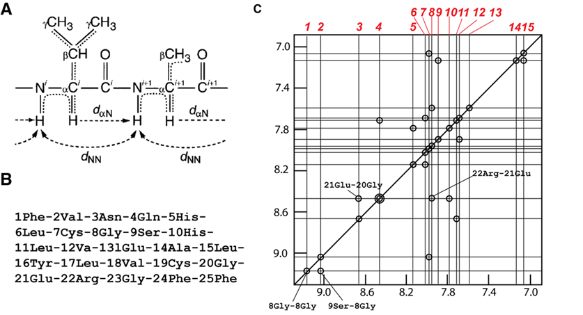

<h1 style="color: black">
<b>$2022$ - $2023$ 学年 医学生物物理学 期末测试</b>
</h1>

基础医学专业课 回忆卷 
本卷为全中文，共配置 30 道题目。满分 100 分，时间 2 小时

---

### 一、选择题（$20$ 分）

*共 20 题，每题五个选项，个别题目为多选，每题 1 分*

1. 虚拟筛选不可用于：  
 
1. 以下哪项不属于蛋白质的二级结构：  
    **A.** $\alpha - $ 螺旋  
    **B.** 平行 $\beta - $ 片层  
    **C.** 反平行 $\beta - $ 片层  
    **D.** $\beta - $ 桶状结构  
 
1. 二十面体病毒的结构特征：  
 
1. 钾离子通道蛋白对钾离子的特异选择性主要依赖于：  
    **A.** 氨基酸链的特异选择位点  
    **B.** 配位氧原子与钾离子的配位距离  
 
1. 有关跨膜运输的描述  
 
1. 通道蛋白英文缩写与通道类型匹配的是：  
 
1. 与机体不能进行核苷酸切除修复导致疾病有关  
 
1. 与帕金森致病蛋白有关  
 
1. 以下哪些蛋白与线粒体运动有关  
 
1.  与线粒体融合关键基因有哪些：  

---

### 二、简答题（$30$ 分）

*共 6 题，每题 5 分*

1. 根据提供的计算生物学蛋白质二级结构分析序列图，定性描述该蛋白的结构特征。
  
2. 蛋白质结构生物学在医学中的应用
  
1. 超氧化物歧化酶的作用
  
1. 单体和六聚体解旋酶之间的区别
  
1. 核磁共振的基本原理
  
1. 基因编码的荧光探针的概念及与化学探针的区别
  
---

### 三、问答题（$20$ 分）

*共 2 题，每题 10 分*

1.阐述冷冻电镜凸透镜成像过程和傅立叶变换的关系
   
2.单分子力谱操控技术有哪四种？列举一种，介绍其操控分子间作用力的原理
   

---

### 四、案例分析题（$30$ 分）

*共 2 题，每题 15 分*

1. 根据 $\text{FRET}$ 荧光信号图推断化合物
    
    
1. 
    - 图（$\text{A}$）是某多肽中第 $\text{i}$ 号和第 $\text{i+1}$ 号氨基酸；  
    - 图（$\text{B}$）是人源胰岛素 $\text{B}$ 链的序列；  
    - 图（$\text{C}$）是人源胰岛素 $\text{B}$ 链 $\mathrm{^1H} \text{-} \mathrm{^1H}\text{ 2D NOESY}$ 核磁谱在 $\text{7.0 – 9.2 ppm}$ 间的部分，每个对角线峰和交叉峰均用圆圈标识，重叠的峰以同心圆标记，部分峰对应的氨基酸已经标识，每个峰对应的化学位移在横轴上从左至右用红色数字 $\text{1-15}$ 标记
    
    已知，多肽中氨基酸的 $\mathrm{NH}$，$\mathrm{C_\alpha H}$ 和侧链 $\mathrm{CH}$ 的化学位移范围大约分别为 $\text{5.7 – 10 ppm}$，$\text{3.3 – 5.7 ppm}$ 和小于 $\text{3.3 ppm}$，请问

    （$1$）$\mathrm{^1H}\text{-}\mathrm{^1H}\text{ 2D COSY}$ 和 $\text{NOESY}$ 分别使用图（$\text{A}$）中哪些 $\text{H}$ 原子的耦合信号？（以 $\mathrm{CH^i}$，$\mathrm{C_\alpha H_i}$，$\mathrm{NH_i}$ 等形式书写）  
    （$2$）图（$\text{C}$）中的 $\mathrm{^1H}\text{-}\mathrm{^1H}\text{ 2D NOESY}$ 核磁谱使用了第（$1$）问中的哪种耦合信号？  
    （$3$）请利用图（$\text{C}$）中已标记的氨基酸信息，将红色数字 $1-15$ 对应的化学位移与图 （$\text{B}$）序列中的氨基酸对应起来

    

    |1|2|3|4|5|6|7|8|9|10|11|12|13|14|15|
    |:--:|--|--|--|--|--|--|--|--|--|--|--|--|--|--|
    |$\text{8 Gly}$|   | | | | | | | | | | | | | |
    
      

---

> <b>`致谢：`</b>
> 
> + 本回忆卷为整合谷雨桦学姐、何楚楚学姐，Chams学长的回忆试卷而来，使用黄浩旸学长制作的 Markdown 模板，感谢他们的付出！
>
> 祝用到这份回忆卷的你考试顺利！！