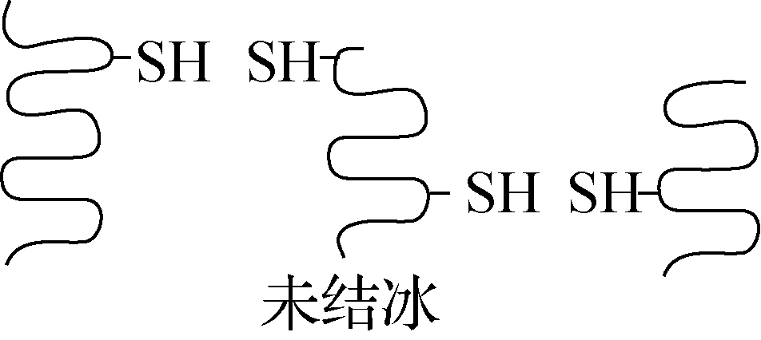
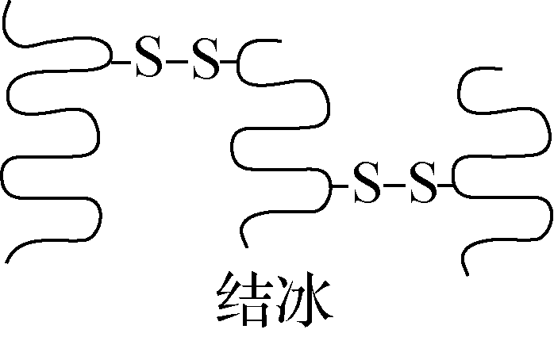
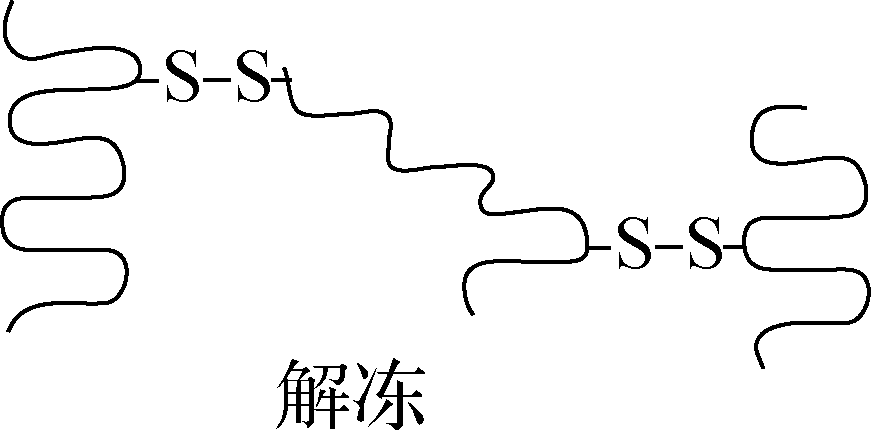

# 2024-2025 学年医学生命基础期末试题及答案

!!! info "试卷说明"

    本页收录老师提供的两套试题及随附答案，按原文件顺序列为“第一套”“第二套”。答案与评分点按原材料录入，未作内容校订。

---

=== "第一套"

    ## 一、单项选择题（30 分） {: .exam-section .exam-section--choice }

    *共 10 题，每题 3 分。*

    1. 细胞受到冰冻时，蛋白质分子相互靠近，当接近到一定程度时，蛋白质分子中相邻近的巯基(－SH)氧化形成二硫键(－S－S－)。解冻时，蛋白质中的氢键断裂，二硫键仍保留，如下图所示。下列说法错误的是 (　　)

        {: .exam-figure }

        {: .exam-figure }

        {: .exam-figure }

        **A.** 巯基位于氨基酸的R基上  
        **B.** 解冻后蛋白质的空间结构未发生改变  
        **C.** 结冰和解冻过程不涉及肽键的变化  
        **D.** 抗冻植物有较强的抗巯基氧化能力

        ??? note "参考答案"

            B

    2. Viral genomes vary greatly in size and may include from four genes to several hundred genes. Which of the following viral features is most apt to correlate with the size of the genome?

        **A.** size of the viral capsomeres  
        **B.** RNA versus DNA genome  
        **C.** double- versus single-strand genomes  
        **D.** size and shape of the capsid  
        **E.** glycoproteins of the envelope

        ??? note "参考答案"

            D

    3. Which of the following was derived from an ancestral cyanobacterium?

        **A.** chloroplast  
        **B.** mitochondrion  
        **C.** hydrogenosome  
        **D.** mitosome  
        **E.** Two of the responses above are correct.

        ??? note "参考答案"

            A

    4. 有关荚膜描述，错误的是 (　　)

        **A.** 具有免疫原性，可用于鉴别细菌  
        **B.** 可增强细菌对热的抵抗力  
        **C.** 具有抗吞噬作用  
        **D.** 一般在机体内形成

        ??? note "参考答案"

            B

    5. In the electrocardiogram:

        **A.** The QT interval indicates when the ventricles are contracting (systole)  
        **B.** The QRS complex indicates when the atria are contracting  
        **C.** The time between two heartbeats is approximately 0.8 milliseconds  
        **D.** The time between heartbeats would get longer as we did vigorous exercise  
        **E.** Provides no information on how long the atria are contacting.

        ??? note "参考答案"

            A: - QT interval is the time of the ventricular action potential when the ventricular cardiomyocytes are contracting

    6. In humans, ventilation of the lungs during inhalation (breathing in) is:

        **A.** a passive process  
        **B.** a result of positive pressure breathing  
        **C.** caused by contraction of the diaphragm that moves down  
        **D.** caused by contraction of the rib cage  
        **E.** a process that pushes air into the alveoli

        ??? note "参考答案"

            C: pulls air into lungs (negative pressure) by expansion of rib cage through contraction of diaphragm

    7. Th1细胞对Tc细胞(CTL)的辅助作用是      (　 )

        **A.** 分泌细胞因子,促进CTL的增殖、分化  
        **B.** 促进CTL表面MHCⅡ类分子的表达  
        **C.** 促进CTL表面MHCⅠ类分子的表达  
        **D.** 促进CTL释放穿孔素

        ??? note "参考答案"

            A

    8. Evolutionary adaptations that help diverse animals directly exchange matter between cells and the environment include

        **A.** a gastrovascular activity, a two-layered body, and a torpedo-like body shape.  
        **B.** an external respiratory surface, a small body size, and a two-cell-layered body.  
        **C.** a large body volume; a long, tubular body; and a set of wings.  
        **D.** complex internal structures, a small body size, and a large surface area.  
        **E.** an unbranched internal surface, a small body size, and thick covering.

        ??? note "参考答案"

            B

    9. 现代人类从猿到人的进化路线大致顺序是:

        **A.** 南方古猿、能人、直立人、早期智人、晚期智人  
        **B.** 南方古猿、直立人、能人、早期智人、晚期智人  
        **C.** 猿人、原始人、直立人、能人、现代人  
        **D.** 猿人、原始人、能人、直立人、现代人

        ??? note "参考答案"

            A

    10. 关于人类文明与疾病关系，以下哪种描述最接近事实

        **A.** 人群的迁徙陡增了疾病的风险，人类疾病是人类“成长的烦恼”  
        **B.** 人类的迁移拓展生境，积累多样性，同时新的生境，也催生多样性  
        **C.** 个体的病患与痛苦、也是群体进化的适应性过程  
        **D.** 以上皆对

        ??? note "参考答案"

            D

    ## 二、简答题（40 分） {: .exam-section .exam-section--short }

    *共 4 题，每题 10 分。*

    <ol start="11" class="exam-question-list exam-question-list--short" markdown="1">
    <li markdown="1">

    List the 5 main processes by which cells communicate with each other in multicellular organisms. For each process state the key mechanism used to transfer information:

    ??? note "参考答案"

        (1 point for each process, 1 point for each explanation of mechanism)

        Gap junctions – direct transfer of ions/molecule through pores connecting cells

        Paracrine/autocrine – release of hormone/molecule that binds to receptor on same/neighbouring cell

        Neurotransmitter: release of neuromone that binds to receptor on target cell across a synapse

        Neurohormone – hormone released into blood stream from neurone  and  binds to receptor on target cell

        Hormone – hormone released from endocrine cell into blood stream from neurone  and  binds to receptor on target cell

    </li>
    <li markdown="1">

    2024年诺贝尔化学奖揭晓，美国科学家David Baker获奖，以表彰其在计算蛋白质设计方面的贡献；另一半则共同授予英国科学家Demis Hassabis 和 John M. Jumper，以表彰其在蛋白质结构预测方面的贡献。请分别列举蛋白质一级结构和三级结构测序的常用方法，并描述蛋白质结构预测和设计在生物医学中的潜在应用价值。

    ??? note "答案要点"

        （1）蛋白质一级结构测序方法：（3分）

        A.蛋白质N端测序，例如Sanger测序法，Edman降解法；

        B.蛋白质质谱技术 (Mass Spectrometry)；

        C.蛋白质从头测序 (De novo sequencing)；

        D.基于纳米孔的单分子荧光测序技术。

        （2）蛋白质三级结构测序方法：（3分）

        A.X射线晶体学：分析纯化并结晶化的蛋白质样品，获得蛋白质的高分辨率三维结构。

        B.核磁共振（NMR）光谱：在液态条件下获得蛋白质的三维结构信息。

        C. 冷冻电镜（Cryo-EM）：用于获得大分子复合物的三维结构。

        （3）潜在应用价值。（4分）

        A.揭示生命过程的关键:

        蛋白质的结构决定其功能，了解蛋白质结构对于理解生命过程至关重要。通过蛋白质结构测定，科学家能够揭示蛋白质的三维结构，从而了解其在细胞内的相互作用、信号传递以及参与的生物过程。这对于研究细胞的生理功能、发育过程以及疾病的发生机制具有重要意义。

        B.药物研发的基础:

        蛋白质结构测定对于药物研发起着关键作用。药物与蛋白质的相互作用是药物疗效的关键，而了解蛋白质结构可以帮助科学家设计和优化药物分子，以提高药物的选择性和效力。通过蛋白质结构测定，科学家能够揭示药物与靶标蛋白之间的相互作用模式，从而指导药物设计和药物研发过程。

        C.疾病治疗的突破:

        研究蛋白质结构可以为疾病治疗带来突破。许多疾病与蛋白质的结构异常或突变有关，通过了解蛋白质的结构，可以揭示疾病发生的机制，并为疾病的诊断和治疗提供新的思路和靶点。例如，通过了解病原体蛋白质的结构，科学家可以设计抗原表位，开发疫苗以及抗体疗法，从而对抗感染性疾病。

        D.生物工程的推动:

        蛋白质结构测定也对生物工程领域的发展起着推动作用。通过了解蛋白质的结构，科学家可以进行蛋白质工程，设计和改造具有特定功能和特性的蛋白质。这对于生物药物的研发、产业的创新以及生物材料的设计具有重要意义。

    </li>
    <li markdown="1">

    阅读这段文字（来自Nature Nov）后，请简述这段文字的内容（不需要逐句翻译）。

    The evolution of multicellular organisms from their unicellular ancestors marks a major transition in the history of life on Earth. This transition was accompanied by fundamental developmental challenges such as generating diverse cell types, forming three-dimensional tissues and establishing overall coordination to drive body plan formation. Asymmetric cell division contributes to cellular diversity, and the formation of three-dimensional tissues relies on the precise coordination of cell divisions, adhesion and signaling.

    ??? note "给分标准"

        （不需要逐句翻译，多细胞生物的发育挑战3分；提到不对称分裂2分；简述这个挑战的解决方法3分；整体印象2分）。

    </li>
    <li markdown="1">

    请简要描述人类生物学属性与文化属性有哪些，其本质特征是什么？

    ??? note "参考答案"

        生物学属性：基因、染色体等生物标志物，遗传表型等。（4分）

        文化属性：语言、文化、生活习俗等等。（4分）

        本质特征：特征是稳定的，必然是可遗传或可传承，群体间的特征差异是进化或演化而实现的。（3分）

    !!! info "原记录"

        本题分项标为 4、4、3 分，合计 11 分；题型说明规定每题 10 分。此处保留原材料的评分。

    </li>
    </ol>

    ## 三、论述题（30 分） {: .exam-section .exam-section--analysis }

    *共 2 题，每题 15 分。*

    <ol start="15" class="exam-question-list exam-question-list--analysis" markdown="1">
    <li markdown="1">

    A biomedical scientist has identified a genetic mutation in a cell surface receptor that results in a reduction of its cell surface expression. Discuss how the mutation may affect surface expression from the point of protein synthesis to transport through the endomembrane system to its expression the plasma membrane. In your answer outline some experimental approaches you could use to define the cellular location in the pathway where the mutation may exert its major effect.

    ??? note "参考答案"

        As cell surface receptor protein translated on ribosomes of rough ER and transported through endomembrane system to cell surface

        Mutation may affect translation efficiency, protein stability or insertion of polypeptide into ER membrane. Protein folded and modified in Rough ER – folding/assembly may be affected eg inability to assemble with chaperone etc. (4 points)

        Protein must exit ER via transport vesicle to travel to Golgi – efficient packaging into transport vesicle may be affected.  At Golgi,  mutation may affect PTM that may be important for plasma membrane targeting, also defects in packaging into transport vesicles or insertion into plasma membrane. Mutation may increase endocytosis or targeting to lysosomes/degradation resulting in surface expression. (4 points)

        Mention of biochemical fractionation and imaging-based approaches to identify where receptor located etc should be included, ideally with diagrams of endomembrane transport pathways etc. (3 points)

        Overall structure/argument – (4 points)

    </li>
    <li markdown="1">

    如何理解处于进化最高等的人类却并不是拥有基因数量最多的生物物种？

    ??? note "参考答案"

        从人与自然、人类生物学属性和文化属性，包括人类的文明角度思考什么是进化。

        人类生物学属性：环境适应性（5分）

        文化属性：文明、文化（5分）

        人与自然自适应（5分）

    </li>
    </ol>

=== "第二套"

    ## 一、单项选择题（30 分） {: .exam-section .exam-section--choice }

    *共 10 题，每题 3 分。*

    1. 关于孢子的描述哪项正确（   ）

        **A.** 是真菌的繁殖器官  
        **B.** 存在细菌菌体内  
        **C.** 细菌处于休眠状态  
        **D.** 抵抗力强，不易被杀死

        ??? note "参考答案"

            A

    2. Which of the following statements about veins is INCORRECT:

        **A.** they always carry blood to the heart  
        **B.** they always carry blood that is deoxygenated  
        **C.** they have a thin muscle layer  
        **D.** they contain valves to prevent blood flowing backwards  
        **E.** they carry blood away from capillaries

        ??? note "参考答案"

            B: the pulmonary veins carry oxygenated blood away from the lungs

    3. A new planet has been discovered in which the composition of gases in the atmosphere is 40% nitrogen, 20% carbon dioxide and 10% oxygen. If the atmospheric pressure is 950 mmHg what would be the partial pressure of Oxygen:

        **A.** 950 mm Hg  
        **B.** 47.5 mm Hg  
        **C.** 190 mm Hg  
        **D.** 95 mm Hg  
        **E.** 10 mm Hg

        ??? note "参考答案"

            D: partial pressure is 0.1 x 950 – 95 mm Hg

    4. 已知①酶、②抗体、③激素、④糖原、⑤脂肪、⑥核酸都是人体内有重要作用的物质。下列说法正确的是 (　)

        **A.** ①②③都是由氨基酸通过肽键连接而成的  
        **B.** ③④⑤都是生物大分子，都以碳链为骨架  
        **C.** ①②⑥都是由含氮的单体连接成的多聚体  
        **D.** ④⑤⑥都是人体细胞内的主要能源物质

        ??? note "参考答案"

            C

    5. 识别MHCⅠ类分子提呈的抗原肽的细胞是  (　)

        **A.** NKT细胞  
        **B.** γδT细胞  
        **C.** CD4+T细胞  
        **D.** CD8+T细胞

        ??? note "参考答案"

            D

    6. In a population in Hardy-Weinberg equilibrium, the frequency of the dominant allele AA is 0.6. What is the percentage of individuals in the population who are heterozygous (Aa)?

        **A.** 24%  
        **B.** 48%  
        **C.** 36%  
        **D.** 60%

        ??? note "参考答案"

            B

    7. The host range of a virus is determined by

        **A.** the enzymes carried by the virus.  
        **B.** whether its nucleic acid is DNA or RNA.  
        **C.** the proteins in the host's cytoplasm.  
        **D.** the enzymes produced by the virus before it infects the cell.  
        **E.** the proteins on its surface and that of the host.

        ??? note "参考答案"

            E

    8. According to the endosymbiotic theory of the origin of eukaryotic cells, how did mitochondria originate?

        **A.** from infoldings of the plasma membrane, coupled with mutations of genes for proteins in energy-transfer reactions  
        **B.** from engulfed, originally free-living proteobacteria  
        **C.** by secondary endosymbiosis  
        **D.** from the nuclear envelope folding outward and forming mitochondrial membranes  
        **E.** when a protoeukaryote engaged in a symbiotic relationship with a protocell

        ??? note "参考答案"

            B

    9. 现代人类进化的主要阶段依次包括：

        **A.** 黑猩猩、类人猿、南方古猿、晚期智人  
        **B.** 直立人、智人、能人和现代人  
        **C.** 南方古猿、能人、直立人和智人  
        **D.** 大猩猩、类人猿、尼安德特人、现代人

        ??? note "参考答案"

            B

    10. 关于人类进化与疾病关系，以下哪种描述最接近事实

        **A.** 人类的进化历史塑造了人类的基因组与环境适应性  
        **B.** 环境和生活方式的变化是人类疾病的重要原因  
        **C.** 人类文明减弱了对人类基因组的自然选择， 同时也催生了科技的创新  
        **D.** 以上皆对

        ??? note "参考答案"

            D

    ## 二、简答题（40 分） {: .exam-section .exam-section--short }

    *共 4 题，每题 10 分。*

    <ol start="11" class="exam-question-list exam-question-list--short" markdown="1">
    <li markdown="1">

    Briefly outline how breathing is controlled by blood pH in humans

    ??? note "参考答案"

        (2 points for each statement & corresponding explanation)

        Blood pH is normally 7.4, gas exchange coordinated with blood circulation and metabolic demand

        Primarily controlled by CO2 that controls blood pH: CO2 + H2O --- HCO3− + H+

        During exercise pH falls as CO2 increases, pH sensors on carotid artery and medulla control neurones in medulla (CNS)

        The brain increases ventilation of lungs (controls rib muscles and diaphragm), reducing CO2 levels and thus pH decreases

        Oxygen levels only control ventilation in extreme conditions of low O2 like high altitude

    </li>
    <li markdown="1">

    阅读这段文字（来自Science Dec 13）后，请简述这段文字的内容（不需要逐句翻译）。

    The diversity of bacteriophages is staggering. An individual human gut contains hundreds of different phage species that stably persist over years. It is now routine to discover thousands of new phage species across virtually every type of microbial community, from the human-associated microbiome to the hot springs at Yellowstone National Park. Phage abundances can be similarly vast. A single gram of soil contains >1 billion phage virions, with an estimated 1031 total virions on Earth. This abundance and diversity underpin the central role of phage in microbial community dynamics, marine ecosystem nutrient cycling, and even human health because of their effects on our microbiomes

    !!! info "原记录"

        原材料将数量写作“1031 total virions”，此处按原样保留。

    ??? note "给分标准"

        （不需要逐句翻译，提到噬菌体，细菌，2分；噬菌体多样性体现在人体和外界比如热喷泉和土壤3分；多样性具体的例子3分；整体印象2分）。

    </li>
    <li markdown="1">

    抗体的生物学作用有哪些？

    ??? note "答案要点"

        （答对1点得3分，2点得7分，3点得10分）：

        （1）与抗原发生特异性结合，在体内可以发挥免疫效应，在体外可以表现为抗原抗体反应；

        （2）激活补体系统；

        （3）与细胞表面Fc受体结合，可发挥调理作用、ADCC作用等。

    </li>
    <li markdown="1">

    简述人类文明与人类疾病的关系

    ??? note "答案要点"

        环境和生活方式的变化是人类疾病的重要因素原因等，答题要点是疾病是个体的不适应性。

        环境变化（3分）2. 生活方式变化（3分）3.个体的不适应性（4分）

    </li>
    </ol>

    ## 三、论述题（30 分） {: .exam-section .exam-section--analysis }

    *共 2 题，每题 15 分。*

    <ol start="15" class="exam-question-list exam-question-list--analysis" markdown="1">
    <li markdown="1">

    Discuss how the body controls ventilation of the lungs and increased blood flow during a short period of intense exercise to efficiently deliver oxygen to metabolically active tissues.

    ??? note "参考答案"

        This brings together two main components and would include:

        Exercise results in increased production of CO2 – mechanisms of pH regulation of ventilation to increase tidal volume to increase gas exchange. (4 points)

        Importance of partial pressures and differences across vasculature. Control of heart rate to increase blood flow and control of blood flow in capillaries in lungs and target tissues.  (4 points).

        Discussion of haemoglobin and oxygen dissociation curves with Bohr effect to control O2 exchange in metabolically active tissues. (3 points)

        Overall structure/argument – (4 points)

    </li>
    <li markdown="1">

    请举例叙述医学人工智能给人类文明带来的机遇与挑战

    ??? note "答案要点"

        AI虚拟现实极大促进学科交叉和健康科技创新（5分），与此同时，也带来了对人类文明的诸多不确定性（可具体举例）（5分），同时催生AI医学责任与使命（5分）。

    </li>
    </ol>
