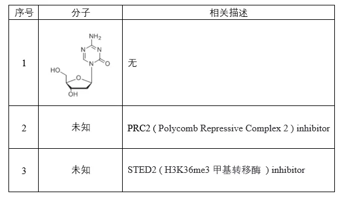
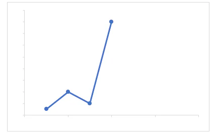

# 2024-2025 学年秋冬学期细胞与生物分子Ⅱ期末回忆卷

> **全中文** · **开卷**
> **2 小时**

!!! info "回忆卷说明"

    本页依据考后回忆整理，不提供参考答案。

---

## 一、辨析题（20 分） {: .exam-section .exam-section--short }
*共 4 题，每题 5 分。*

解释每组名词并写出它们的联系和差异。

1. **miRNA** 与 **siRNA**

2. **substrate-level phosphorylation** 与 **oxidative phosphorylation**

3. **one carbon unit** 与 **S-Adenosylmethionine（SAM）**

4. **chromatin loops** 与 **topologically associated domains**

---

## 二、简答题（20 分） {: .exam-section .exam-section--short }
*共 4 题，每题 5 分。*

1. 写出蛋白质变性且沉淀、蛋白质变性但不沉淀、蛋白质不变性但沉淀的例子各一个。

2. 100 个葡萄糖通过磷酸戊糖途径变为 40 个 5-磷酸-核酮糖，剩下的碳架全部通过磷酸戊糖途径完全氧化为二氧化碳。请计算生成的 NADPH 的总数量。

3. 三组小鼠，先空腹 12 小时。随后 A 组给含有 20 种蛋白质结构氨基酸的饲料；B 组给含除精氨酸的 19 种氨基酸的饲料；C 组给含有除精氨酸的 19 种结构氨基酸但添加鸟氨酸的饲料。发现只有 B 组小鼠氨中毒。回答以下问题：

    1. 为什么要提前空腹 12 小时？
    2. 为什么 B 组小鼠氨中毒？
    3. 为什么 C 组小鼠没有氨中毒？

4. 拓扑异构酶Ⅱ（Topoisomerase Ⅱ）是一类重要的酶。现发现其还可以治疗癌症。请回答以下问题：

    1. 拓扑异构酶Ⅱ有什么效果？
    2. 写两个该酶参与的过程。
    3. 写出其治疗癌症可能的机理。

---

## 三、论述题（30 分） {: .exam-section .exam-section--analysis }
*共 3 题。*

1. 手性分子是指那些就像左手和右手一样互为镜像但不能重合的分子，镜像生命体是指其生物分子的手性与地球上的已知生命形式相反的生命体。有科学家尝试合成“镜像生命体”，请思考“镜像分子”和“镜像生命体”可能带来的机遇和挑战。

2. 一个人被发现醉酒在小巷中，经检验发现他血糖 40 mg/L，血液酒精浓度 0.25 g/L，但是肝功能正常。清醒后了解到该患者长期酗酒，一周内只喝酒，几乎没有进食。请你推测他低血糖的原因和可能的分子机制。

3. HBG1/2 是编码人类胎血红蛋白的基因，随着婴儿的出生和成长，HBG1/2 的表达逐渐减少。增加 HBG1/2 的表达可作为一种治疗镰状细胞贫血的策略。以下三种分子是可能的药物，请简要说明每种分子可能的治疗机制，并分析可能的缺点。

    {: .exam-figure }

---

## 四、解析题（30 分） {: .exam-section .exam-section--analysis }
*共 2 题，每题 15 分。*

1. 研究者将某培养液分为两组，都加入 0.1 M 草酰乙酸。第一组在供氧情况下加入丙酸盐（复合物Ⅱ抑制剂），发现促进了琥珀酸生成；第二组在切断氧气供应（供 $N_2$）下加入丙酸盐，发现抑制了琥珀酸生成。请推测可能的机理。

    !!! note "表格说明"

        原题配有表格，但现有回忆未记录表格内容。

2. 基因 X 在免疫中发挥作用。研究者用一细胞因子进行实验。第一阶段用该因子处理 12 h，发现基因 X 表达上升；第二阶段除去该因子，发现表达下降；第三阶段再添加该因子，发现表达相比第一阶段大幅度升高，如下图所示。请你提出可能的机理的假说并设计实验。

    {: .exam-figure }

    !!! warning "示意图说明"

        现有图片仅用于表示回忆到的变化趋势，并非原题图；不代表原题的具体数值和曲线形态。
