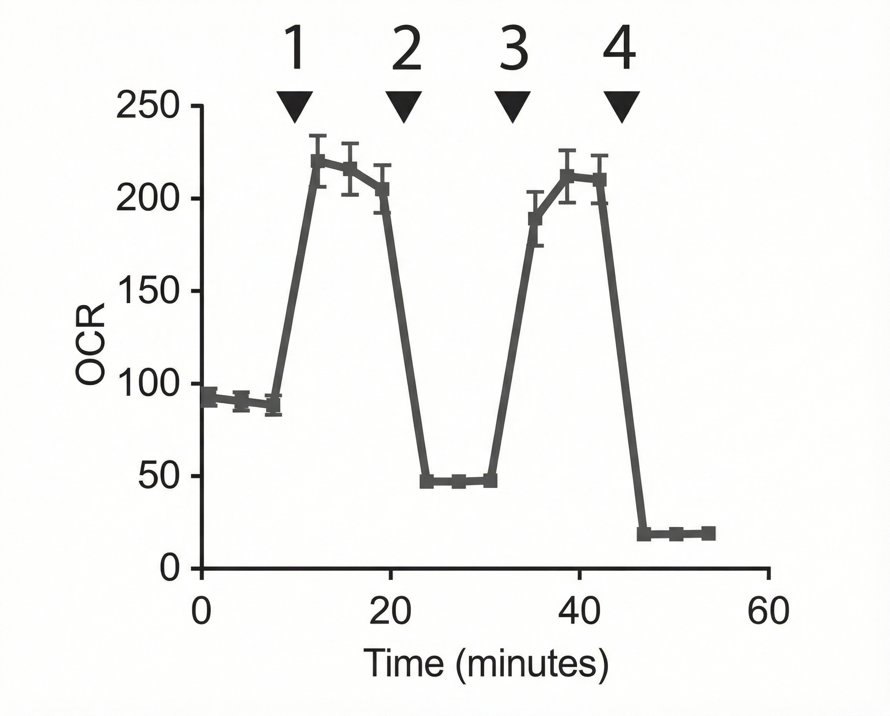

# 2025-2026 学年秋冬学期小测回忆卷

> **形式：** 线下 · 闭卷 · 共 3 次  
> **学期起始：** 本学年第一周周一为 9 月 15 日

=== "第一次小测"

    **教师：** 冯钰　　**日期：** 10 月 12 日（秋五周周一）

    ### 问题 1

    极性中性氨基酸结构

    ### 问题 2

    B 型 DNA 结构特点

    ### 问题 3

    写出米氏方程和各字母解释

=== "第二次小测"

    **教师：** 周龙　　**日期：** 11 月 20 日（冬二周周四）

    ### 问题 1

    当新生儿出现黄疸（血液胆红素升高）时，医生通常会开具葡萄糖-6-磷酸脱氢酶（glucose-6-phosphate dehydrogenase, G6PD）的酶活性检测。请说明该检查的合理性并列举出相关的核心反应过程。（10 分）

    ### 问题 2

    设想一个食物中的甘油三酯分子，其中含有一条单不饱和脂肪酸。该脂肪酸经消化吸收后进入脂肪组织储存，随后在机体需要能量时被动员并最终在心肌中完全氧化供能。请详细描述这一脂肪酸分子所经历的主要化学反应历程，并指出所涉及的主要细胞类型与细胞器位置。（10 分）

    ### 问题 3

    如果你的饮食富含丙氨酸，但是缺乏天冬氨酸，你会出现天冬氨酸缺乏的症状吗？请解释原因。（10 分）

    ### 问题 4

    下图展示了利用纯化的小鼠心肌线粒体测定耗氧速率（Oxygen consumption rate, OCR）的分析实验。实验体系中，氧气、苹果酸和丙酮酸均处于过量状态。在实验过程中，实验者以某种顺序加入了解偶联剂（FCCP）、ATP 合酶抑制剂（Oligomycin）、复合体 III 抑制剂（Antimycin）以及 ADP，引发了耗氧速率的显著变化。请给出四种试剂的加入顺序。（10 分）

    {: .quiz-figure }

=== "第三次小测"

    **教师：** 刘楠　　**日期：** 12 月 29 日（冬八周周一）

    ### 问题 1

    **请回答如下问题（15 分）**

    **（除特别指出外，回答不限中英文，正确即可得分）**

    真核生物染色质的基本结构单元是：______________ （中文），______________ （英文）。

    人类的基因组中存在大量的重复序列，其中一类重复序列的特征是大量在一起的重复，其名称是______________，另一类的每个单元散布在基因组中，称为______________，后者根据转座方式不同又分为两大类，名称分别是______________，______________。

    原核生物 DNA 复制的全酶名称是______________，其中的 α 亚基作用是______________。

    真核生物中负责 mRNA 合成的酶名称是：______________。

    人类基因组中的基因印迹现象，主要有哪些表观遗传机制（修饰）控制：______________。

    人体细胞中，染色体两端的重复序列结构称为______________。DNA 每次复制都会在这里损失一部分 DNA，而在干细胞或生殖细胞中，细胞利用______________酶，通过其______________（活性）延长末端，解决了这一问题。这种酶活性的分子本质是______________-dependent ______________ polymerase。

    ### 问题 2

    大肠杆菌 mRNA 翻译延伸过程中，每个氨酰 tRNA 的合成和掺入肽链需要消耗能量。请列出这个过程中，消耗能量的步骤，参与的关键蛋白质名称，其使用的能量的载体分子和数目（9分）。

    ### 问题 3

    **请解释下面三种组蛋白翻译后修饰名称的含义，并指出其功能（6分）。**

    H3K4me3：

    H3K27me3：

    H3K9ac：
