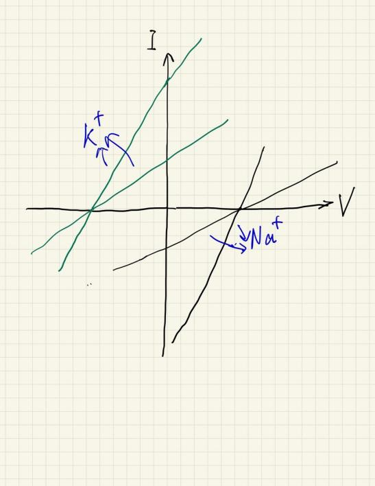

# 2021-2022 学年春夏学期神经科学期末回忆卷

> **2 道必答题、12 选 6 道选答题**  

!!! info "回忆卷说明"

    本页依据考后回忆整理，不提供参考答案。选答题只回忆到 10 道，题图按原记录保留。

---

## 一、必答题（2 题，每题 20 分） {: .exam-section .exam-section--analysis }

1. 叙述在兴奋传导过程中突触前后发生的生物学变化（以谷氨酸能神经元为例）。

2. 根据下图完成下列各问：

    （1）读出 Na+、K+ 的平衡电位；

    （2）计算静息时和受扰动时的 gK/gNa；

    （3）计算静息时和受扰动时的膜电位大小。

    {: .exam-figure }

## 二、选答题（原卷 12 选 6，每题 10 分） {: .exam-section .exam-section--short }

1. 描述星形胶质细胞在调控神经元间信息传递中的作用，主要涉及谷氨酰胺、GABA 和谷氨酸。

2. 解释长颈鹿颈部神经元发育、迁移的现象。

3. 视觉的光感受器细胞有哪几种？比较其结构、分布、功能、对光的敏感性和对颜色的敏锐程度等方面的不同。

4. 什么是本体感觉？有何生理意义？

5. 动作电位的幅度比突触后电位大，为什么 EEG 的主要贡献却是后者？

6. James-Lange 情绪学说与 Cannon-Bard 情绪学说的主要差别是什么？

7. 举例说明视交叉上核（SCN）是生物钟的证据。

8. 结合 Hebb 学习法则，说明 LTP 突触前后增强中 NMDAR 变化的分子机制。

9. 说明社会脑在形态、结构和功能等方面的变化。

10. 什么是光遗传学？其分子机制如何？ChR2、Arch、NpHR 中哪些具有兴奋作用，哪些具有抑制作用？
