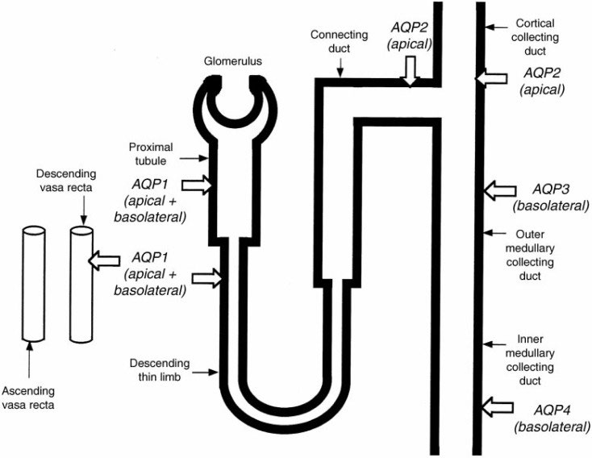

<h1 style="color: black">
<b>$2024$ - $2025$ 学年 人体结构与功能学 期末测试</b>
</h1>

基础医学专业课 回忆卷 
本卷题目中英对半，中英分布遵循原卷. 闭卷. 共 68 道题目. 满分 100 分，时间 2 小时

---

### 一、 单项选择题（60 分）  

*共60题，每题五个选项，每题1分*  

1.	神经嵴的作用不包括以下哪项？  
**A.** 介导体节的分化  
**B.** 参与头尾轴形成  
**C.** 参与椎间盘髓核的形成  
**D.** 参与颅面骨板的发育  
**E.** 形成外周神经系统  
   

2.	Which of the following statements about the ovary is incorrect?  
**A.** A constant endocrine gland secreting estrogen and progesterone  
**B.** Lies between the internal and external iliac arteries  
**C.** Located in the ovarian fossa  
**D.** Covered by peritoneum on its surface  
**E.** Develops from the paramesonephric duct  
   

3.	一名新生儿因肚子微胀被检查发现无肛门，推测其母亲在孕早期发烧导致此畸形。根据胚胎发育规律，该畸形最可能发生在末次月经计算的哪一周？  
**A.** 1-2  
**B.** 3-4  
**C.** 9-10  
**D.** 19-20  
**E.** 29  
   

4.	A woman undergoes an abdominal examination immediately after breakfast while lying supine (on her back). Which of the following organs is most likely to be palpable or auscultated under these conditions?  
**A.** Stomach  
**B.** Pancreas  
**C.** Kidney  
**D.**   
**E.**   
   

5.	关于甲状腺的描述错误的是  
**A.** 人体最大的内分泌器官  
**B.** 甲状腺峡部通常位于第 2-4 气管软骨前方  
**C.** 在 C1-C2 椎体的位置  
**D.** 分泌三碘甲状腺原氨酸（T3）和甲状腺素（T4）  
**E.** 甲状腺滤泡上皮细胞是甲状腺激素合成的主要细胞  
   

6.	甲状腺滤泡的形态与其功能状态密切相关，关于甲状腺滤泡旁细胞的描述，正确的是  
**A.** 甲状腺分泌活跃时，滤泡旁细胞变扁平，滤泡腔缩小  
**B.** 甲状腺分泌不活跃时，滤泡旁细胞呈立方或柱状，滤泡腔变大  
**C.** 甲状腺分泌活跃时，滤泡旁细胞呈高柱状，滤泡腔变大  
**D.** 甲状腺分泌不活跃时，滤泡旁细胞变扁平，滤泡腔缩小  
**E.** 其形态与功能状态无关  
   

7.	The alveolus is mainly composed of which of the following?  
**A.** Elastic fibers  
**B.** Reticular fibers  
**C.** Collagen fibers  
**D.** Type I pneumocytes  
**E.** Type II pneumocytes  
   

8.	Which of the following statements about the thymus is correct?  
**A.** Located anterior to the 2nd-4th thoracic vertebrae  
**B.** Secretes thymosin  
**C.** Site of B lymphocyte differentiation  
**D.**  
**E.**  
   

9.	What is the basic structural and functional unit of the kidney?  
**A.** Glomerulus  
**B.** Renal pyramid  
**C.** Nephron  
**D.** Collecting duct  
**E.** Renal pelvis  
   

10.	Which transporter mediates NaCl reabsorption in the thick ascending limb of the loop of Henle?  
**A.** $\mathrm{Na^+/K^+}$ ATPase  
**B.** $\mathrm{Na^+/H^+}$ exchanger  
**C.** $\mathrm{Na^+-K^+-2Cl^−}$ cotransporter  
**D.** $\text{ACP}$  
**E.** Mineralocorticoid receptor  
   

11.	肾上腺  
**A.** 是腹膜内器官  
**B.** 分泌肾素  
**C.** 髓质分泌肾上腺素  
**D.** 束状带和网状带分泌醛固酮  
**E.** 球状带分泌糖皮质激素  
   

12.	下列哪种激素主要促进肾小管对钠离子的重吸收？  
**A.** 醛固酮（Aldosterone）  
**B.** 抗利尿激素（ADH）  
**C.** 心房利钠肽（ANP）  
**D.** 甲状旁腺激素（PTH）  
**E.** 血管紧张素 II（Angiotensin II）  
   

13.	Which vein drains the gallbladder?  
**A.** Hepatic portal vein  
**B.** Inferior vena cava  
**C.** Splenic vein  
**D.** Superior mesenteric vein  
**E.** Hepatic veins  
   

14.	关于近端小管重吸收的特点，正确的是：  
**A.** 选择性吸收葡萄糖和氨基酸  
**B.** 主动重吸收钠离子并伴随被动重吸收水  
**C.** 通过渗透作用重吸收尿素  
**D.** 高度依赖管周毛细血管的胶体渗透压  
**E.** 参与肾小管-间质旁路重吸收  
   

15.	子宫内膜增生的主要促进激素是：  
**A.** 雌激素  
**B.** 孕激素  
**C.** 黄体生成素（LH）  
**D.** 促卵泡激素（FSH）  
**E.**  
   

16.	肺换气的直接动力是：  
**A.** 气体扩散  
**B.** 呼吸膜的通透性  
**C.** 扩散系数  
**D.** 肺内负压  
**E.**  
   

17.	The primary mode of carbon dioxide ($\mathrm{CO_2}$) transport in the blood is:  
**A.** $\mathrm{H_2CO_3}$  
**B.** Bound to plasma proteins  
**C.** $\mathrm{HCO_3^-}$  
**D.** carbaminohemoglobin  
**E.** $\mathrm{CO_2}$  
   

18.	肺通气的直接动力是什么？  
**A.** 肺的顺应性  
**B.** 呼吸运动引起的胸廓容积变化  
**C.** 胸廓的弹性回缩力  
**D.** 肺泡表面活性物质的作用  
**E.** 气道阻力  
   

19.	氧气在血液中的主要运输方式是什么？  
**A.** 直接溶解于血浆中  
**B.** 与血红蛋白结合形成氧合血红蛋白  
**C.** 以碳酸氢盐形式运输  
**D.** 通过细胞外液扩散运输  
**E.** 与白蛋白结合运输  
   

20.	结肠看不到下列哪种组织？  
**A.** 腺体组织  
**B.** 脂肪组织  
**C.** 骨骼肌  
**D.** 神经丛  
**E.** 浆膜  
   

21.	关于胰岛的描述，下列哪项正确？  
**A.** 胰岛素是目前发现唯一的降血糖激素  
**B.** 胰岛A细胞和B细胞均分泌胰岛素  
**C.** 胰岛的内分泌细胞与外分泌细胞数量相近  
**D.**   
**E.**   
   

22.	Which of the following is the function of the acrosome reaction（顶体反应）?  
**A.** Prevents polyspermy  
**B.**   
**C.**  
**D.**  
**E.**  
   

23.	垂体门脉系统的主要作用是？  
**A.** 为垂体组织提供营养物质  
**B.** 将下丘脑分泌的释放激素传递至垂体前叶  
**C.**  
**D.**   
**E.**   
   

24.	甲状腺滤泡旁细胞分泌的激素是？  
**A.** 降钙素  
**B.** 甲状腺素（T4）  
**C.** 甲状旁腺激素（PTH）  
**D.** 皮质醇  
**E.**  
   

25.	某同学看见吃羊肉烧烤吞咽并流口水的反射活动，其神经通路不涉及以下哪项？  
**A.** 视神经  
**B.** 舌咽神经  
**C.** 三叉神经  
**D.** 面神经  
**E.** 泌涎核  
   

26.	Which of the following is not part of the respiratory portion of the lung?  
**A.** Respiratory bronchioles  
**B.** Terminal bronchioles  
**C.** Alveoli  
**D.** Alveolar sacs  
**E.** Alveolar ducts  
   

27.	The mucosal epithelium of the trachea develops from which embryonic layer?  
**A.** Ectoderm  
**B.** Endoderm  
**C.** Mesoderm  
**D.** Neuroectoderm  
**E.** Trophoblast  
   

28.	控制胃的神经丛主要位于以下哪个部位？  
**A.** 贲门  
**B.** 胃底  
**C.** 幽门  
**D.** 胃体  
**E.** 胃窦  
   

29.	Which cell type secretes pulmonary surfactant（表面活性物质）?  
**A.** Type I pneumocytes  
**B.** Type II pneumocytes  
**C.** Alveolar macrophages  
**D.** Capillary endothelial cells  
**E.** Fibroblasts  
   

30.	关于细支气管的结构特征，下列说法正确的是  
**A.** 没有杯状细胞和软骨环，但有完整的平滑肌  
**B.** 有大量杯状细胞  
**C.** 上皮为假复层纤毛柱状上皮  
**D.** 管壁存在完整的软骨环  
**E.**   
   

31.	下列结构中，哪一项具有假复层纤毛柱状上皮？  
**A.** 气管  
**B.** 食管  
**C.** 胃  
**D.** 小肠  
**E.**  
   

32.	肾上腺髓质分泌什么激素  
   

33.	肾上腺皮质只分泌皮质激素  
   

34.	雄激素是什么细胞分泌的  
   

35.	孕激素是什么分泌的  
   

36.	食管的上皮类型  
 

---

### 二、 简答题（24 分）  
*共6题，每题4分*  

1. Please briefly describe the mechanical and chemical digestions of rice.  
  

2. What are the structural characteristic of cells that secrete peptide/protein hormones and steroid hormones （肽类/蛋白质类激素与甾体类激素）? What is the characteristic of the transport and action model of the hormones?  
  

3. 肺内的结构，从主支气管开始到肺泡，管壁中哪些组织学成分发生了哪些变化？  
  

4. 什么是波尔效应与何尔登效应？与肺循环和体循环的气体交换有什么关系？  
  

5. 肾小球滤过的结构包括哪些？有效过滤压如何产生？  
  

6. What parts does the seminiferous tubule（生精小管）wall structure include? What is the main cellar component?  
  

---

### 三、分析题（16 分）  
*共2题，每题8分*  

1. 有一学生，18岁，自3月每天服用奥利司他（减肥药，抑制胃肠道的脂肪酶），体重下降 15kg 大便频繁，量多，近一周乏力。端午节因腹痛被家长送医，查体得：身高 174cm，体重 54kg，血红蛋白 100g/L（正常 110-140），血钾 3.2mmol/L（正常 3.3-3.5），肝功能正常，大便常规检查显示，色黄，稀水样，表面有油腻光泽。初诊为：吸收不良综合征，请：  
(1) 判断该生营养状况并阐明理由  
(2) 试用脂肪消化吸收部位和过程解释该疾病异常检测结果产生机理  
   

2. Because of the hot weather, a students drank a bottle of water (500 mL) in a short time.  
(1) What change will occur in the osmotic pressure（渗透压）of the students' urine compared with normal drinking water?  
(2) In the figure below, AQP means 水通道蛋白, based on the figure, explain the mechanism of the change.  

    {: style="display: block; margin: 0 auto; max-width: 70%; height: auto;"}
    
    
    
       
