# 2024-2025 学年夏学期解剖学实验考试题目整理

> **2025 年 6 月 7 日 19:00—19:15** · **线上图片填空** · **16 题** · **16 分** · **1 次作答机会**

!!! info "试题说明"

    本页依据课程平台保存页整理。保存页采用随机作答顺序，本页按照题图中标注的原题号恢复为第 1—16 题。答案来自课程平台公布的正确答案；同一题列出多个答案时，表示平台接受这些同义写法，并非多个空。

1. 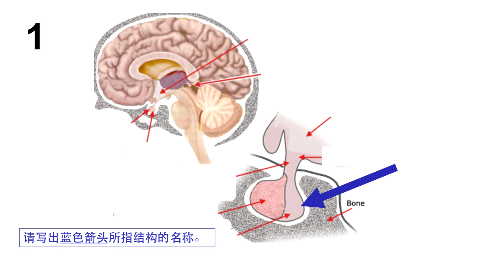{: .quiz-figure }

    

    
查看答案

    **课程平台列出的正确答案：** 垂体后叶；神经垂体

    

2. 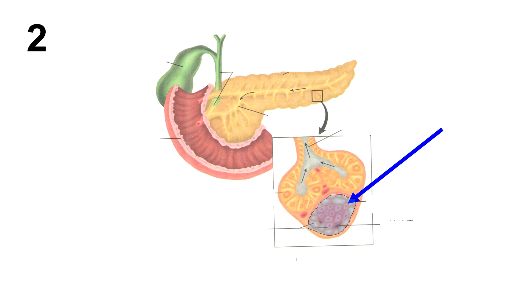{: .quiz-figure }

    

    
查看答案

    **答案：胰岛**

    

3. 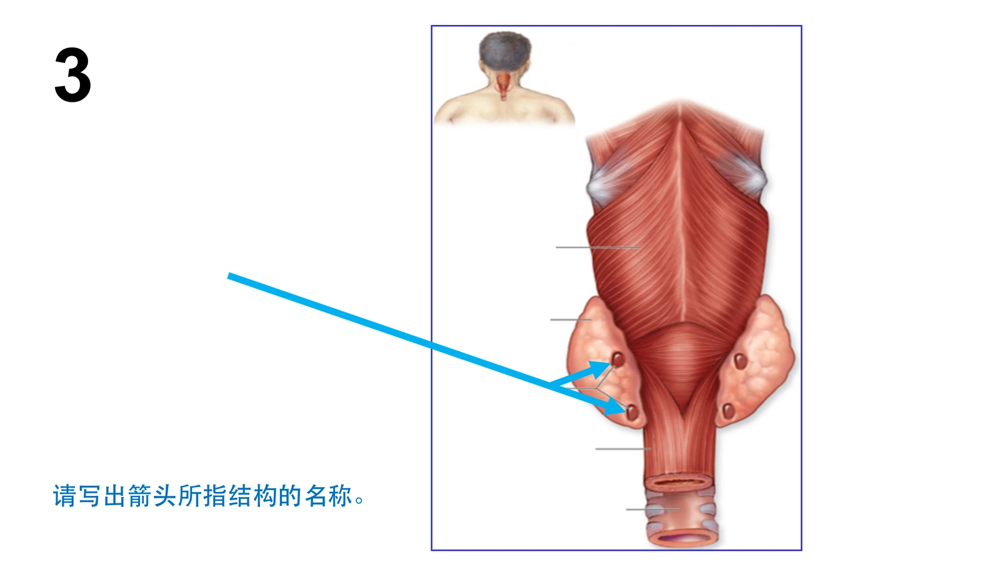{: .quiz-figure }

    

    
查看答案

    **答案：甲状旁腺**

    

4. 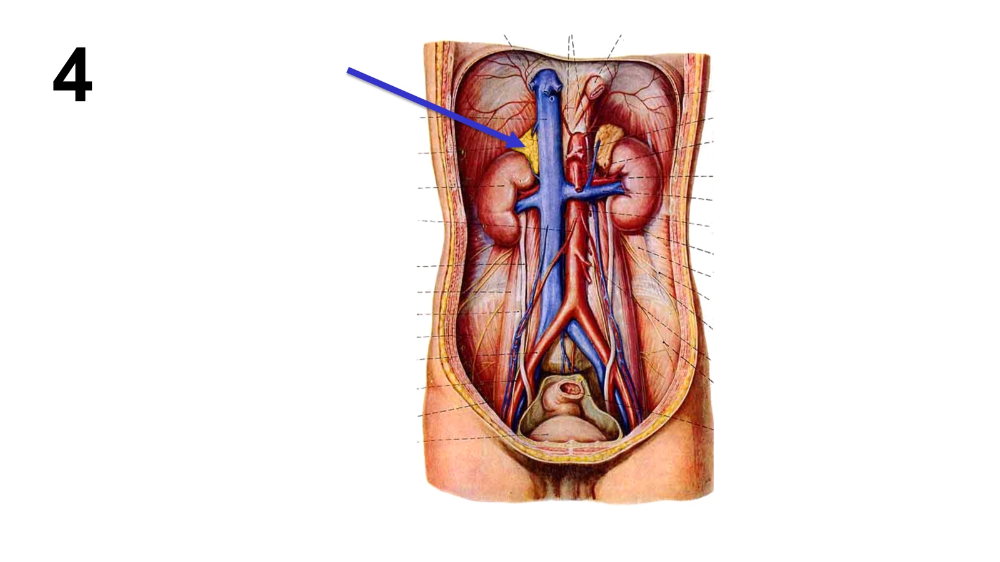{: .quiz-figure }

    

    
查看答案

    **课程平台列出的正确答案：** （右）肾上腺；右肾上腺；肾上腺

    

5. 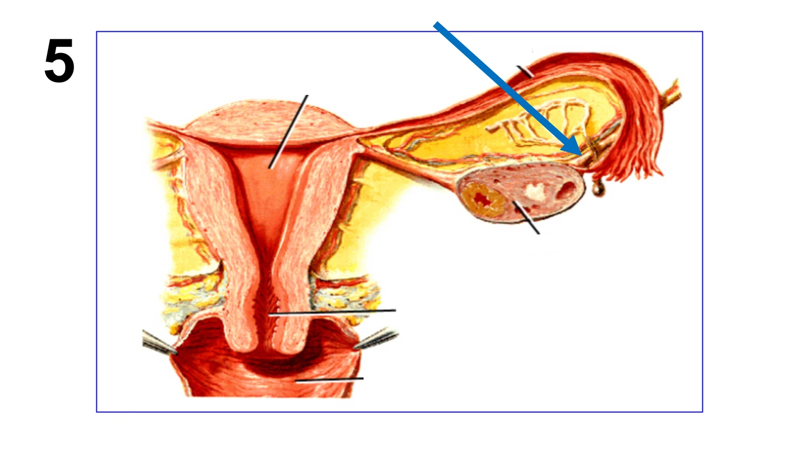{: .quiz-figure }

    

    
查看答案

    **答案：卵巢悬韧带**

    

6. 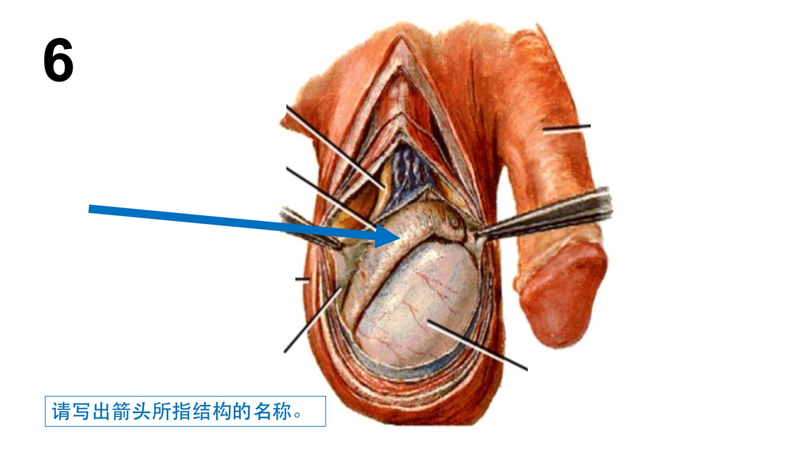{: .quiz-figure }

    

    
查看答案

    **答案：附睾**

    

7. 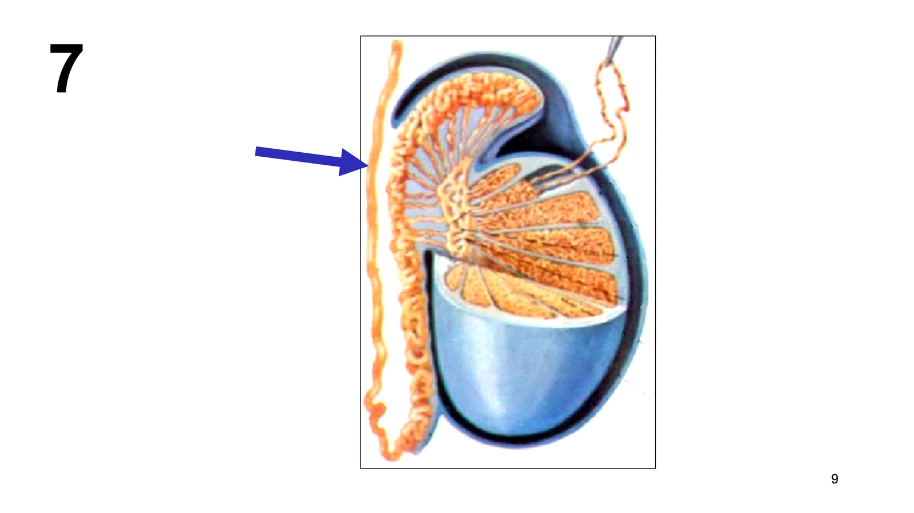{: .quiz-figure }

    

    
查看答案

    **答案：输精管**

    

8. 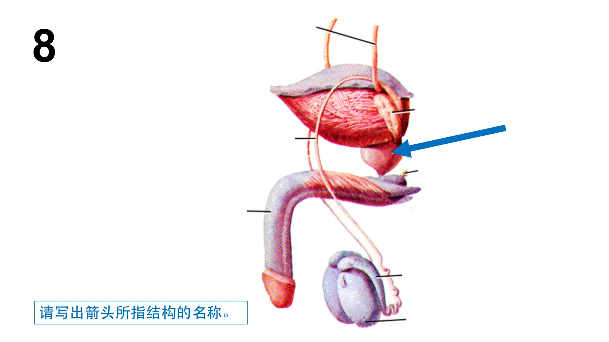{: .quiz-figure }

    

    
查看答案

    **答案：前列腺**

    

9. 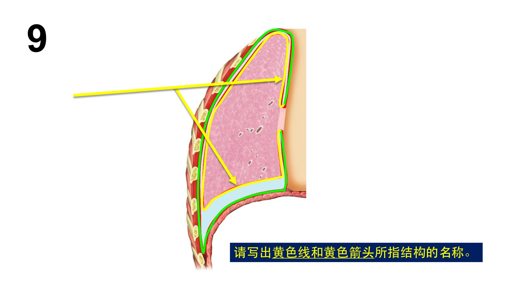{: .quiz-figure }

    

    
查看答案

    **答案：脏胸膜**

    

10. 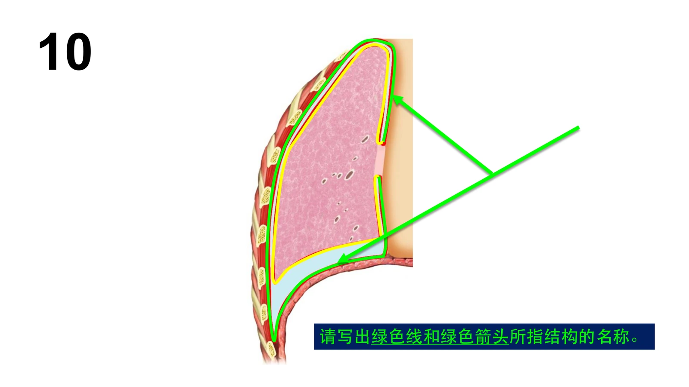{: .quiz-figure }

    

    
查看答案

    **答案：壁胸膜**

    

11. 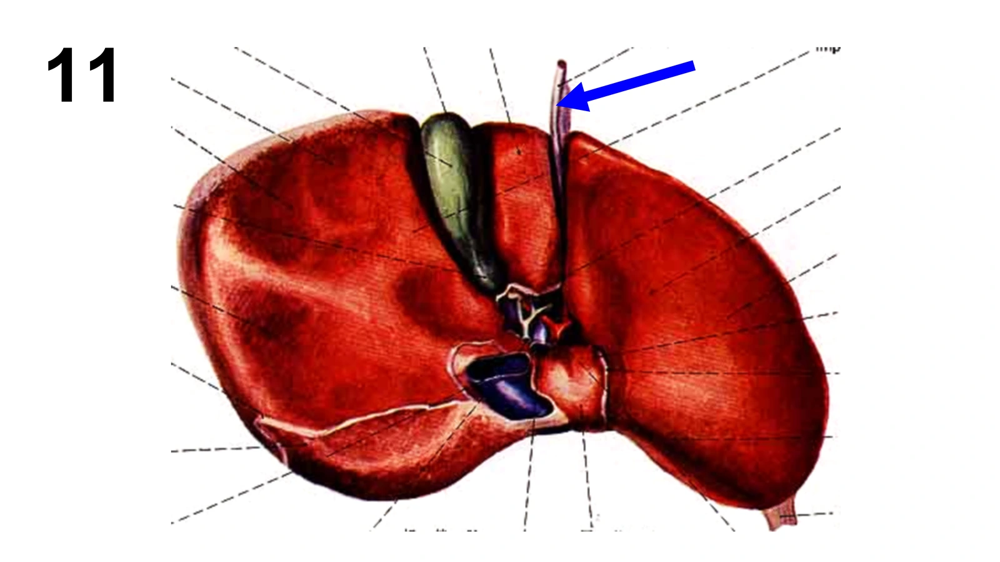{: .quiz-figure }

    

    
查看答案

    **答案：肝圆韧带**

    

12. 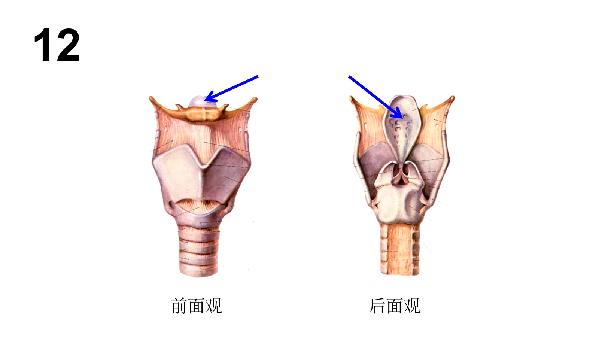{: .quiz-figure }

    

    
查看答案

    **课程平台列出的正确答案：** 会厌软骨；会厌

    

13. 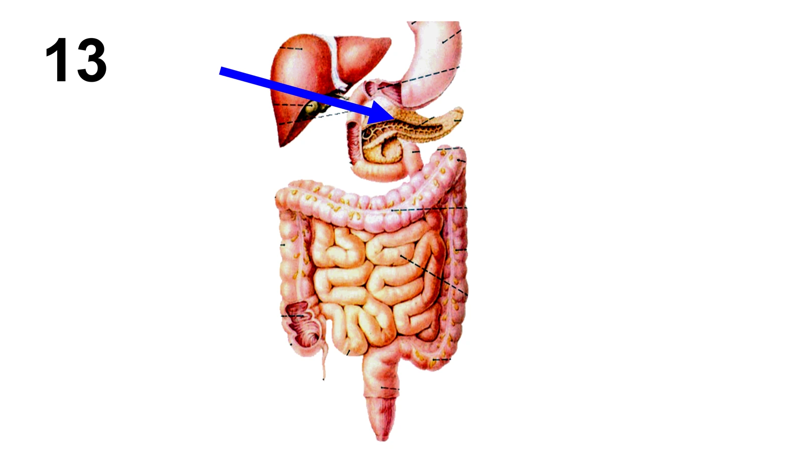{: .quiz-figure }

    

    
查看答案

    **课程平台列出的正确答案：** 胰腺；胰

    

14. 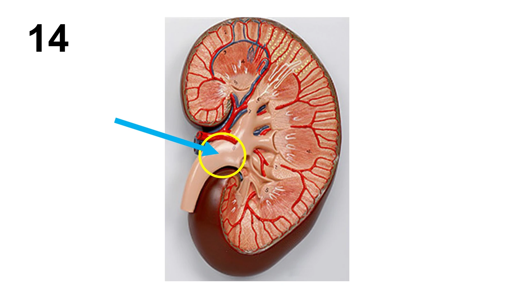{: .quiz-figure }

    

    
查看答案

    **答案：肾盂**

    

15. 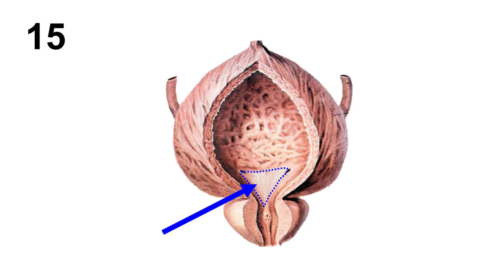{: .quiz-figure }

    

    
查看答案

    **答案：膀胱三角**

    

16. 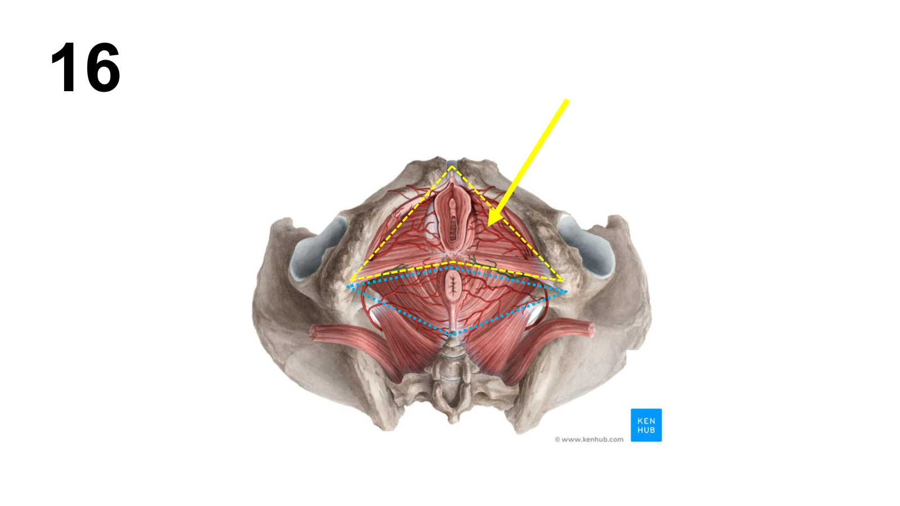{: .quiz-figure }

    

    
查看答案

    **课程平台列出的正确答案：** 尿生殖三角；尿生殖区

    

