# 2025-2026 学年春学期解剖学实验考试（回忆整理）

<!--
source-attribution
回忆整理及上传：朱晓彤。
原始出处：钉钉群分享的《解剖第一次小测.pptx》。
资料性质：根据测验记忆从教师课件中重新找图整理，非现场使用的原始 PPT。
整理说明：共 16 题，每张题图 40 秒，要求写出结构名称；题号沿用回忆稿，图片裁切与标注可能与现场不同。
附注性质：有关实际出题范围的说明来自提供同学的回忆。
来源记录：RS-074、FILE-001。
-->

> **16 题** · **每张题图 40 秒** · **写出结构名称**

!!! info "资料来源说明"

    本页不是当时考试现场使用的原始 PPT。题图由朱晓彤同学根据参加考试时的记忆，从教师课件中重新找出并整理，用于帮助回忆当时考查的内容。题号和排列沿用这份回忆整理，图片的裁切、标注和题目表述可能与现场不同。

    春学期考试共 16 题，每张题图展示 40 秒，要求写出结构名称。

!!! note "提供同学附注"

    据提供同学回忆，实际出题范围可能超出此前说明的复习范围：当时原先说只考前两次作业内容，实际也考到了第三次作业。后续考试范围仍以当年课程通知为准。

1. 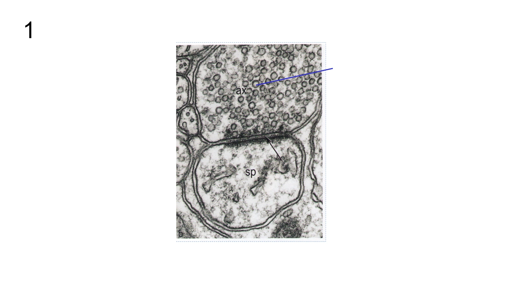{: .quiz-figure }

2. 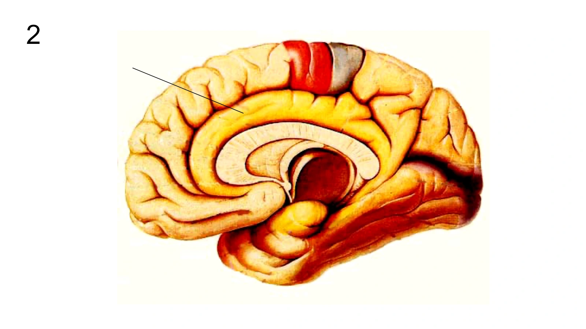{: .quiz-figure }

3. 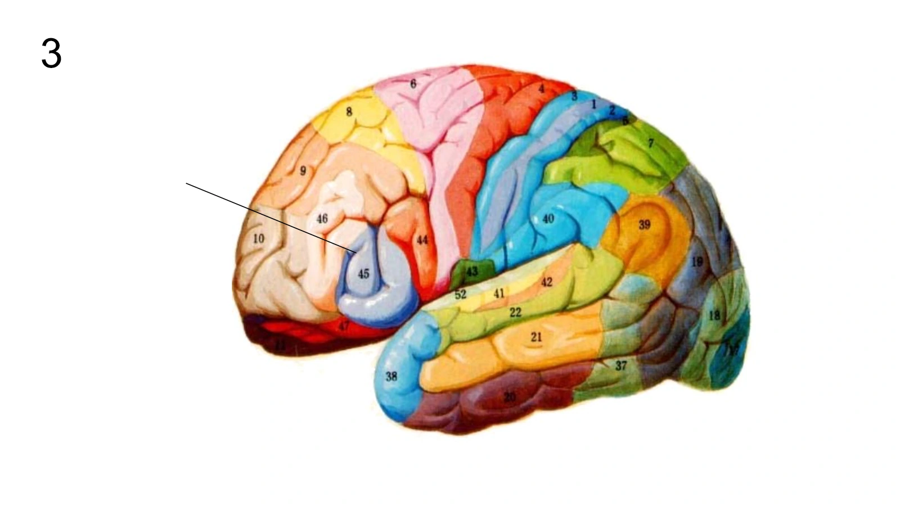{: .quiz-figure }

4. 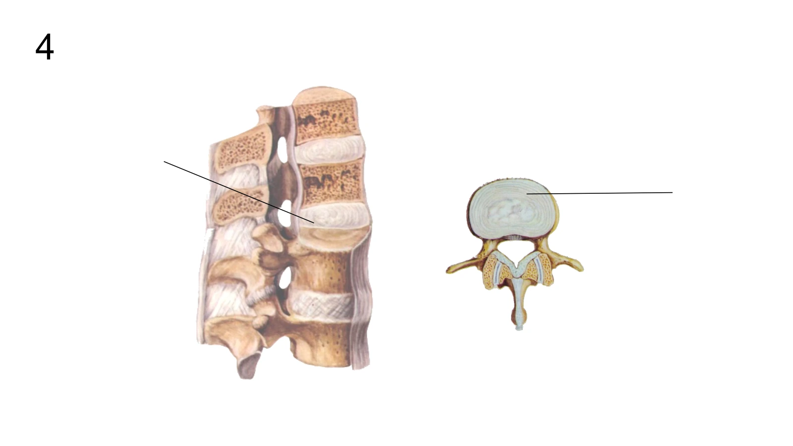{: .quiz-figure }

5. 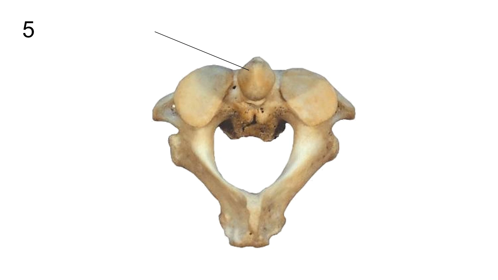{: .quiz-figure }

6. 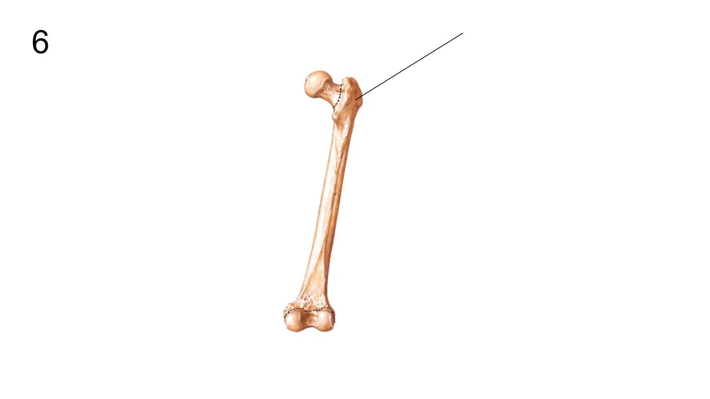{: .quiz-figure }

7. 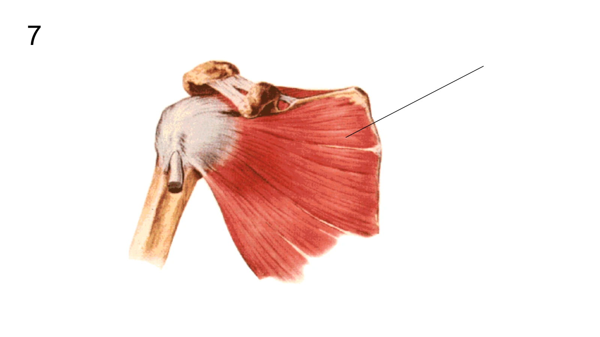{: .quiz-figure }

8. 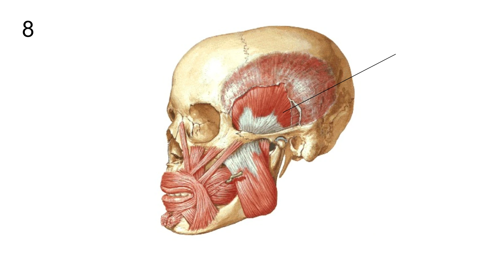{: .quiz-figure }

9. 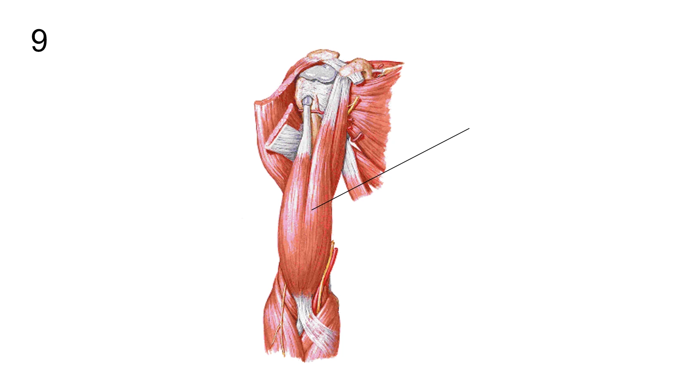{: .quiz-figure }

10. 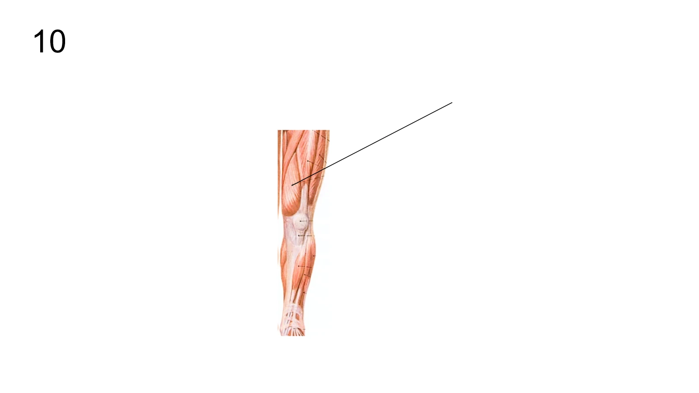{: .quiz-figure }

11. 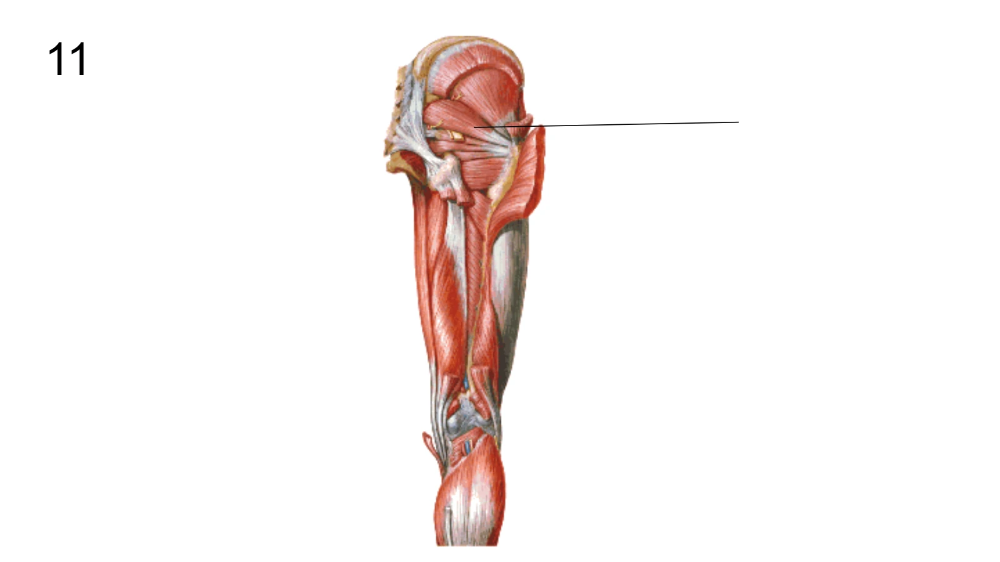{: .quiz-figure }

12. 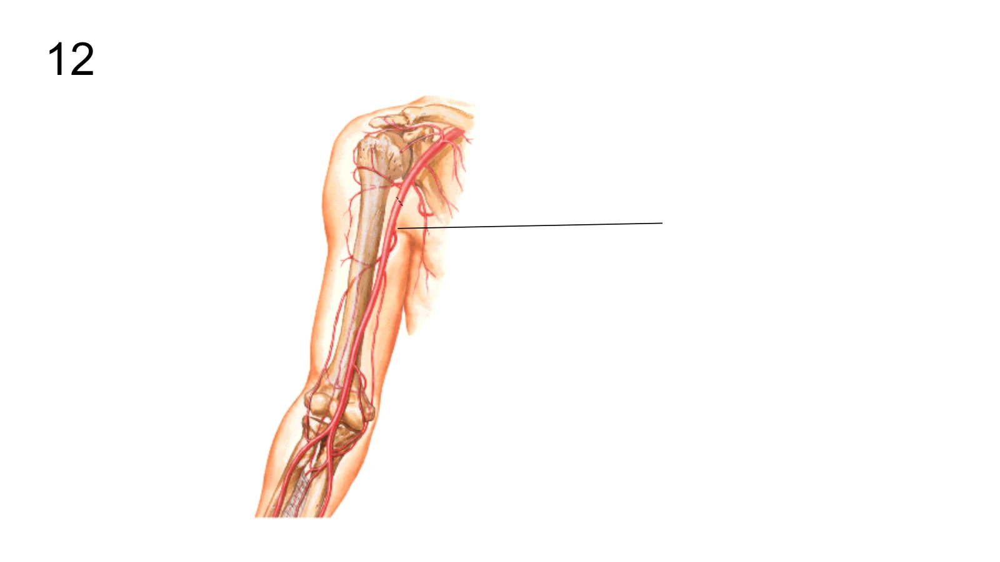{: .quiz-figure }

13. 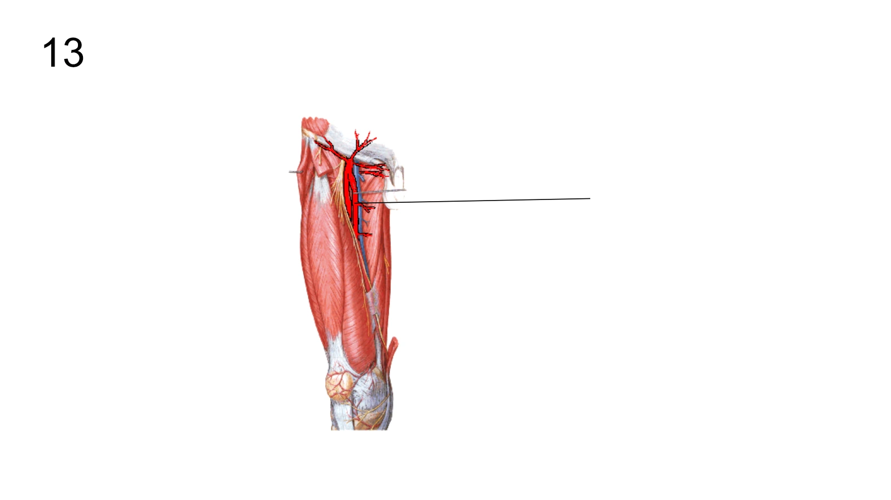{: .quiz-figure }

14. 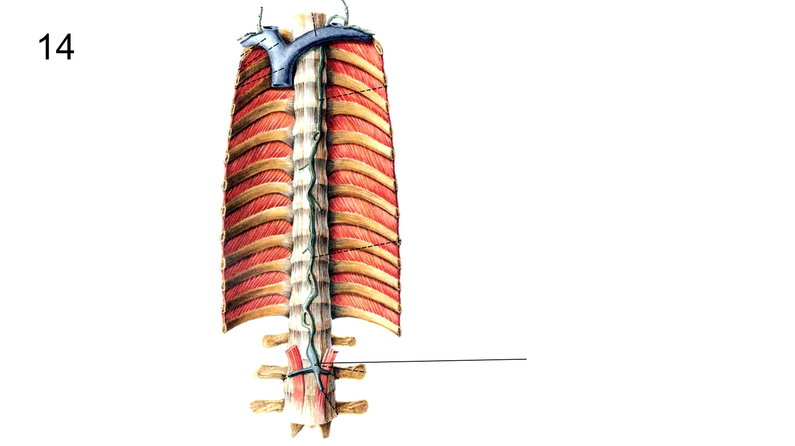{: .quiz-figure }

15. 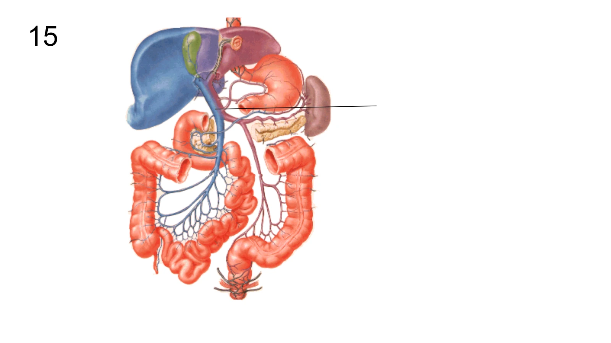{: .quiz-figure }

16. 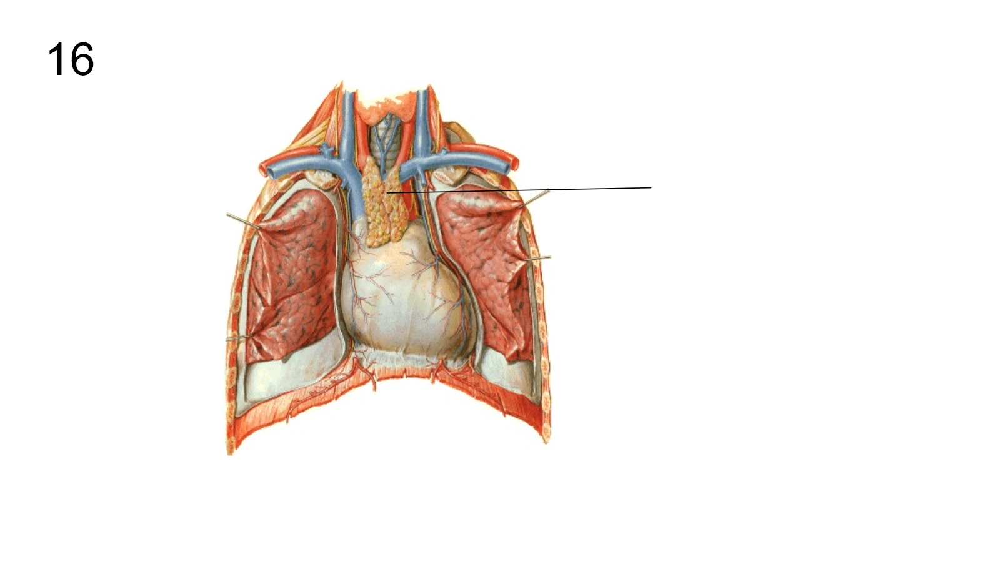{: .quiz-figure }
