# 2025-2026 学年夏学期解剖学标本测验（回忆整理）

!!! info "资料来源说明"

    本页不是当时测验现场使用的原始 PPT。题图由朱晓彤同学根据参加测验时的记忆，从教师课件中重新找出并整理，用于帮助回忆当时考查的内容。题号和排列沿用这份回忆整理，图片的裁切、标注和题目表述可能与现场不同；整理材料未附答案，本站不补写答案。

1. 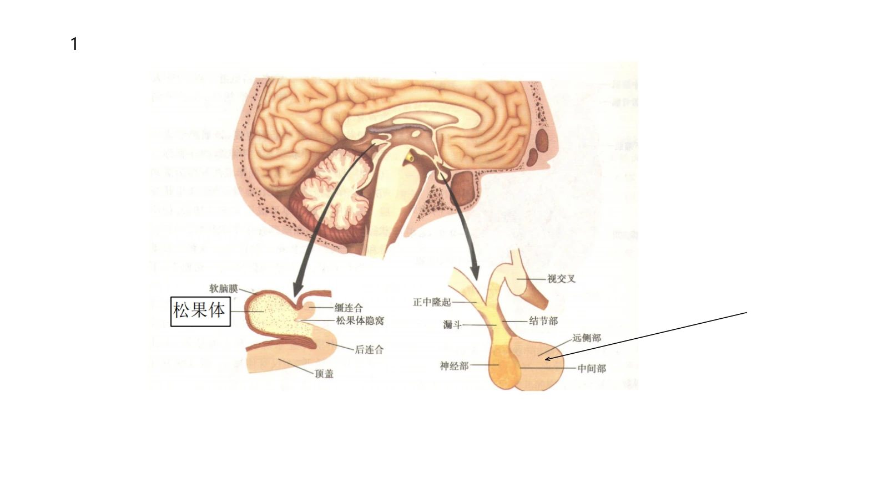{: .quiz-figure }

2. 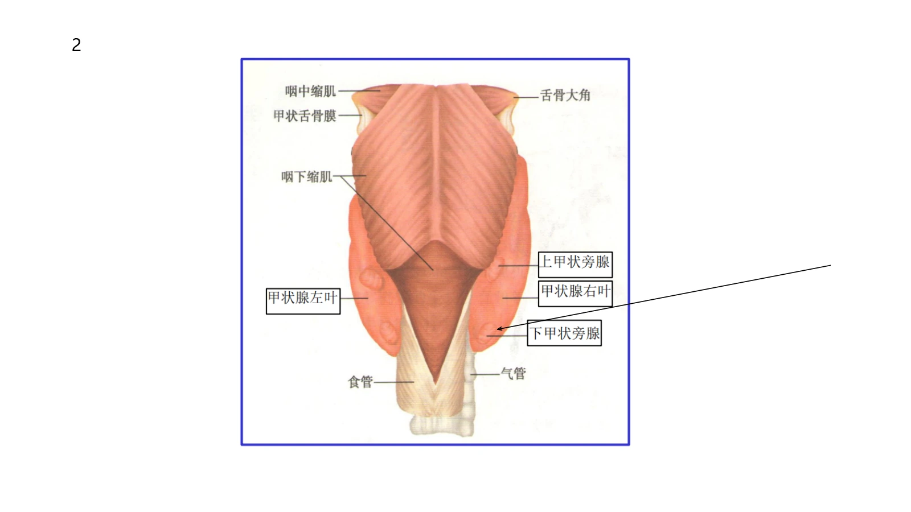{: .quiz-figure }

3. 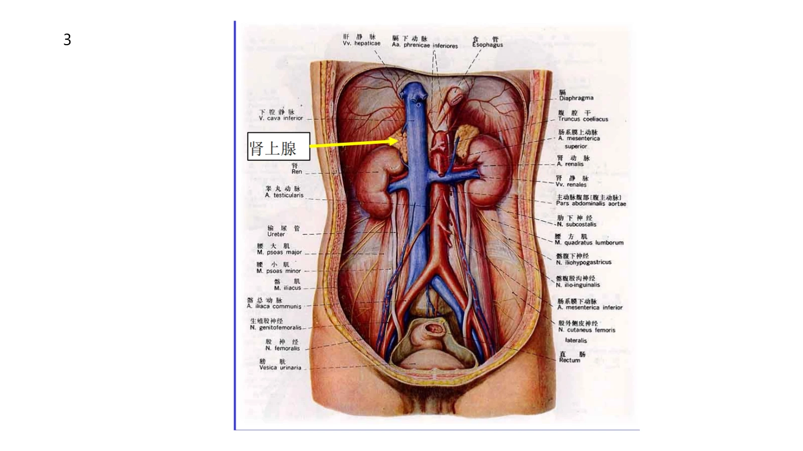{: .quiz-figure }

4. 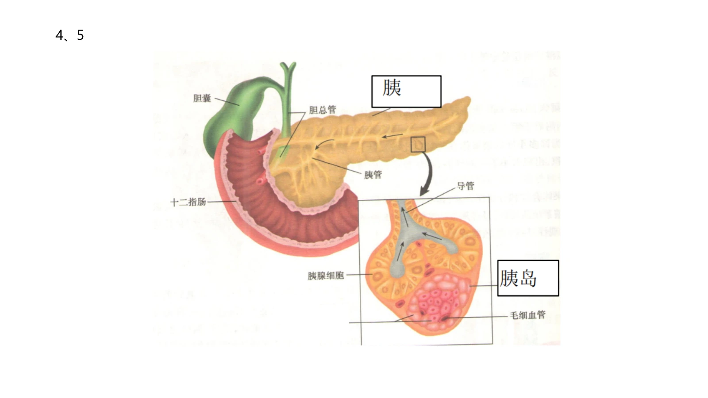{: .quiz-figure }

5. 与第 4 题共用上图。

6. 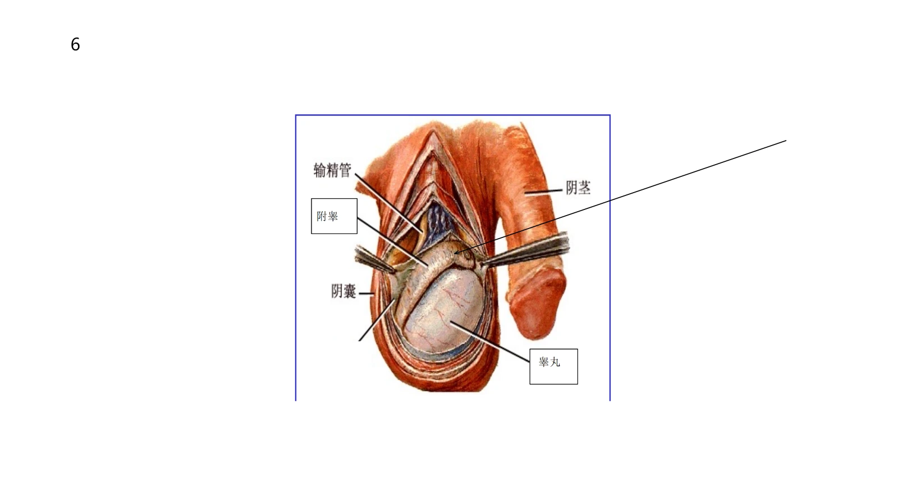{: .quiz-figure }

7. 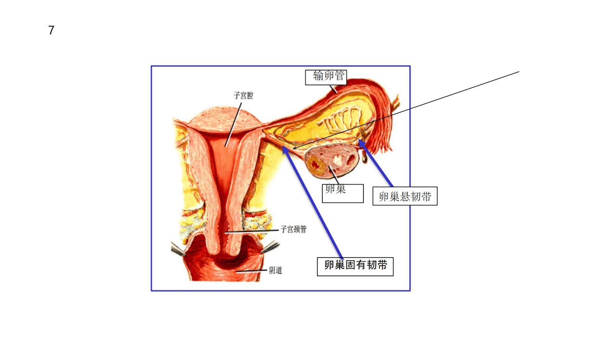{: .quiz-figure }

8. 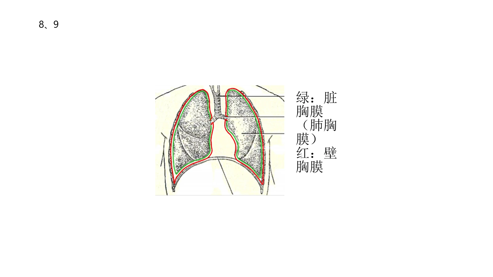{: .quiz-figure }

9. 与第 8 题共用上图。

10. 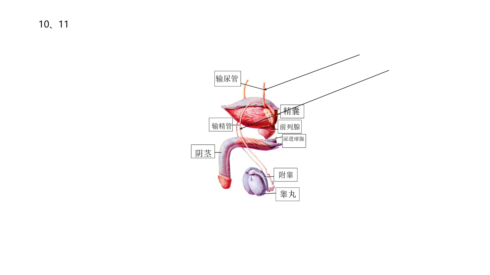{: .quiz-figure }

11. 与第 10 题共用上图。

12. 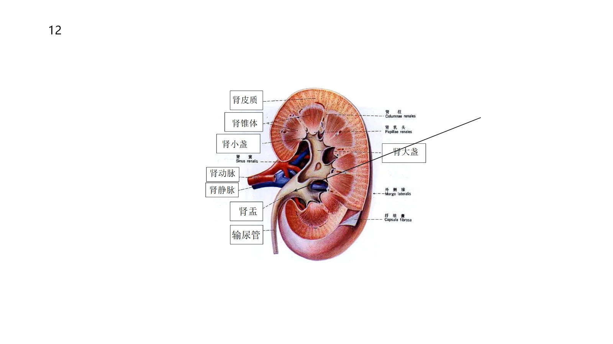{: .quiz-figure }

13. 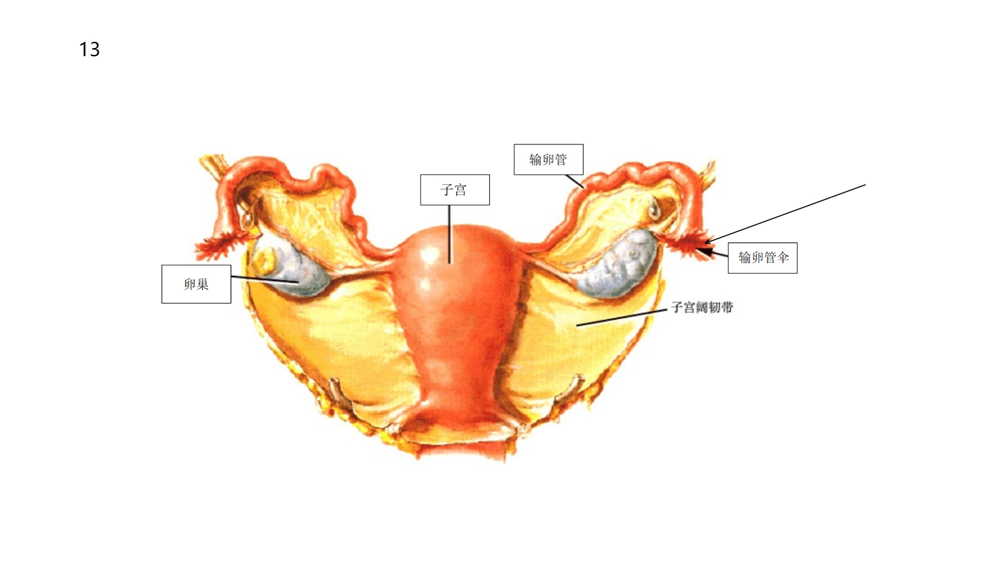{: .quiz-figure }

14. 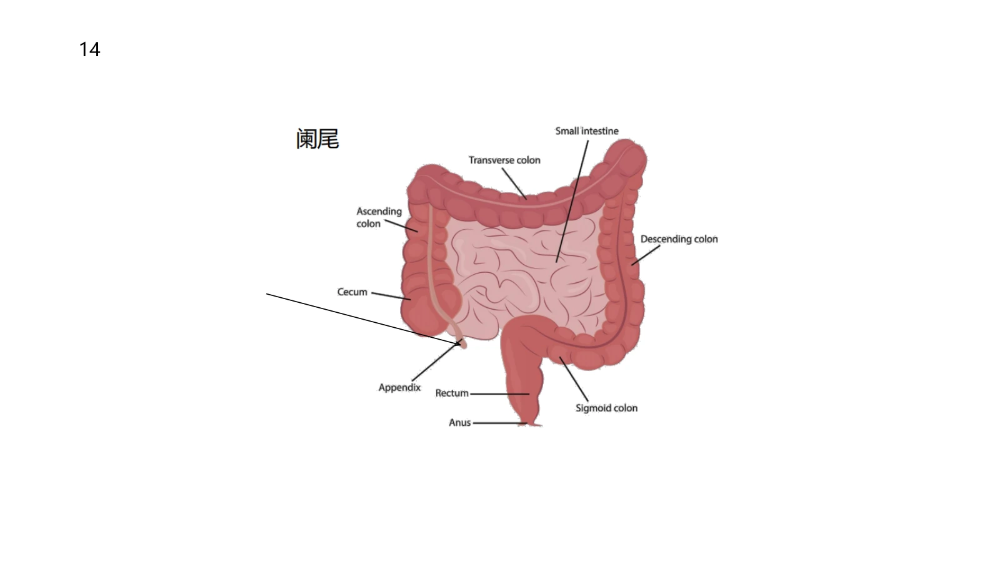{: .quiz-figure }

15. 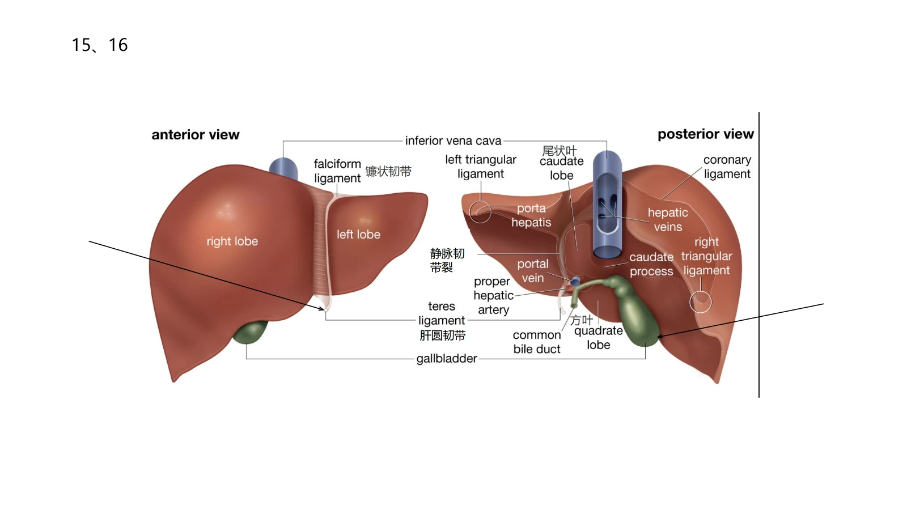{: .quiz-figure }

16. 与第 15 题共用上图。
