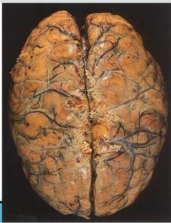
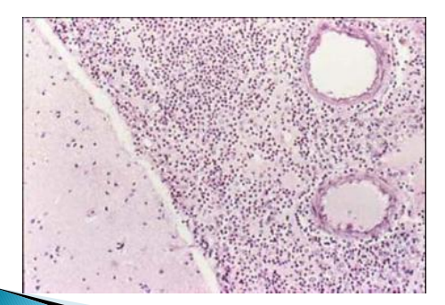

# 2022-2023 学年秋冬学期疾病基础期末回忆卷

<!--
source-attribution
贡献者：李鹏辉（制作、整理）；谷雨桦（资料上传）。
原始出处：《疾病基础期末考试回忆卷-2023.2.19-李鹏辉.docx》。
资料性质：考后回忆卷。
来源记录：RESOURCE-AUDIT-FEEDBACK-20260908 / R06。
-->

!!! info "回忆卷说明"

    题目按回忆记录顺序排列，不代表原卷题号。选项字母沿用原记录；“—”表示原记录未写出的其余选项，可能不止一项。存疑表述保留原貌。

---

## 一、选择题 {: .exam-section .exam-section--choice }

*原卷共 50 题，以下收录 28 条回忆。*

1. 一个妇女满月分娩，但是分娩过后出现紫绀、呼吸困难、肺气肿（有点忘记是肺气肿还是肺水肿了），最终死亡。请问可能是什么因素导致该情况的发生？

    **A.** 羊水栓塞  
    **B.** 脂肪栓塞  
    **C.** 空气栓塞  
    **D.** —

2. 预防原发性高血压最应该降低以下何种物质的摄入？

    **A.** 动物蛋白  
    **B.** 脂肪  
    **C.** 糖  
    **D.** 盐  
    **E.** 酒

3. 以下关于蛋白后修饰，说法错误的是？

    **A.** 蛋白的磷酸化修饰可以被蛋白磷酸酶去除  
    **B.** 泛素化后的蛋白可以被去泛素化酶逆转

4. 以下说法错误的是？

    **A.** GPCRs 可以由配体调控  
    **B.** GPCRs 可以被磷酸化调控  
    **C.** GPCRs 可以被 G 蛋白调控  
    **D.** GPCRs 可以与腺核苷可逆结合  
    **E.** —

5. 请问内生致热源作用于谁？

    **A.** EP generating cells  
    **B.** POAH  
    **C.** OVLT  
    **D.** —

6. 为什么怀孕时子宫会扩张？

    **A.** 子宫平滑肌肥大  
    **B.** 子宫内膜增殖  
    **C.** —

7. 以下什么疾病是由受体异常导致的？

    **A.** 弥漫性甲状腺肿  
    **B.** 假性甲状腺功能减退症  
    **C.** 巨人症  
    **D.** 肢端肥大症  
    **E.** —

8. 急性肾盂肾炎与慢性肾小球肾炎不同在什么地方？

    **A.** 有不对称的大瘢痕  
    **B.** —

9. 一个人喜欢喝酒，有一天突然 chest pain，并且皮下出现“蜘蛛痣”，请问他患有什么疾病？

    **A.** Cirrhosis  
    **B.** Hepatitis  
    **C.** —

10. 一个儿童，患有肾病，但是检查发现肾小球结构正常，只是肾小球中有脂肪增多，请问该儿童得了什么病？

    **A.** 微小病变性肾小球病变  
    **B.** 局灶性节段性肾小球硬化  
    **C.** —

11. 急性蜂窝织炎性阑尾炎/急性化脓性阑尾炎 acute phlegmonous appendicitis 以什么细胞浸润为主？

    **A.** 中性粒细胞  
    **B.** 浆细胞  
    **C.** 嗜酸性粒细胞  
    **D.** —

12. 黄嘌呤氧化酶和黄嘌呤还原酶之间需要什么离子的参与？

    **A.** 铜离子  
    **B.** 钙离子  
    **C.** 钠离子  
    **D.** 锌离子  
    **E.** 铁离子

13. 重症肝炎以什么炎性细胞浸润为主？

    **A.** 中性粒细胞  
    **B.** 浆细胞  
    **C.** 淋巴细胞  
    **D.** —

14. 如何判断是否是门脉性肝硬化？

    **A.** 活检看是否有假小叶  
    **B.** 血检  
    **C.** —

15. 什么可以反映血浆的 pH？

    **A.** HCO3-/H2CO3  
    **B.** Hb/HbO2  
    **C.** —

16. 绒毛癌特征，以下说法正确的是？

    **A.** 有绒毛  
    **B.** 有丰富的血供  
    **C.** 由合体滋养层癌细胞和细胞滋养层癌细胞组成  
    **D.** —

17. 如何区分结节性甲状腺肿和甲状腺腺瘤？

    **A.** 周围细胞情况不同  
    **B.** 大小不同  
    **C.** 形状不同  
    **D.** —

18. 心衰发生，什么器官最先受到影响？

    **A.** 肝脏  
    **B.** 肾脏  
    **C.** 肺  
    **D.** —

19. 病理生理学实验中，使用亚硝酸盐注射小鼠，小鼠嘴唇、皮下是什么颜色的？

    **A.** 樱桃红  
    **B.** 暗红色  
    **C.** 棕褐色  
    **D.** —

20. 休克时为什么血压会降低？

    **A.** 微灌流减少，回心血量少  
    **B.** 儿茶酚胺效果减弱  
    **C.** —

21. 下面哪种情况 P50 会下降？

    **A.** 2,3-DPG↓  
    **B.** pH↑  
    **C.** 温度↓  
    **D.** —

22. 新冠患者，（告诉你很多数据），发现 PaO2 偏低，该患者呼吸困难，请问这属于哪种类型的缺氧？

    **A.** 低张性缺氧  
    **B.** 血液性缺氧  
    **C.** 循环性缺氧  
    **D.** 组织性缺氧  
    **E.** 混合型缺氧

23. 以下能够促进细胞凋亡的基因是？

    **A.** BAX  
    **B.** Bcl-xL  
    **C.** 野生型的p53  
    **D.** —

24. 一名肺癌患者肺部灌洗液中，发现有一种细胞核很小甚至没有的细胞，请问这是什么类型的肺癌？

    **A.** 小细胞癌  
    **B.** 大细胞癌  
    **C.** 鳞癌  
    **D.** 腺癌

25. 以下关于缺血-再灌注说法错误的是？

    **A.** 缺血再灌注一定会导致组织损伤  
    **B.** 做好预处理，缺血再灌注大概率不会造成组织损伤  
    **C.** —

26. 以下关于缺氧耐受的说法错误的是？

    **A.** 成年人比儿童有更强的缺氧耐受能力  
    **B.** 如果交感兴奋被抑制，缺氧耐受能力会提高  
    **C.** 日常适度缺氧能够增强缺氧耐受能力  
    **D.** —

27. 外源性凝血最重要的一部分是？

    **A.** TF组织因子  
    **B.** C3  
    **C.** C1q  
    **D.** —

28. 患者常年吸烟，突然呼吸困难，动脉血检测发现，PaO2 降低，PaCO2 升高，可能是什么疾病导致的？

    **A.** 慢性支气管炎  
    **B.** 肺水肿  
    **C.** —

## 二、简答题 {: .exam-section .exam-section--short }

1. 请说出慢性支气管炎的病理特征与临床表现的关系。

2. 请说出血氨升高与肝性脑病的关系。

3. 请说出胃溃疡的病理特征。

4. 请简要说明为什么 Ras 突变会导致 tumor development。

5. 请说出风湿病和风湿性心脏病的病理特征。

## 三、案例分析题 {: .exam-section .exam-section--analysis }

1. 一名患者突然 chest pain，被送往医院，医生推断可能是心肌梗死。经过治疗暂时没事。后来在病房里突然呼吸困难，胸部疼痛，抢救无效去世。

    图 1：一张心肌图，心肌增厚，并且有白色的梗死区。

    图 2：冠状动脉图，有一个大的冠脉粥样硬化斑块。

    图 3、4：图 2 的放大图。

    !!! note "题图缺失"

        原文件未附本题图 1—4，仅保留了上述文字描述。

    **（a）** 请根据病史和图 1，为死者做诊断。

    **（b）** 请描述图 1 的病理特征。

    **（c）** 请描述图 2—3 的病理特征。

2. 一名儿童夜晚突然发烧、嗜睡，服用阿司匹林后无效果。送往医院后，使用另一种抗生素，情况恶化，不久后死亡。图片为尸检结果。

    **（a）** 请做诊断。

    **（b）** 请描述图 1 的病理特征。

    **（c）** 请描述图 2、3 的病理特征。

    图 1：

    [{: .exam-figure width="320" }](../assets/2022-2023-final-exam-case-2-1.png "查看原图")

    图 2、3：

    [{: .exam-figure width="500" }](../assets/2022-2023-final-exam-case-2-2-3.png "查看原图")
