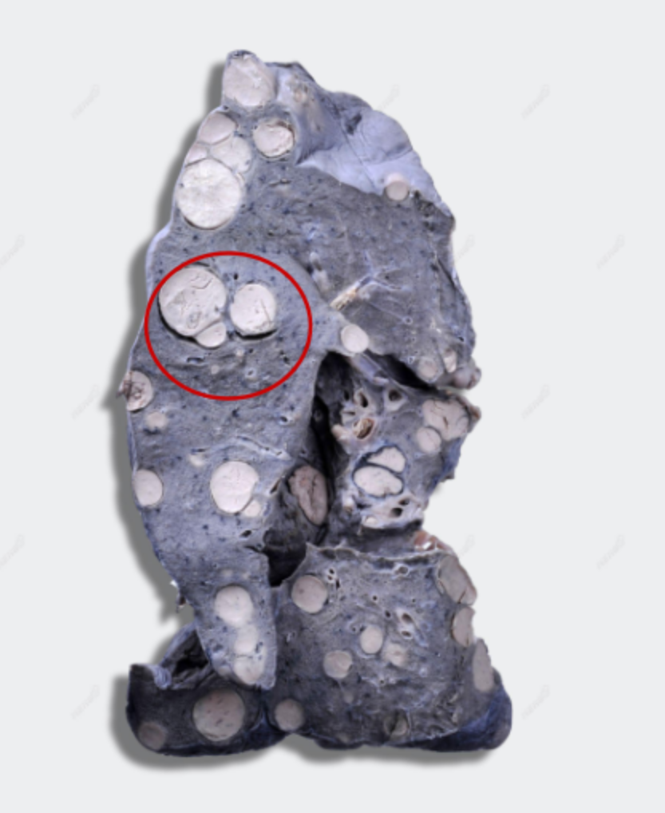
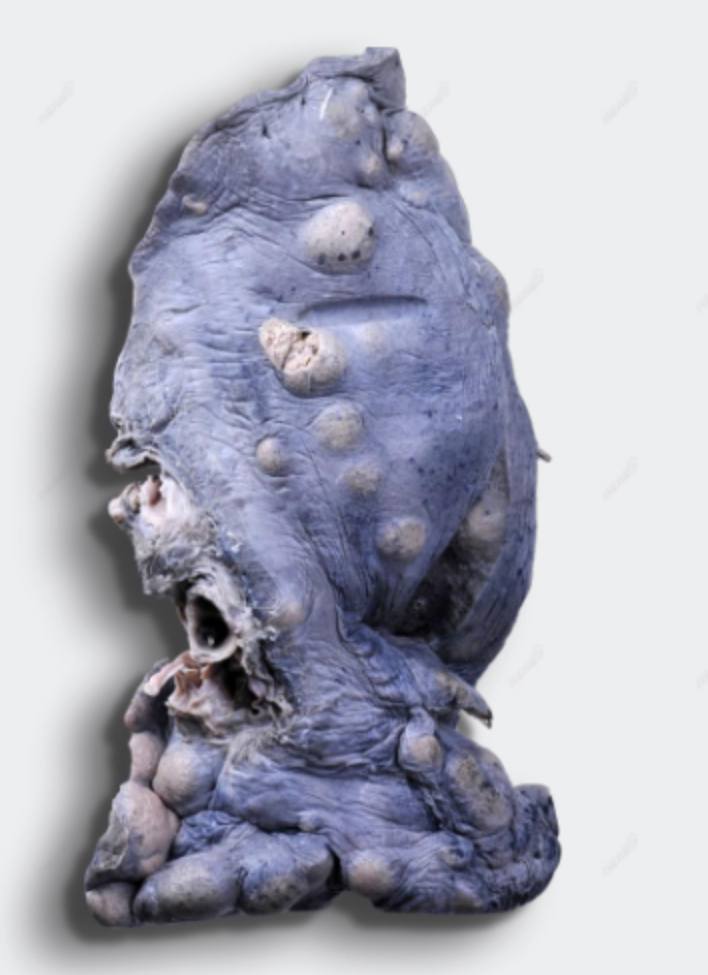

# 2024-2025 学年秋冬学期疾病基础期末回忆卷

<!--
source-attribution
贡献者：王姊（群文件上传）；爆龙战土（另一份回忆原帖发布）。
原始出处：基础医学family钉钉群文件《2024-2025 秋冬 疾病基础回忆卷.docx》；https://www.cc98.org/topic/6091266。
资料性质：考后回忆卷。
整理说明：以群文件回忆为主体，补充原帖记录的实验课信息。选择题使用整理序号，第9题选项字母按现有记录顺序补排，两张大体标本图均属于第一道大题。
来源记录：BHD-EXAM-DING-20260908、RS-077、HTML-008。
-->

> **中英文混合**

!!! info "回忆卷说明"

    选择题共回忆 15 题，以下题号为整理序号，不代表原卷题号。第 9 题的选项字母按现有记录顺序补排，仅用于阅读，不代表原卷顺序。部分英文题以中文回忆记录，原有语言提示保留。

---

## 一、选择题（50 分） {: .exam-section .exam-section--choice }

*共 50 题，每题 1 分。*

1. 胃肠道内妨碍氨吸收的主要因素是

    **A.** 胆汁分泌减少  
    **B.** 蛋白质摄入减少  
    **C.** 肠道细菌受抑制  
    **D.** 血液中尿素浓度下降  
    **E.** 肠内 pH 小于 5

2. 氧疗对于下列哪种情况引起的病变基本无效（英文无注释）

    **A.** 通气障碍  
    **B.** 气体弥散障碍  
    **C.** 功能性分流  
    **D.** 死腔样通气  
    **E.** 真性分流

3. 肺气肿患者出现呼气性呼吸困难的机制为

    **A.** 小气道阻塞  
    **B.** 小气道管壁增厚  
    **C.** 小气道管壁顺应性减低  
    **D.** 小气道痉挛  
    **E.** 气道等压点移至膜性气道

4. 患者女性，28岁，在心尖区可闻舒张期隆隆样杂音，该患者瓣膜的病变可能是

    **A.** 二尖瓣狭窄  
    **B.** 二尖瓣关闭不全  
    **C.** 主动脉瓣关闭不全  
    **D.** 主动脉瓣狭窄

5. 心肌缺血-再灌注导致自由基增多的机制与以下哪项无关

    **A.** 儿茶酚胺的减少  
    **B.** 中性粒细胞聚集及激活  
    **C.** 黄嘌呤氧化酶形成增加  
    **D.** 诱导型NOS表达增强  
    **E.** 线粒体功能失调

6. 下列哪项是恶性肿瘤细胞的最主要形态特点

    **A.** 核大  
    **B.** 多核或异形核  
    **C.** 核仁大  
    **D.** 核染色浓染  
    **E.** 病理性核分裂象

7. 以下关于慢性心力衰竭时心室重构的描述错误的是?（英文无注释）

    **A.** III型胶原增多将有利于肥大的心肌细胞的重排  
    **B.** III型胶原增加可防止心室进一步扩大和心室壁变薄  
    **C.** I型胶原过度增加可引起心室壁僵硬程度增加  
    **D.** I型胶原过度增加可引起冠状动脉管壁增厚  
    **E.** I型胶原过度增加影响心肌间的信息传导

8. 下述哪项原因不会导致心脏容量负荷增加（英文，选项有注释）

    **A.** 二尖瓣关闭不全  
    **B.** 主动脉关闭不全  
    **C.** 室间隔缺损  
    **D.** 肺动脉高压  
    **E.** 动静脉瘘

9. 与遗传性疡症综合征无关的突变基因有

    **A.** BRCA1和BRCA2  
    **B.** KRAS  
    **C.** PTEN  
    **D.** APC  
    **E.** TP53

    !!! info "原记录"

        “遗传性疡症综合征”为原记录用语。

10. 与异柠檬酸脱氢酶1/2(IDH1/2)基因突变改变细胞代谢导致表观遗传调控异常的促肿瘤作用机制相关的是

    **A.** KDM和TET  
    **B.** JAK和STAT3  
    **C.** EGFR和KRAS  
    **D.** Bcr-Abl  
    **E.** TGFB和Smad

11. P50升高见于下列哪种情况

    **A.** 氧离曲线左移  
    **B.** 血温降低  
    **C.** 血液H浓度升高  
    **D.** 血K升高  
    **E.** 红细胞内2.3-DPG含量减少

12. DIC时，血液凝固性表现为（英文无注释）

    **A.** 凝固性增高  
    **B.** 凝固性降低  
    **C.** 凝固性先降低后增高  
    **D.** 凝固性先增高后降低  
    **E.** 凝固性无明显变化

13. 周期中细胞转化为G0期细胞，多发生在哪个时期（英文无注释）

    **A.** G1  
    **B.** S  
    **C.** G2  
    **D.** M

14. A 5-year-old child has a history of recurrent bacterial infections, including pneumonia. Analysis of leukocytes collected from the peripheral blood shows a deficiency in myeloperoxidase. A reduction in which of the following processes is the most likely cause of this child's increased susceptibility to infections?

    **A.** Hydrogen peroxide (H₂O₂) elaboration  
    **B.** Hydroxy-halide radical (HOCl-) formation  
    **C.** Failure of migration resulting from complement deficiency  
    **D.** Phagocytic cell oxygen consumption  
    **E.** Prostaglandin production

15. Which of the following factors play most important roles in the remodeling of the scar?

    **A.** Neutrophil elastase  
    **B.** Cathepsin G  
    **C.** Plasmin  
    **D.** Metalloproteinases  
    **E.** Kinin

---

## 二、简答题（30 分） {: .exam-section .exam-section--short }

*共 5 题，每题 6 分。*

1. 应激性溃疡的病理及治疗选择（英文，有注释应激性溃疡）

2. 急性肾小管损伤造成少尿的病理机制

3. 良性高血压的内脏病变期主要内脏病变特征

4. 原发和继发性肺结核的不同疾病特征（英文）

5. 反流性食管炎的解剖特征（英文）

---

## 三、大题（20 分） {: .exam-section .exam-section--analysis }

*共 2 题，每题 10 分。*

??? info "相关实验课信息"

    两道题分别来自张伟老师和张雪老师讲授的实验内容。

1. 68 岁男性，肝癌 3 年，死后大体如图，请诊断疾病（器官＋疾病），描写病理特征。这个疾病与原有肝癌有关吗？请说明理由。

    {: .exam-figure }

    {: .exam-figure }

2. 阑尾炎诊断，大体特征（3 分），切片特征（3 分）。

