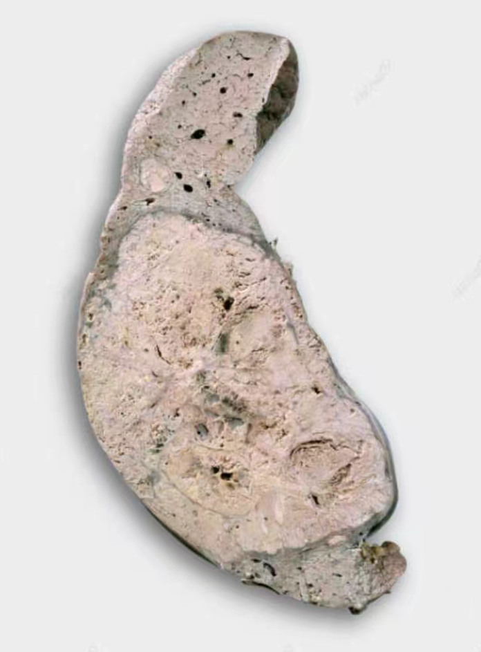
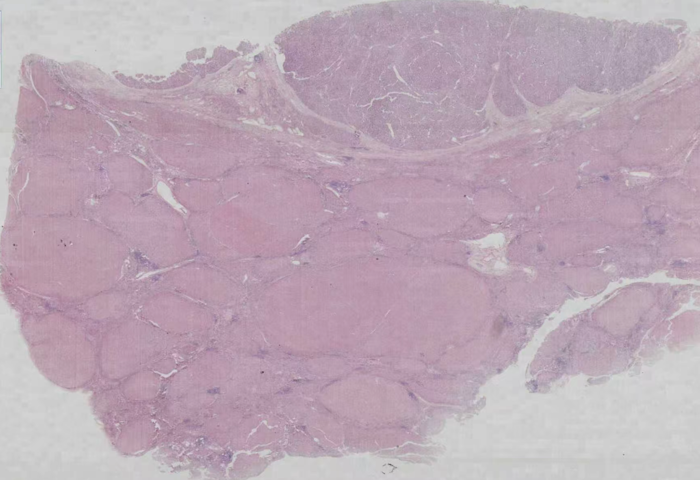
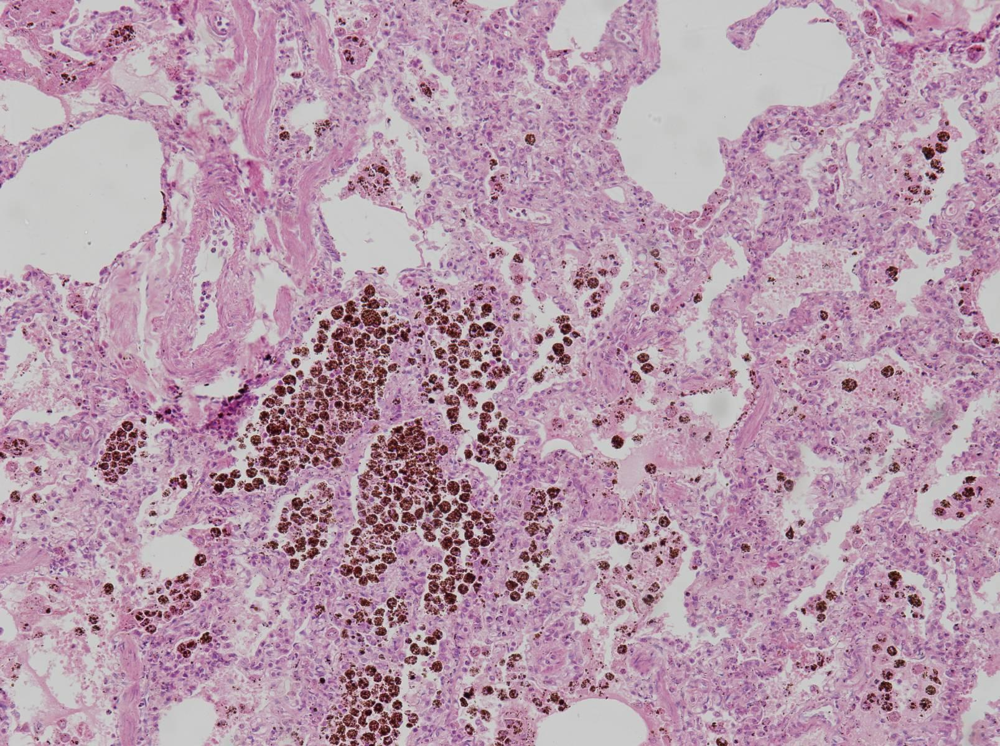
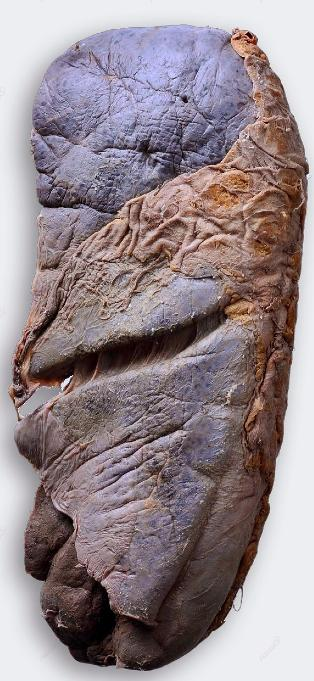
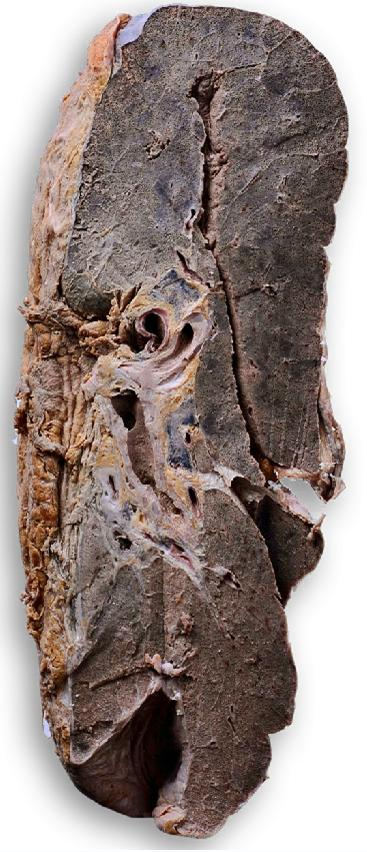

# 2025-2026 学年秋冬学期疾病基础期末回忆卷

> **中英文混合**  

!!! info "回忆卷说明"

    单项选择题共 50 题。原记录能够确认第 1—5、21—31、48—50 题的题号，另保留了 13 道题号不详的选择题。选项字母按原记录顺序补排，仅用于阅读，不代表原卷顺序。

---

## 一、单项选择题 {: .exam-section .exam-section--choice }

1. 黏液样变是指间质内有：

    **A.** 糖原蓄积  
    **B.** 胶原纤维组合、融合  
    **C.** 蛋白质和黏多糖蓄积  
    **D.** 脂肪蓄积  
    **E.** 异常钙盐沉积

2. Hemosiderin can be found in which cell?

    **A.** 肥大细胞  
    **B.** 巨噬细胞  
    **C.** 红细胞  

3. 下列哪种细胞属于稳定细胞？

    **A.** 心肌细胞  
    **B.** 肝细胞  
    **C.** 肠道上皮细胞  

4. 肉芽组织转变为瘢痕组织时会出现哪种现象？

    **A.** 毛细血管减少  
    **B.** 胶原减少  
    **C.** 炎症细胞增多  
    **D.** 成纤维细胞增多

5. 有一种附着于血管内皮或纤维样结构的变性，遇碘后变为棕褐色，加入硫酸后变蓝。这种变性是哪一种？

    **A.** 水肿  
    **B.** 脂肪变  
    **C.** —  
    **D.** —  
    **E.** —

*第 6—20 题没有按原题号保存。下方题号不详的 13 道选择题可能属于第 6—20 题或第 32—47 题。*

<ol start="21" class="exam-question-list exam-question-list--choice" markdown="block">
<li markdown="block">

一名产妇肺部出现羊水样物质，最可能属于哪种栓塞？

**A.** 羊水栓塞  
**B.** 其他类型的栓塞，具体内容未能回忆  

</li>
<li markdown="block">

观察到一种具有两个对称细胞核的细胞，该细胞是：

**A.** 镜影细胞  

</li>
<li markdown="block">

一名男孩感染痢疾杆菌后出现腹泻，属于哪种炎症？

**A.** 肉芽肿性炎  
**B.** 黏膜蜂窝织炎  
**C.** 浆液性炎  
**D.** 黏液性炎  

</li>
<li markdown="block">

下列哪种肾小球疾病可见线性荧光？

**A.** GBM 病  
**B.** 膜性肾病  
**C.** 微小病变性肾病  
**D.** 急性弥漫增生性肾小球肾炎  
**E.** 新月体性肾小球肾炎  

</li>
<li markdown="block">

一名男性长期酗酒，出现肝掌和蜘蛛痣，最可能患有哪种疾病？

**A.** 肝硬化  

</li>
<li markdown="block">

下列关于植物状态的说法，错误的是：

**A.** 没有自主呼吸  
**B.** 没有意识  

</li>
<li markdown="block">

下列关于基因甲基化的说法，错误的是：

**A.** 甲基化可以促进癌基因表达  
**B.** 甲基化促进抑癌基因下调  
**C.** 其余选项为类似概念的正反表述，具体文字未能回忆  

</li>
<li markdown="block">

关于 BCR-ABL 融合基因，下列说法正确的是：

**A.** 一种原癌基因位于强启动子下游并发生过表达的过程  

</li>
<li markdown="block">

下列哪项是近年整合进衰老标志的内容？

**A.** 细胞外基质改变  
**B.** 端粒变短  

</li>
<li markdown="block">

英文题，题意为：下列哪项属于肿瘤细胞的表达特征？

**A.** Cyclin D/E 过度表达  
**B.** 周期蛋白失活  
**C.** 促凋亡基因表达上调  

</li>
<li markdown="block">

英文题，题意为：下列关于肿瘤细胞中凋亡相关信号表达的说法，正确的是：

**A.** 生存信号表达较高  
**B.** Caspase 表达升高  
**C.** 凋亡信号表达升高  

</li>
</ol>

*以下 1—13 为整理序号，不代表原卷题号。*

1. 以下哪种疾病是刺激型抗体介导的典型疾病？

    **A.** Graves 病  
    **B.** 桥本甲状腺炎  
    **C.** 重症肌无力  

2. 下列哪种情况会使体温调定点升高？

    **A.** 怀孕  
    **B.** 细菌感染  
    **C.** 中暑  
    **D.** 汗腺凋亡  

    !!! info "原记录"

        “汗腺凋亡”为原记录。

3. 高血糖不具有以下哪种表现？

    **A.** 胰岛素摄取减少  
    **B.** 葡萄糖摄取减少  

4. 代谢综合征共同的病理生理基础是：

    **A.** 胰岛素抵抗  

5. Waterhouse-Friderichsen syndrome（华-佛综合征）见于哪种疾病？

    **A.** 流行性脑脊髓膜炎  
    **B.** 乙型脑炎  

6. 休克缺血期的特征是：

    **A.** 多灌少流，灌大于流  
    **B.** 少灌多流，灌少于流  
    **C.** 少灌少流，灌大于流  
    **D.** 少灌少流，灌少于流  
    **E.** 不灌不流，灌流瘀滞

7. 应激时 HPA 轴的中枢效应激素是：

    **A.** CRH  
    **B.** GC  
    **C.** NE  

8. 缺血-再灌注损伤中新出现的关键效应因子是：

    **A.** 黄嘌呤氧化酶  
    **B.** 黄嘌呤脱氢酶  

9. 缺血-再灌注时 $\mathrm{Na^+-Ca^{2+}}$ 交换异常的原因是：

    **A.** 细胞内高 $\mathrm{Na^+}$ 激活 $\mathrm{Na^+/Ca^{2+}}$ 交换蛋白反向转运，大量 $\mathrm{Ca^{2+}}$ 进入细胞  
    **B.** 细胞内高 $\mathrm{Ca^{2+}}$ 引发 $\mathrm{Na^+/Ca^{2+}}$ 交换蛋白反向转运  
    **C.** 细胞内高 $\mathrm{K^+}$，$\mathrm{H^+/K^+}$ 交换引发—  

10. 题目涉及 AG（阴离子间隙）所反映的指标。

11. 英文选项题：低容量性低钠血症时，下列哪部分液体减少最多？

    **A.** 细胞内液  
    **B.** 组织间液  
    **C.** 第三间隙液  
    **D.** 血浆  
    **E.** 淋巴液  

12. 糖尿病患者尿液中 $\mathrm{Na^+}$ 浓度较高。题目同时给出尿 $\mathrm{K^+}$、尿蛋白、血 $\mathrm{Na^+}$ 和血 $\mathrm{K^+}$ 的具体数值，问出现这些变化的原因。

    **A.** 渗透性利尿  
    **B.** 醛固酮分泌过多  
    **C.** ADH 分泌过多  

13. 慢性肾衰竭时血钙和血磷如何变化？

    候选项由“血钙增加或减少”“血磷增加或减少”以及“两者总量不变、增加或减少”等变化组合构成，具体组合未能回忆。

*第 32—47 题中，除上述题号不详的回忆外，其余内容未能确认。*

<ol start="48" class="exam-question-list exam-question-list--choice" markdown="block">
<li markdown="block">

脓毒血症休克晚期低动力型休克的主要特点是：

**A.** 心排血量减少、外周阻力增高  
**B.** 心排血量减少、外周阻力减少  
**C.** 心排血量减少、外周阻力不变  
**D.** 心排血量增高、外周阻力增高  
**E.** 心排血量增高、外周阻力减少

</li>
<li markdown="block">

符合垂体功能亢进的激素分泌特点是：

**A.** TSH 减少，T3、T4 减少  
**B.** TSH 增加，T3、T4 增加  
**C.** ACTH 减少，皮质醇增加  
**D.** FSH、LH 增加，雌激素减少  
**E.** TRH 增加，TSH 增加

</li>
<li markdown="block">

Cushing 综合征与下列哪种激素分泌亢进有关？

**A.** 生长激素  
**B.** 甲状腺激素  
**C.** 胰岛素  
**D.** 糖皮质激素  
**E.** 抗利尿激素

</li>
</ol>

---

## 二、问答题 {: .exam-section .exam-section--short }

1. 阐述良性肿瘤和恶性肿瘤的区别。

    Describe the main differences between benign tumors and malignant tumors.

2. 试述溃疡型胃癌与良性消化性溃疡大体特征的区别。

    Describe the gross morphological differences between ulcerative gastric carcinoma and benign peptic ulcer.

3. 心功能不全时心率加快的发生机制和不利影响是什么？

    What are the mechanisms underlying increased heart rate in cardiac insufficiency, and what are its negative impacts?

4. 在“缺氧与酸中毒对家兔呼吸系统和循环系统功能的影响”实验中，哪些实验处理因素可造成动物缺氧及酸碱平衡紊乱？说明具体缺氧类型，并根据实验结果解释每分钟通气量、呼吸频率、血压和心率发生显著变化的机制。

5. COPD 患者用力呼吸时常伴有呼吸困难。简述其呼吸困难的类型及主要原因。

---

## 三、分析题 {: .exam-section .exam-section--analysis }

!!! info "题图说明"

    分析题中的大体标本和切片由考场多媒体放映。以下图片是现有回忆中保存的部分题图，可能并不完整；记得至少有一道题同时展示了多张大体标本或切片，但因时间较久，已经无法确认当时的完整数量和组合。

### 病例 1

老年男性，近 1 个月感右上腹饱胀，深呼吸时疼痛，食欲差，消瘦明显，近几天卧床不起并出现衰竭。10 年前曾患肝炎，脾肿大 6 年，2 年前曾出现腹水。

体检：轻度黄疸；肝在左肋下 $9~\mathrm{cm}$；有腹水、腹壁静脉怒张和下肢水肿。超声检查显示肝右叶实质性肿块，AFP 阳性。

{: .exam-figure }

{: .exam-figure }

1. 根据病史摘要、大体标本和镜下切片作出病理诊断。（4 分）

2. 描述大体标本和镜下图像中观察到的病理改变。（大体 3 分，切片 3 分）

### 病例 2

一名 68 岁女性，有 15 年高血压病史和 5 年充血性心力衰竭病史。因呼吸困难加重、下肢水肿入院，入院 2 天后死于心源性休克。尸检显示某脏器发生病变。

A 68-year-old female with a 15-year history of hypertension and a 5-year history of congestive heart failure was admitted for worsening shortness of breath and lower-extremity edema. She died of cardiogenic shock 2 days after admission. An autopsy was performed, and part of the findings are shown below.

{: .exam-figure }

{: .exam-figure }

{: .exam-figure }

1. 该脏器最可能的病理诊断是什么？

2. 根据标本图片，列出支持该诊断的眼观及镜下特征。
