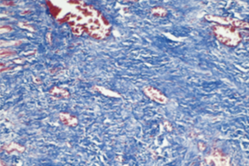

---
hide:
  - toc
---

# 2025-2026 学年秋冬学期疾病基础小测 1

> **开放时间：** 2025.10.11 08:00 - 2025.10.12 23:59  
> **作答：** 线上 · 120 分钟 · 1 次机会  
> **题量：** 76 题 · 76 分

1. When you notice that someone has unusually blue eyes, you've noticed their

    *单选题，1分*

    **A.** phenotype.  
    **B.** genotype.  
    **C.** allele.  
    **D.** hybridization.  
    **E.** polymorphism  

    

    
查看答案

    **答案：A**

    

2. BRCA1 is associated with which cancer?

    *单选题，1分*

    **A.** lung cancer  
    **B.** leukemia  
    **C.** Breast cancer  
    **D.** thyroid  
    **E.** colon cancer  

    

    
查看答案

    **答案：C**

    

3. 全基因组关联分析的阳性p值一般是

    *单选题，1分*

    **A.** 0.05  
    **B.** $5 \times 10^{-6}$  
    **C.** $5 \times 10^{-7}$  
    **D.** $5 \times 10^{-8}$  
    **E.** 0.01  

    

    
查看答案

    **答案：D**

    

4. 一位54岁男性胫骨骨折入院,伤口愈合情况很差。进一步的病史显示,他的日常饮食营养价值差,严重缺乏维生素c。以下哪一种细胞外基质成分的合成最受这种缺乏的影响?

    *单选题，1分*

    **A.** 胶原蛋白  
    **B.** 弹性蛋白  
    **C.** 纤连蛋白  
    **D.** 整合素  
    **E.** 层粘连蛋白  

    

    
查看答案

    **答案：A**

    

5. 以下哪一种物质最有可能介导细胞骨架和细胞外基质之间的相互作用?

    *单选题，1分*

    **A.** 表皮生长因子  
    **B.** 纤连蛋白  
    **C.** 整合素  
    **D.** 血小板衍生生长因子  
    **E.** I型胶原  
    **F.** 血管内皮生长因子  

    

    
查看答案

    **答案：C**

    

6. A 24-year-old man with acute appendicitis undergoes surgical removal of the inflamed appendix. The incision site is sutured. A trichrome-stained section representative of the site with blue appearing collagen is shown in the figure. How long after the surgery would this appearance most likely be seen?

    {: .quiz-figure }

    *单选题，1分*

    **A.** 1 day  
    **B.** 2 to 3 days  
    **C.** 4 to 5 days  
    **D.** 2 weeks  
    **E.** 1 month  

    

    
查看答案

    **答案：E**

    

7. A 23-year-old woman receiving corticosteroid therapy for an autoimmune disease has an abscess on her upper outer right arm. She undergoes minor surgery to incise and drain the abscess, but the wound heals poorly over the next month. Which of the following aspects of wound healing is most likely to be deficient in this patient?

    *单选题，1分*

    **A.** Collagen deposition  
    **B.** Elaboration of VEGF  
    **C.** Neutrophil infiltration  
    **D.** Reepithelialization  
    **E.** Serine proteinase production  

    

    
查看答案

    **答案：A**

    

8. A 51-year-old woman tests positive for hepatitis A anti body. Her serum AST level is 275 U/L, and ALT is 310 U/L. One month later, these enzyme levels have returned to normal. Which phase of the cell cycle best describes the hepatocytes 1 month after her infection?

    *单选题，1分*

    **A.** GO  
    **B.** G1  
    **C.** S  
    **D.** G2  
    **E.** M  

    

    
查看答案

    **答案：A**

    

9. A 65-year-old man develops worsening congestive heart failure 2 weeks after an acute myocardial infarction. An echo cardiogram shows a markedly decreased ejection fraction. Now, capillaries, fibroblasts, collagen, and inflammatory cells have largely replaced the infarcted myocardium. Which of the following inflammatory cell types in this lesion plays the most important role in the healing process?

    *单选题，1分*

    **A.** Eosinophils  
    **B.** Epithelioid cells  
    **C.** Macrophages  
    **D.** Neutrophils  
    **E.** Plasma cells  

    

    
查看答案

    **答案：C**

    

10. Which of the following factors play most important roles in the remodeling of the scar?

    *单选题，1分*

    **A.** Neutrophil elastase  
    **B.** Cathepsin G  
    **C.** Plasmin  
    **D.** Metalloproteinases  
    **E.** Kinin  

    

    
查看答案

    **答案：D**

    

11. 有关疾病的概念下列哪种提法较确切?

    *单选题，1分*

    **A.** 疾病是不健康的生命活动过程  
    **B.** 疾病是机体对外环境的协调发生障碍  
    **C.** 疾病是机体在一定病因的作用下,因自稳调节紊乱而发生的异常生命活动过程。  
    **D.** 疾病是指机体的不舒服  
    **E.** 疾病是细胞受损的表现  

    

    
查看答案

    **答案：C**

    

12. 决定疾病特异性的因素是

    *单选题，1分*

    **A.** 致病的原因  
    **B.** 致病的条件  
    **C.** 疾病的诱因  
    **D.** 机体的反应性  
    **E.** 机体的本身特征  

    

    
查看答案

    **答案：A**

    

13. 有关损伤与抗损伤的叙述下列哪项是错误的?

    *单选题，1分*

    **A.** 是推动疾病发展的基本动力  
    **B.** 对不同的损伤所发生的抗损伤反应是相同的  
    **C.** 二者之间可以相互转化  
    **D.** 二者力量的对比常影响疾病的发展方向  
    **E.** 二者相互依存又相互斗争  

    

    
查看答案

    **答案：B**

    

14. 有关因果交替的叙述下列哪项是错误的

    *单选题，1分*

    **A.** 原因和结果可以相互转化  
    **B.** 因果交替规律的发展常可形成恶性循环  
    **C.** 因果交替规律的发展常可形成良性循环  
    **D.** 在同一疾病的不同阶段因果交替的内容相同  
    **E.** 能够采取措施打断因果交替  

    

    
查看答案

    **答案：D**

    

15. 脑死亡的标志是

    *单选题，1分*

    **A.** 脑细胞功能消失  
    **B.** 大脑机能严重障碍  
    **C.** 脑干以上中枢机能严重障碍  
    **D.** 全脑功能永久消失  
    **E.** 大脑分析综合功能丧失  

    

    
查看答案

    **答案：D**

    

16. 以下关于染色体畸变的描述是错误的?

    *单选题，1分*

    **A.** 染色体畸变是指多种体内外因素导致染色体的数目和结构发生变异  
    **B.** 染色体畸变可引起基因及其产物的结构和功能异常  
    **C.** 产前诊断是降低染色体畸变所致的遗传性疾病发生的有效途径  
    **D.** 二倍体属于染色体数目的改变  
    **E.** 唐氏综合征(47,XX或XY,+21)属于整倍体变异  

    

    
查看答案

    **答案：E**

    

17. 以下关于染色体结构异常的描述哪项是正确的?

    *单选题，1分*

    **A.** 染色体易位只发生在同源染色体上。  
    **B.** 染色体缺失均为两条染色体在相同区段同时缺失。  
    **C.** 染色体重复不仅是基因的拷贝数增加,且一定是顺接重复。  
    **D.** 拷贝数变异是基因组中1kb以上大片段DNA的拷贝数增加或缺失。  
    **E.** 染色体倒位不但增加了遗传物质,还改变了染色体上基因排列的顺序。  

    

    
查看答案

    **答案：D**

    

18. 以下哪个不属于点突变?

    *单选题，1分*

    **A.** 同义突变  
    **B.** 错义突变  
    **C.** 无义突变  
    **D.** 移码突变  
    **E.** 终止密码突变  

    

    
查看答案

    **答案：D**

    

19. 关于单核苷酸多态性(SNP)的描述哪项是正确的

    *单选题，1分*

    **A.** SNP指DNA序列中一个或多个核苷酸的缺失所引起的基因多态性  
    **B.** SNP属于DNA非氨基酸编码序列改变  
    **C.** SNP在种群中的发生频率小于1%  
    **D.** SNP通常是双等位基因的遗传变异  
    **E.** 所有的SNP与疾病表型均存在功能相关性  

    

    
查看答案

    **答案：D**

    

20. 关于DNA短串联重复序列(STR)的描述以下错误的是?

    *单选题，1分*

    **A.** STR一般以2-6 bp为核心单位  
    **B.** STR的重复数目在不同个体间呈现高度变异性  
    **C.** STR是法医学鉴定、亲属关系分析的重要依据  
    **D.** 动态突变发生在世代传递过程中  
    **E.** 动态突变指的是基因组中一些STR重复次数逐渐减少的突变  

    

    
查看答案

    **答案：E**

    

21. 关于液-液相分离的描述哪项是错误的

    *单选题，1分*

    **A.** 液-液相分离依赖于合适的PH及温度等条件  
    **B.** 当溶液中生物大分子浓度高于某一阈值时可发生液-液相分离  
    **C.** 细胞内蛋白质和核酸可通过相分离形成生物分子凝聚物  
    **D.** 液-液相分离是细胞组分发挥各种生物功能的一种膜系统依赖模式  
    **E.** 可调控染色质三维结构,促进超级增强子形成,从而调控基因转录  

    

    
查看答案

    **答案：D**

    

22. 关于表观遗传改变的描述哪个是正确的?

    *单选题，1分*

    **A.** 指DNA序列发生变化的前提下,基因的表达水平发生改变  
    **B.** 表观遗传改变是一种不可遗传的改变  
    **C.** 组蛋白修饰属于表观遗传调控  
    **D.** DNA点突变属于表观遗传调控  
    **E.** 染色质重塑不属于表观遗传调控  

    

    
查看答案

    **答案：C**

    

23. 以下关于DNA修饰的描述哪一项是不正确的?

    *单选题，1分*

    **A.** DNA甲基化常发生于CpG岛  
    **B.** 启动子序列的CpG岛高甲基化可促进基因表达  
    **C.** DNA的甲基化一般发生在胞嘧啶残基上  
    **D.** S-腺苷甲硫氨酸为甲基供体  
    **E.** DNA修饰受DNA甲基转移酶和DNA去甲基酶的可逆调控  

    

    
查看答案

    **答案：B**

    

24. 关于蛋白质翻译后修饰的描述不正确的是

    *单选题，1分*

    **A.** 蛋白质磷酸化是由蛋白激酶和磷酸酶催化的不可逆反应  
    **B.** 蛋白质磷酸化一般发生在苏氨酸、丝氨酸、酪氨酸残基  
    **C.** 蛋白质翻译后修饰异常将会影响蛋白质空间结构改变  
    **D.** ATP或GTP可作为磷酸基的供体  
    **E.** 阿尔茨海默病患者神经元存在tau蛋白过度磷酸化  

    

    
查看答案

    **答案：A**

    

25. 受体异常参与了下列那种疾病的发生

    *单选题，1分*

    **A.** 肢端肥大症  
    **B.** 重症肌无力  
    **C.** 霍乱  
    **D.** 巨人症  
    **E.** 假性甲状旁腺功能减退症  

    

    
查看答案

    **答案：B**

    

26. 下列哪种基因的激活能抑制凋亡

    *单选题，1分*

    **A.** 野生型p53  
    **B.** Bcl-2  
    **C.** Fas  
    **D.** ICE  
    **E.** Bax  

    

    
查看答案

    **答案：B**

    

27. 电镜下细胞凋亡的特征性改变是

    *单选题，1分*

    **A.** 细胞皱缩  
    **B.** 胞浆致密  
    **C.** 染色质边集  
    **D.** 核碎裂  
    **E.** 凋亡小体形成  

    

    
查看答案

    **答案：E**

    

28. 终末分化细胞的共同特点是:

    *单选题，1分*

    **A.** 可快速进入S期  
    **B.** 永久失去分裂能力  
    **C.** 持续进行增殖和死亡  
    **D.** 对损伤刺激高度敏感  
    **E.** 能随时启动DNA复制  

    

    
查看答案

    **答案：B**

    

29. 一种细胞直接转变为另一类分化细胞的过程是:

    *单选题，1分*

    **A.** 去分化  
    **B.** 重分化  
    **C.** 逆分化  
    **D.** 重编程  
    **E.** 转分化  

    

    
查看答案

    **答案：E**

    

30. 细胞周期中Cyclin D/CDK4主要调控:

    *单选题，1分*

    **A.** G1/S 转换  
    **B.** S期DNA复制  
    **C.** G2/M 进入  
    **D.** 有丝分裂中期  
    **E.** 胞质分裂完成  

    

    
查看答案

    **答案：A**

    

31. INK4家族蛋白主要抑制哪类复合物的活性?

    *单选题，1分*

    **A.** Cyclin A/CDK2  
    **B.** Cyclin D/CDK4/6  
    **C.** Cyclin E/CDK2  
    **D.** Cyclin B/CDK1  
    **E.** Cyclin A/CDK1  

    

    
查看答案

    **答案：B**

    

32. DNA损伤不能修复时,p53将主要介导什么作用?

    *单选题，1分*

    **A.** 激活细胞自噬  
    **B.** 促进细胞分裂  
    **C.** 诱导细胞凋亡  
    **D.** 加速DNA复制  
    **E.** 维持细胞衰老  

    

    
查看答案

    **答案：C**

    

33. 表观遗传调控分化的主要机制是:

    *单选题，1分*

    **A.** DNA序列突变  
    **B.** 蛋白质降解加速  
    **C.** 细胞膜受体改变  
    **D.** 基因选择性表达  
    **E.** 信号通路缺失  

    

    
查看答案

    **答案：D**

    

34. Caspase家族的主要功能是:

    *单选题，1分*

    **A.** 降解DNA复制酶  
    **B.** 激活细胞周期  
    **C.** 抑制坏死性死亡  
    **D.** 调控表观遗传修饰  
    **E.** 执行凋亡级联反应  

    

    
查看答案

    **答案：E**

    

35. 恶性肿瘤细胞常见的分子异常是:

    *单选题，1分*

    **A.** Cyclin D/E过度表达  
    **B.** CDK抑制因子增加  
    **C.** p53功能增强  
    **D.** caspase持续活化  
    **E.** 自噬持续亢进  

    

    
查看答案

    **答案：A**

    

36. 急性早幼粒细胞白血病的分子病理特点是:

    *单选题，1分*

    **A.** Cyclin B过表达  
    **B.** PML-RARa融合基因  
    **C.** CDK2突变激活  
    **D.** p21基因扩增  
    **E.** IAPs过度抑制  

    

    
查看答案

    **答案：B**

    

37. 再生障碍性贫血的主要病理机制是:

    *单选题，1分*

    **A.** 造血干细胞分化潜能下降  
    **B.** Cyclin D基因扩增  
    **C.** p53缺失导致凋亡减少  
    **D.** Bcl-2过表达抑制细胞死亡  
    **E.** 造血干细胞增殖亢进  

    

    
查看答案

    **答案：A**

    

38. 细胞凋亡的特点不包括以下哪项?

    *单选题，1分*

    **A.** 细胞肿胀伴随膜破裂  
    **B.** 细胞皱缩和染色质浓缩  
    **C.** DNA梯状片段化  
    **D.** 形成凋亡小体  
    **E.** 不引发炎症反应  

    

    
查看答案

    **答案：A**

    

39. 下列哪项属于凋亡的内源性途径关键因素?

    *单选题，1分*

    **A.** 死亡受体Fas  
    **B.** 细胞色素释放  
    **C.** TNF受体激活  
    **D.** IAPs抑制caspase  
    **E.** 抗原递呈细胞刺激  

    

    
查看答案

    **答案：B**

    

40. 下列哪种不属于膜受体介导的跨膜信号转导通路?

    *单选题，1分*

    **A.** G蛋白耦联受体  
    **B.** 受体酪氨酸激酶  
    **C.** 受体核糖核酸酶  
    **D.** 离子通道型受体  
    **E.** 酪氨酸蛋白激酶关联受体  

    

    
查看答案

    **答案：C**

    

41. 类固醇激素和甲状腺素信号传导特点是:

    *单选题，1分*

    **A.** 通过膜受体传导  
    **B.** 通过细胞内受体直接调控基因表达  
    **C.** 激活细胞外信号通路  
    **D.** 依赖离子通道开闭  
    **E.** 通过G蛋白介导快速反应  

    

    
查看答案

    **答案：B**

    

42. 家族性肾性尿崩症的发病机制是:

    *单选题，1分*

    **A.** 受体后信号传导缺陷  
    **B.** 抗体介导的受体激活  
    **C.** 受体过度表达造成水潴留  
    **D.** 受体数量增加引发肾脏损伤  
    **E.** 受体基因突变导致受体功能缺陷  

    

    
查看答案

    **答案：E**

    

43. RAS基因突变导致的信号异常特点是:

    *单选题，1分*

    **A.** GTP酶活性增强  
    **B.** 无法水解GTP  
    **C.** 结合GDP持续活跃  
    **D.** 激活线粒体通路  
    **E.** 抑制增殖信号  

    

    
查看答案

    **答案：B**

    

44. Ras突变导致的持续活化最终结果是:

    *单选题，1分*

    **A.** DNA修复受阻  
    **B.** 细胞周期停滞  
    **C.** 细胞凋亡增加  
    **D.** 细胞坏死发生  
    **E.** 细胞持续增殖  

    

    
查看答案

    **答案：E**

    

45. 自身免疫性甲状腺病中刺激型抗体的典型疾病是:

    *单选题，1分*

    **A.** 桥本甲状腺炎  
    **B.** Graves病  
    **C.** Addison病  
    **D.** 甲状腺结节  
    **E.** 黏液性水肿  

    

    
查看答案

    **答案：B**

    

46. 重症肌无力的主要发病机制是:

    *单选题，1分*

    **A.** 受体下调  
    **B.** Ca*泵蛋白缺陷  
    **C.** 电压钠通道缺陷  
    **D.** AChR受体阻断  
    **E.** Na+/K+泵过度激活  

    

    
查看答案

    **答案：D**

    

47. 发热与过热的本质区别在于:

    *单选题，1分*

    **A.** 是否由病原体感染引起  
    **B.** 是否由体温调定点上移导致  
    **C.** 是否伴随寒战和畏寒表现  
    **D.** 是否导致体温超过40℃  
    **E.** 是否发生在炎症性疾病中  

    

    
查看答案

    **答案：B**

    

48. 下列哪种疾病导致的体温升高属于过热而非发热?

    *单选题，1分*

    **A.** 中 (中暑)  
    **B.** 败血症  
    **C.** 流行性乙型脑炎  
    **D.** 结核性胸膜炎  
    **E.** 风湿热  

    

    
查看答案

    **答案：A**

    

49. 下列哪项属于外源性致热原?

    *单选题，1分*

    **A.** IL-1  
    **B.** TNF-α  
    **C.** LPS  
    **D.** IL-6  
    **E.** IFN-y  

    

    
查看答案

    **答案：C**

    

50. 内生致热原作用的关键中枢部位是:

    *单选题，1分*

    **A.** 丘脑  
    **B.** 下丘脑  
    **C.** 延髓  
    **D.** 海马  
    **E.** 小脑  

    

    
查看答案

    **答案：B**

    

51. TLR介导的致热机制主要识别:

    *单选题，1分*

    **A.** 病毒核酸  
    **B.** 抗原肽-MHC复合物  
    **C.** 细菌内毒素  
    **D.** 自身抗体复合物  
    **E.** 细胞内代谢产物  

    

    
查看答案

    **答案：C**

    

52. 下列关于 TCR介导内源性致热原产生的描述,哪项正确?

    *单选题，1分*

    **A.** 主要由巨噬细胞完成  
    **B.** 不依赖抗原呈递细胞  
    **C.** 与前列腺素无关  
    **D.** 通过补体系统直接激活  
    **E.** 主要由T细胞受体识别抗原后合成  

    

    
查看答案

    **答案：E**

    

53. 发热时,介导下丘脑体温调定点升高的介质是:

    *单选题，1分*

    **A.** 去甲肾上腺素  
    **B.** 前列腺素 E2  
    **C.** 精氨酸升压素  
    **D.** 白细胞介素  
    **E.** 5-羟色胺  

    

    
查看答案

    **答案：B**

    

54. 发热的高温持续期的临床表现是:

    *单选题，1分*

    **A.** 面色苍白,寒颤明显  
    **B.** 出汗增加,体温下降  
    **C.** 基础代谢率降低  
    **D.** 体温调定点恢复正常  
    **E.** 体温维持在高水平  

    

    
查看答案

    **答案：E**

    

55. 发热的体温下降期的热代谢特点是:

    *单选题，1分*

    **A.** 产热减少,散热增加  
    **B.** 产热增加,散热减少  
    **C.** 产热与散热均下降  
    **D.** 产热与散热均升高  
    **E.** 产热减少,散热不变  

    

    
查看答案

    **答案：A**

    

56. 发热时基础代谢率的改变是:

    *单选题，1分*

    **A.** 明显降低  
    **B.** 维持不变  
    **C.** 随体温升高而提高  
    **D.** 与体温变化无关  
    **E.** 在退热期升高  

    

    
查看答案

    **答案：C**

    

57. 每100 mL血液在Hb完全饱和条件下能结合的最大氧量称为:

    *单选题，1分*

    **A.** 血氧容量  
    **B.** 血氧含量  
    **C.** O结合力  
    **D.** 动静脉氧差  
    **E.** 氧离解曲线  

    

    
查看答案

    **答案：A**

    

58. 动-静脉血氧含量差(CaO2-CvO2)增大提示:

    *单选题，1分*

    **A.** PaO2升高  
    **B.** Hb浓度增高  
    **C.** 2,3-DPG降低  
    **D.** 血浆渗透压升高  
    **E.** 末梢组织摄氧增加  

    

    
查看答案

    **答案：E**

    

59. 低张性缺氧的主要血气特征是:

    *单选题，1分*

    **A.** PaO2降低  
    **B.** Hb含量减少  
    **C.** PaO2正常  
    **D.** CvO2升高  
    **E.** CO潴留  

    

    
查看答案

    **答案：A**

    

60. 下列哪种情况易导致低张性缺氧?

    *单选题，1分*

    **A.** 急性贫血  
    **B.** CO中毒  
    **C.** 法洛四联症  
    **D.** 休克状态  
    **E.** 氰化物中毒  

    

    
查看答案

    **答案：C**

    

61. 一氧化碳中毒患者的血氧指标最可能表现为?

    *单选题，1分*

    **A.** 动-静脉血氧含量差增大  
    **B.** 血氧含量降低  
    **C.** 血氧分压降低  
    **D.** 血氧饱和度不变  
    **E.** 血氧容量降低  

    

    
查看答案

    **答案：B**

    

62. 患者,男,30岁,因食用大量腌制食品后出现全身皮肤黏膜青紫,伴头晕、乏力1天。实验室检查:SpO2 98%,血液呈深褐色。该患者最可能的发病机制是:

    *单选题，1分*

    **A.** 血红蛋白分子结构异常  
    **B.** 一氧化碳与血红蛋白结合  
    **C.** 二价铁被氧化为三价铁  
    **D.** 血红蛋白硫化物形成  
    **E.** 血红蛋白与氧亲和力下降  

    

    
查看答案

    **答案：C**

    

63. 循环性缺氧的主要机制是:

    *单选题，1分*

    **A.** PaO2下降  
    **B.** Hb含量减少  
    **C.** Hb亲和力升高  
    **D.** 线粒体利用障碍  
    **E.** 组织血流量减少  

    

    
查看答案

    **答案：E**

    

64. 组织性缺氧的典型机制是:

    *单选题，1分*

    **A.** 氧化磷酸化障碍  
    **B.** 外呼吸功能不足  
    **C.** Hb减少导致氧运载下降  
    **D.** 循环灌注量减少  
    **E.** 动静脉分流增加  

    

    
查看答案

    **答案：A**

    

65. 低张性缺氧时,呼吸系统的主要代偿反应是:

    *单选题，1分*

    **A.** 呼吸变浅变慢  
    **B.** 呼吸变深变快  
    **C.** 呼吸变浅变快  
    **D.** 呼吸变深变慢  
    **E.** 呼吸抑制  

    

    
查看答案

    **答案：B**

    

66. 细胞缺氧后诱导HIF-1α升高,其作用包括:

    *单选题，1分*

    **A.** 抑制血管新生  
    **B.** 增加葡萄糖摄取  
    **C.** 促进VEGF表达  
    **D.** 抑制厌氧代谢  
    **E.** 减少EPO合成  

    

    
查看答案

    **答案：C**

    

67. 下列哪一机制最可能导致止血与凝血功能降低?

    *单选题，1分*

    **A.** 抗凝蛋白C缺乏  
    **B.** 纤溶功能抑制  
    **C.** 血小板生成障碍  
    **D.** 血管内皮细胞损伤  
    **E.** 血流缓慢  

    

    
查看答案

    **答案：C**

    

68. 关于血栓形成的描述,正确的是:

    *单选题，1分*

    **A.** 仅见于静脉系统  
    **B.** 与凝血因子缺乏有关  
    **C.** 与抗凝功能增强有关  
    **D.** 与纤溶功能亢进有关  
    **E.** 可由血液黏滞度增高诱发  

    

    
查看答案

    **答案：E**

    

69. 血友病A的主要发病机制是:

    *单选题，1分*

    **A.** 凝血因子IX缺乏  
    **B.** 凝血因子四缺乏  
    **C.** 凝血因子V缺乏  
    **D.** 维生素K缺乏  
    **E.** 凝血酶抑制剂过多  

    

    
查看答案

    **答案：B**

    

70. DIC的起始环节是:

    *单选题，1分*

    **A.** 凝血系统广泛激活  
    **B.** 抗凝系统功能减弱  
    **C.** 纤溶活性亢进  
    **D.** 凝血酶持续增多  
    **E.** 微血栓大量形成  

    

    
查看答案

    **答案：A**

    

71. 下列哪种情况最易导致组织因子表达增加?

    *单选题，1分*

    **A.** 缺氧  
    **B.** 低温  
    **C.** 高血压  
    **D.** 失血性休克  
    **E.** 全身炎症反应  

    

    
查看答案

    **答案：E**

    

72. 以下关于DIC中血管内皮损伤的描述,哪项正确?

    *单选题，1分*

    **A.** 内皮细胞合成NO与PGI2减少  
    **B.** 血管内皮增生加厚  
    **C.** TFPI与凝血酶调节蛋白表达上调  
    **D.** 组织因子表达减少  
    **E.** ADP酶活性增加  

    

    
查看答案

    **答案：A**

    

73. 以下哪项不属于DIC出血机制?

    *单选题，1分*

    **A.** 广泛微血栓消耗凝血因子  
    **B.** 继发性纤溶功能增强  
    **C.** FgDP具有抗凝作用  
    **D.** 微血管壁损伤出血  
    **E.** 血管内皮分泌NO大量增加  

    

    
查看答案

    **答案：E**

    

74. DIC引起多器官功能障碍的主要机制是:

    *单选题，1分*

    **A.** 感染扩散损伤器官功能  
    **B.** 微血栓导致组织缺血缺氧  
    **C.** 大型红细胞破坏引起炎症  
    **D.** 过度炎症反应介导细胞凋亡  
    **E.** 血糖代谢异常造成能量缺乏  

    

    
查看答案

    **答案：B**

    

75. DIC相关溶血性贫血中出现裂红细胞的主要机制是?

    *单选题，1分*

    **A.** 微血栓造成红细胞机械性损伤  
    **B.** 纤溶酶直接溶解红细胞膜  
    **C.** 抗红细胞抗体介导细胞破裂  
    **D.** 血小板释放ADP损伤红细胞  
    **E.** 组织因子激活补体系统  

    

    
查看答案

    **答案：A**

    

76. 下列实验室检查结果最符合DIC特征的是:

    *单选题，1分*

    **A.** PT、APTT延长,血小板增多  
    **B.** Fbg升高,D-二聚体减少  
    **C.** PT、APTT缩短,Fbg正常  
    **D.** PT APTT延长,D-二聚体升高  
    **E.** Fbg正常,血小板正常  

    

    
查看答案

    **答案：D**

    

