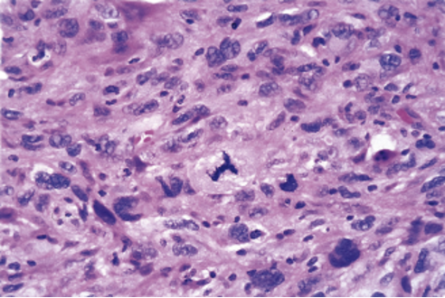

<h1 style="color: black">
<b>$2025$ - $2026$ 学年 疾病基础 小测 3（含答案）</b>
</h1>

基础医学专业课 线上小测 
测试时间: 2025.11.16 09:00 - 2025.11.17 23:59, 答题限时: 120 分钟, 允许尝试次数: 1
 
原卷中英文分布与该卷相同, 答案为标准答案, 共 56 道题目, 满分 56 分

---

1. 点突变(point mutation) 不包括  
   *单选题，1分*  
   **A.** 同义突变(synonymous mutation)  
   **B.** 错义突变(missense mutation)  
   **C.** 无义突变(nonsense mutation)  
   **D.** 终止密码突变(terminator codon mutation)  
   **E.** 移码突变(frameshift mutation)  
   正确答案：E  
 

2. 肿瘤细胞基因转录超级增强子(super-enhancer)的形成机制不包括  
   *单选题，1分*  
   **A.** SNP或突变,导致缺失或形成转录因子(TF)结合位点,或改变TF亲和力,或招募共激活因子  
   **B.** 染色质易位重排  
   **C.** 表观遗传调控异常导致染色质结构重塑  
   **D.** 超级增强子核心元件扩增  
   **E.** 启动子序列甲基化修饰增强  
   正确答案：E  
 

3. 与异柠檬酸脱氢酶1/2 (IDH1/2)基因突变改变细胞代谢导致表观遗传调控异常的促肿瘤作用机制相关的是  
   *单选题，1分*  
   **A.** KDM和TET  
   **B.** JAK和STAT3  
   **C.** EGFR和KRAS  
   **D.** Bcr-Abl  
   **E.** TGFẞ和Smad  
   正确答案：A  
 

4. 蛋白质相互作用异常与疾病机制相关,以下不相关的是  
   *单选题，1分*  
   **A.** 蛋白质分子内部结构域互作与构象异常所导致的蛋白质分子功能异常  
   **B.** 蛋白质复合物中蛋白质分子之间互作异常所导致的复合物功能异常  
   **C.** 蛋白质信号通路和网络调控异常  
   **D.** 蛋白质分子定向输送异常  
   **E.** 蛋白质分子修饰异常导致蛋白质分子互作异常  
   正确答案：D  
 

5. 以下哪个是直接致癌物?  
   *单选题，1分*  
   **A.** Nitrosamines  
   **B.** Polycyclic aromatic hydrocarbons  
   **C.** Aromatic amines  
   **D.** Aflatoxin  
   **E.** Benzo(a)pyrene  
   正确答案：A  
 

6. DNA repair systems do not include  
   *单选题，1分*  
   **A.** Translesion DNA synthesis (TLS)  
   **B.** Direct DNA repair (Direct reversal)  
   **C.** Base excision repair (BER)  
   **D.** Nucleotide excision repair (NER)  
   **E.** Mismatch repair (MMR)  
   正确答案：A  
 

7. Which one below is not a mechanism of oncogene activation  
   *单选题，1分*  
   **A.** Gene amplification  
   **B.** Point mutation  
   **C.** Chromosomal rearrangement or translocation  
   **D.** Viral insertion activation  
   **E.** Promoter hypermethylation  
   正确答案：E  
 

8. 与遗传性癌症综合征无关的突变基因有  
   *单选题，1分*  
   **A.** BRCA1和BRCA2  
   **B.** KRAS  
   **C.** PTEN  
   **D.** APC  
   **E.** TP53  
   正确答案：B  
 

9. 顺式激活逆转录病毒(cis-Activating Retrovirus)的致癌机制是  
   *单选题，1分*  
   **A.** 携带病毒癌基因(v-onc)  
   **B.** 病毒基因产物激活细胞基因转录  
   **C.** 病毒序列插入激活细胞癌基因(c-onc)  
   **D.** 病毒基因与细胞基因形成融合基因  
   **E.** 病毒基因产物抑制细胞基因产物  
   正确答案：C  
 

10. Which one below is not a carcinogenic mechanism of oncoviruses  
    *单选题，1分*  
    **A.** Transduction of v-onc  
    **B.** cis-Activation of c-onc  
    **C.** Trans-Activation of c-onc  
    **D.** Transforming proteins  
    **E.** Promotion of cell differentiation  
    正确答案：E  
 

11. 以下哪个是抑癌基因?  
    *单选题，1分*  
    **A.** RB  
    **B.** PIK3CA  
    **C.** KRAS  
    **D.** MYC  
    **E.** MDM4  
    正确答案：A  
 

12. Which one below is not a tumor suppressor protein  
    *单选题，1分*  
    **A.** RB  
    **B.** PTEN  
    **C.** KRAS  
    **D.** P53  
    **E.** APC  
    正确答案：C  
 

13. 与直接驱动肿瘤细胞Epithelial-mesenchymal transition (EMT)无关的转录因子是  
    *单选题，1分*  
    **A.** Snail  
    **B.** Slug  
    **C.** Twist  
    **D.** ZEB1/2  
    **E.** E2F1  
    正确答案：E  
 

14. 肿瘤发生发展机制与细胞分化异常有关,但不包括  
    *单选题，1分*  
    **A.** 诱导分化  
    **B.** 去分化  
    **C.** 阻分化  
    **D.** 转分化  
    **E.** 逆分化  
    正确答案：A  
 

15. 与遗传性癌症综合征有关的突变基因有  
    *单选题，1分*  
    **A.** BRCA1和BRCA2  
    **B.** TP53  
    **C.** PTEN  
    **D.** APC  
    **E.** 以上都是  
    正确答案：E  
 

16. TP53异常与肿瘤关系不正确的是  
    *单选题，1分*  
    **A.** Mutant p53 can antagonize wild-type p53  
    **B.** LOH  
    **C.** Point mutation  
    **D.** MDM2 negative regulation  
    **E.** viral-oncogene products mediated activation  
    正确答案：E  
 

17. 瘤细胞间散在多数吞噬各种细胞碎屑的巨嗜细胞,形成所谓“满天星“图像的恶肿瘤是  
    *单选题，1分*  
    **A.** 脂肪肉瘤  
    **B.** 恶性组织细胞增生症  
    **C.** 恶性纤维组织细胞瘤  
    **D.** 恶性巨细胞瘤  
    **E.** Burkitt淋巴瘤  
    正确答案：E  
 

18. 霍奇金淋巴瘤中预后最好的组织学类型是  
    *单选题，1分*  
    **A.** 淋巴细胞为主型  
    **B.** 淋巴细胞减少型  
    **C.** 结节硬化型  
    **D.** 混合细胞型  
    **E.** 以上都是  
    正确答案：A  
 

19. 恶性淋巴瘤是  
    *单选题，1分*  
    **A.** 单核巨噬细胞系统发生的肿瘤  
    **B.** 淋巴结发生的肿瘤  
    **C.** 淋巴结和结外淋巴组织发生的肿瘤  
    **D.** 淋巴结窦组织细胞发生的肿瘤  
    **E.** 淋巴结的B淋巴细胞发生的肿瘤  
    正确答案：C  
 

20. 典型的镜影细胞是  
    *单选题，1分*  
    **A.** 多核瘤巨细胞  
    **B.** 细胞大,浆丰富,双色性或嗜酸性  
    **C.** 核大,核膜厚,核呈空泡状  
    **D.** 有大的嗜酸性核仁  
    **E.** 双核并列,有大的嗜酸性核仁,形似镜影的R——S细胞  
    正确答案：E  
 

21. 霍奇金淋巴瘤在我国发病率占全部恶性淋巴瘤的  
    *单选题，1分*  
    **A.** 5%~10%  
    **B.** 10%-20%  
    **C.** 20%~30%  
    **D.** 30%~40%  
    **E.** 40%-50%  
    正确答案：B  
 

22. 下列哪项不属于霍奇金淋巴瘤的类型  
    *单选题，1分*  
    **A.** 淋巴细胞为主型  
    **B.** 组织细胞型  
    **C.** 淋巴细胞减少型  
    **D.** 结节硬化型  
    **E.** 混合细胞型  
    正确答案：B  
 

23. 在霍奇金淋巴瘤混合细胞型中不易见到的细胞是  
    *单选题，1分*  
    **A.** 巨噬细胞  
    **B.** 嗜酸粒细胞  
    **C.** 幼稚的淋巴细胞  
    **D.** R-S细胞  
    **E.** 霍奇金细胞  
    正确答案：C  
 

24. 急性B淋巴母细胞性白血病的原发部位主要是  
    *单选题，1分*  
    **A.** 淋巴结  
    **B.** 骨髓  
    **C.** 胸腺  
    **D.** 脾脏  
    **E.** 散在的淋巴组织  
    正确答案：B  
 

25. “癌症”是指  
    *单选题，1分*  
    **A.** 所有恶性肿瘤的统称  
    **B.** 所有肿瘤的统称  
    **C.** 癌肉瘤的统称  
    **D.** 上皮组织发生的恶性瘤的统称  
    **E.** 间叶组织发生的恶性瘤的统称  
    正确答案：A  
 

26. 恶性肿瘤的主要生长方式为  
    *单选题，1分*  
    **A.** 内生性生长  
    **B.** 浸润性生长  
    **C.** 膨胀性生长  
    **D.** 内翻性生长  
    **E.** 外生性生长  
    正确答案：B  
 

27. 良性肿瘤的异型性主要表现在  
    *单选题，1分*  
    **A.** 瘤细胞核的多形性  
    **B.** 肿瘤组织结构紊乱  
    **C.** 瘤细胞的多形性  
    **D.** 核浆比值不明显  
    **E.** 可见核分裂象  
    正确答案：B  
 

28. 下列哪项是恶性肿瘤细胞的最主要形态特点  
    *单选题，1分*  
    **A.** 核大  
    **B.** 多核或异形核  
    **C.** 核仁大  
    **D.** 核染色浓染  
    **E.** 病理性核分裂象  
    正确答案：E  
 

29. 恶性肿瘤的主要特征是  
    *单选题，1分*  
    **A.** 核形态不规则,大小不一  
    **B.** 核分裂多见  
    **C.** 胞浆嗜碱性  
    **D.** 血管丰富  
    **E.** 浸润性生长和转移  
    正确答案：E  
 

30. 肿瘤的间质主要指哪些成分  
    *单选题，1分*  
    **A.** 血管  
    **B.** 淋巴管  
    **C.** 结缔组织  
    **D.** 血管及结缔组织  
    **E.** 网状支架  
    正确答案：D  
 

31. 癌的肉眼形态,下列哪一种可能性最大  
    *单选题，1分*  
    **A.** 结节状  
    **B.** 绒毛状  
    **C.** 乳头状  
    **D.** 火山口状溃疡  
    **E.** 肿块状  
    正确答案：D  
 

32. 诊断转移瘤的主要理论依据是  
    *单选题，1分*  
    **A.** 恶性瘤细胞侵入小静脉  
    **B.** 恶性瘤细胞侵入毛细血管  
    **C.** 血中发现肿瘤细胞  
    **D.** 瘤细胞栓塞远隔器官  
    **E.** 在远隔部位形成与原发瘤相同的肿瘤  
    正确答案：E  
 

33. 上皮性恶性肿瘤转移的主要方式为  
    *单选题，1分*  
    **A.** 直接蔓延  
    **B.** 淋巴管播散  
    **C.** 血管播散  
    **D.** 种植播散  
    **E.** 接触播散  
    正确答案：B  
 

34. 诊断恶性肿瘤的主要依据是  
    *单选题，1分*  
    **A.** 肿瘤迅速增大  
    **B.** 肿瘤局部疼痛  
    **C.** 瘤细胞出现明显异型性  
    **D.** 所属淋巴结肿大  
    **E.** 机体明显消瘦  
    正确答案：C  
 

35. 良性肿瘤对机体的影响主要取决于肿瘤的  
    *单选题，1分*  
    **A.** 生长方式  
    **B.** 生长部位  
    **C.** 生长速度  
    **D.** 有无复发  
    **E.** 有无转移  
    正确答案：B  
 

36. 良、恶性肿瘤的根本区别在于  
    *单选题，1分*  
    **A.** 肿瘤的生长部位  
    **B.** 有无坏死、出血  
    **C.** 肿瘤的生长方式  
    **D.** 有无转移  
    **E.** 有无溃疡形成  
    正确答案：D  
 

37. 肿瘤的异型性是指  
    *单选题，1分*  
    **A.** 肿瘤实质与间质之间的差异  
    **B.** 癌与肉瘤之间的差异  
    **C.** 良、恶性肿瘤之间的差异  
    **D.** 肿瘤与起源组织之间的差异  
    **E.** 癌与癌前病变之间的差异  
    正确答案：D  
 

38. 肿瘤组织分化程度越低,则  
    *单选题，1分*  
    **A.** 异型性越大  
    **B.** 恶性程度越低  
    **C.** 预后越好  
    **D.** 对放疗越不敏感  
    **E.** 与起源组织越相似  
    正确答案：A  
 

39. 癌与肉瘤的根本区别是  
    *单选题，1分*  
    **A.** 发病年龄  
    **B.** 转移途径  
    **C.** 组织来源  
    **D.** 生长方式  
    **E.** 对机体的危害  
    正确答案：C  
 

40. 原位癌的概念是  
    *单选题，1分*  
    **A.** 镜下才见到的微小癌  
    **B.** 没有转移的早期癌  
    **C.** 上皮组织轻度不典型增生,并累及全层1/3  
    **D.** 上皮组织中度不典型增生,并累及全层2/3  
    **E.** 重度不典型增生的细胞,累及全层但未突破基底膜  
    正确答案：E  
 

41. 一名60岁男性患有慢性咳嗽,并出现了咳血的症状。X光显示右肺中有一个6厘米的肿块,术后病理诊断为鳞状细胞癌,如该肿瘤出现转移,转移灶最可能出现在以下哪个部位?  
    *单选题，1分*  
    **A.** 右侧大脑  
    **B.** 胸壁肌肉  
    **C.** 肺门淋巴结  
    **D.** 脾脏红髓  
    **E.** 肾脏  
    正确答案：C  
 

42. 下列哪项属于癌前疾病  
    *单选题，1分*  
    **A.** 阑尾炎  
    **B.** 肝脓肿  
    **C.** 粘膜白斑  
    **D.** 慢性肥厚性胃炎  
    **E.** 十二指肠溃疡  
    正确答案：C  
 

43. 骨肉瘤的好发部位是  
    *单选题，1分*  
    **A.** 头面骨  
    **B.** 脊椎骨  
    **C.** 扁骨  
    **D.** 长骨  
    **E.** 指(趾)骨  
    正确答案：D  
 

44. A 57-year-old woman has experienced an increasing feeling of fullness in her neck along with a 3-kg (7-lb) weight loss over the past 3 months. On physical examination, there is a firm, fixed mass in a $3\times5$ cm area in the right side of the neck. A CT scan shows a solid infiltrating mass in the region of the right lobe of the thyroid gland. A biopsy of the mass is performed and the microscopic appearance is shown in the figure. All areas of the tumor have similar morphology. Which of the following terms best describes this neoplasm?  
   {: style="display: block; margin: 0 auto; max-width: 50%; height: auto;"}
    *单选题，1分*  
    **A.** Anaplastic  
    **B.** Apoptotic  
    **C.** Dysplastic  
    **D.** Metaplastic  
    **E.** Well-differentiated  
    正确答案：A  
 

1.  A 69-year-old man has noted a chronic cough for the past 3 months. On physical examination, there is mild stridor (喘鸣) on inspiration over the right lung. A chest radiograph shows a 5-cm right hilar (肺门) lung mass, and a fine-needle aspiration biopsy (活检) specimen of the mass shows cells consistent with squamous cell carcinoma. If staging of this neoplasm is denoted as T2N1M1, which of the following findings is most likely in this man?  
    *单选题，1分*  
    **A.** Brain metastases  
    **B.** Elevated corticotropin level  
    **C.** Infiltration of the chest wall  
    **D.** Obstruction of a mainstem bronchus  
    **E.** Poorly differentiated tumor cells  
    正确答案：A  
 

1.  肿瘤性增生与炎性增生的根本区别是  
    *单选题，1分*  
    **A.** 生长快  
    **B.** 有核分裂像  
    **C.** 细胞生长活跃  
    **D.** 细胞不同程度地失去了分化成熟的能力  
    **E.** 细胞生长活跃  
    正确答案：D  
 

1.  下列哪项最能概括心功能不全的本质?  
    *单选题，1分*  
    **A.** 心脏射血分数降低  
    **B.** 心率增快但搏出量减少  
    **C.** 心脏泵血功能不能满足组织代谢需要  
    **D.** 心肌收缩力下降导致低血压  
    **E.** 心肌肥厚后顺应性下降  
    正确答案：C  
 

1.  心功能不全时交感-肾上腺髓质系统激活的直接结果是:  
    *单选题，1分*  
    **A.** 心率减慢  
    **B.** 外周血管舒张  
    **C.** 醛固酮分泌减少  
    **D.** 心肌收缩力增强  
    **E.** 尿钠排出增加  
    正确答案：D  
 

1.  以下哪项不属于心功能不全时机体快速启动的功能性调整?  
    *单选题，1分*  
    **A.** 红细胞增多  
    **B.** 心肌收缩力增强  
    **C.** 心肌紧张源性扩张  
    **D.** 血容量增加  
    **E.** 血流重新分布  
    正确答案：A  
 

1.  长期压力负荷导致的心室改变为:  
    *单选题，1分*  
    **A.** 离心性肥大  
    **B.** 向心性肥大  
    **C.** 心肌萎缩  
    **D.** 心室扩张  
    **E.** 心肌纤维串联排列  
    正确答案：B  
 

1.  长期容量负荷下,心肌纤维:  
    *单选题，1分*  
    **A.** 并联增生  
    **B.** 缩短变粗  
    **C.** 串联增生  
    **D.** 数量减少  
    **E.** 无显著改变  
    正确答案：C  
 

1.  心肌收缩功能降低的直接原因不包括:  
    *单选题，1分*  
    **A.** 心室顺应性显著改善  
    **B.** 心肌收缩蛋白数量减少  
    **C.** 能量代谢障碍ATP缺乏  
    **D.** 兴奋收缩耦联钙转运异常  
    **E.** 心肌细胞坏死或凋亡  
    正确答案：A  
 

1.  兴奋-收缩耦联障碍的关键因素是:  
    *单选题，1分*  
    **A.** 心肌细胞数量过度增加  
    **B.** 心脏传导速度显著加快  
    **C.** 血容量不足前负荷降低  
    **D.** 交感神经活性被抑制  
    **E.** 钙离子转运或分布异常  
    正确答案：E  
 

1.  心排血量减少的直接后果是:  
    *单选题，1分*  
    **A.** 动脉系统灌注不足  
    **B.** 静脉回流显著增加  
    **C.** 血氧饱和度升高  
    **D.** 心肌收缩力增强  
    **E.** 组织耗氧量减少  
    正确答案：A  
 

1.  体循环静脉淤血主要发生于?  
    *单选题，1分*  
    **A.** 左心衰竭  
    **B.** 右心衰竭  
    **C.** 肺循环衰竭  
    **D.** 心包炎  
    **E.** 心房颤动  
    正确答案：B  
 

1.  夜间阵发性呼吸困难的加重机制不包括:  
    *单选题，1分*  
    **A.** 平卧后肺淤血加重  
    **B.** 入睡后迷走神经兴奋  
    **C.** 入睡后呼吸中枢敏感性降低  
    **D.** 交感神经兴奋增强  
    **E.** 膈肌上移妨碍肺扩张  
    正确答案：D  
 
