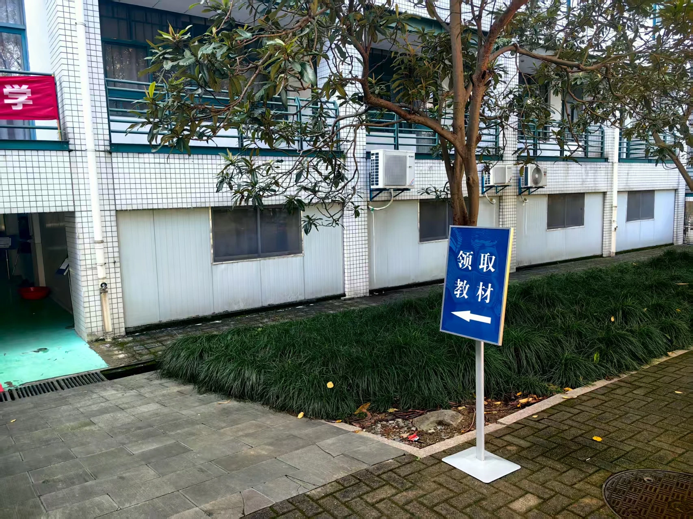
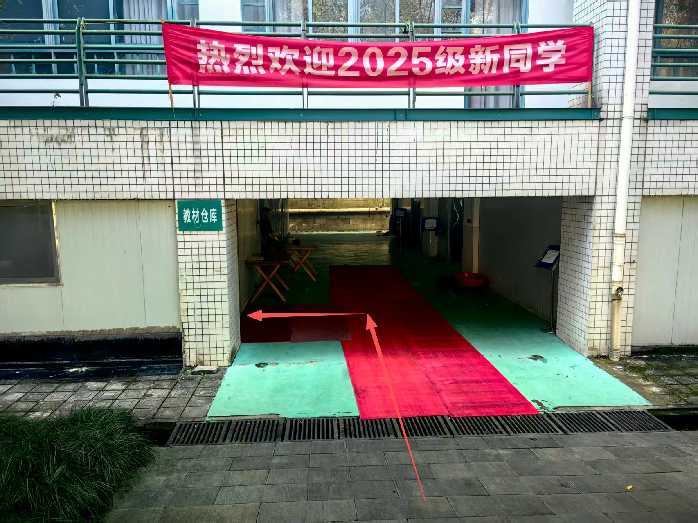

# 教材选购与退订

## 什么时候预订 {#_2}

教材预订时间要看当期通知，新生首学期和之后的学期安排可能不同：

- **新生第一学年秋冬学期：**[2026级新生选课通知](https://zdbk.zju.edu.cn/jwglxt/xtgl/xwck_ckLoginNews.html?xwbh=569D011381027E3FE06329B3CA0A448F)规定，教材在第一轮选课期间预订，课程经筛选选中后，预订信息才有效；后续几轮不再安排预订。
- **之后的学期：**不要直接沿用新生首学期的时间。例如，[2026-2027学年秋冬教材预订通知](http://zhfw.zju.edu.cn/2026/0612/c4903a3177755/page.psp)将教材预订安排在第二轮选课结果确定后，单独开放一次，时间为2026年6月16日9时至6月29日24时。

同一门课的不同教学班可能使用不同教材，预订或自行买书前，要核对自己所选教学班要求的书名和版本。选课与教学班查询可参看[选课](course-selection.md)。

## 怎样预订和领书 {#_3}

登录[本科教学管理信息服务平台](https://zdbk.zju.edu.cn)，在导航栏“功能列表”中选择“选课管理 → 教材预订”。页面会列出已选课程，核对后点击对应课程的“预订”按钮。操作入口及下述折扣见[2026-2027学年秋冬教材预订通知](http://zhfw.zju.edu.cn/2026/0612/c4903a3177755/page.psp)。

学校统一预订教材为**定价的7.8折（即定价的78%），“两课”教材及讲义除外**；具体折扣和例外范围以当期科教中心通知为准。

预订教材一般在开学时以行政班为单位集中领取，再分发给同学，留意当期领书通知和班级安排。

错过预订、有补买或退换问题时，可联系科教服务中心：**0571-88206075**。[后勤集团教材服务说明](https://zulg.zju.edu.cn/guide/textbook.htm)所列的紫金港教材服务部位于**东四B二楼文化长廊最南端**；现场退书可按下方的[退教材路线](#textbook-returns)前往东四北侧的办公室。

## 教材退订 {#textbook-returns}

**当学期预订的教材可在学期内到现场办理退订；往学期预订的教材不在这一办理范围内。** 2026-2027学年秋冬学期仍按以下路线办理。

带上要退的教材，到**东四北侧“教材仓库”入口**，进入后左转至办公室，向值班老师说明来意即可。

??? note "查看退教材路线与入口"

    

    **1. 到东四北侧**

    沿图中的红色箭头前往东四北侧。点击图片可以查看原图。

    [{ loading=lazy }](assets/textbook-return-route.png)

    **2. 找到“领取教材”指示牌旁的入口**

    到达图中位置后，按蓝色“领取教材”指示牌的方向，找到左侧通道。

    [{ loading=lazy }](assets/textbook-return-entrance.jpg)

    **3. 进入通道，左转到办公室**

    入口上方有绿色“教材仓库”标牌，沿红色箭头进入通道，再向左进入办公室，向值班老师说明要退教材。

    [{ loading=lazy }](assets/textbook-return-office.png)

    

!!! info "退书前确认"

    上述为现场办理经验。[本学期第三轮选课通知](https://zdbk.zju.edu.cn/jwglxt/xtgl/xwck_ckLoginNews.html?xwbh=5ADD2E8131280957E06329B3CA0AAA5B)写明上学期末已订教材不再予以退订，[后勤集团教材服务说明](https://zulg.zju.edu.cn/guide/textbook.htm)也写明确认订购的教材原则上不予退换。**已经写字、拆封或有破损的教材能否退回，需另行确认**，可先拨打 **0571-88206075** 咨询。

## 新书还是二手书 {#_4}

如果没有购买新书的强烈意愿，可以先考虑二手教材。先向上过这门课的同学了解教材实际用得多不多、当前教学班是否更换了版本，再决定购买哪些书。

可以礼貌询问学长学姐是否愿意赠送或低价转让，也可以在CC98、朵朵校友圈寻找。收书时核对书名、作者、版次和完整程度，避免只看书名就买错版本。

按以往买卖二手书的经验，**蓝田书店收购旧书的价格较低，出售价格相对较高**。因此，无论买书还是出书，都更建议先尝试同学之间直接转让，再比较书店报价。

## 《时事大学生报告》的领退经验 {#_5 data-toc-label="《时事大学生报告》"}

《形势与政策Ⅰ》使用的《时事大学生报告》，即使没有在系统中预订，也会默认发放，**每学期一本、每本20元**。按实际办理经验，开学后可以到教材办退掉。

从以往使用经验看，这本书在课程学习中用得不多。如果本教学班没有使用要求、自己也不准备留用，可以在开学后办理退书，并核对教材费用是否相应调整。办理地点可参看上面的[退教材路线](#textbook-returns)。
