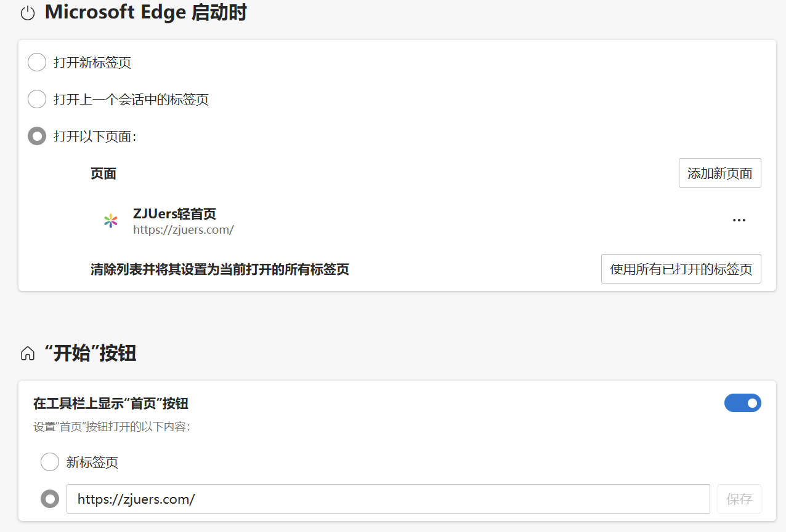

# 常用工具与网站

这里整理了查找校园网站、查看教师评分，以及管理课表和待办时可以用到的工具。按自己的需要选择即可。

本页仍在建设中，目前只收录了部分常用工具与网站，后续会继续补充。

## ZJUers 轻首页 {#zjuers}

[ZJUers 轻首页](https://zjuers.com/)汇集了学在浙大、教务网、智云课堂、图书馆、邮箱等常用入口，可以收藏，也可以设为浏览器启动时打开的页面。

在电脑浏览器中，可以分别设置启动页面和主页按钮：

=== "Edge"

    1. 点击右上角“⋯ → 设置 → 开始、主页和新建标签页”。
    2. 在“Microsoft Edge 启动时”选择“打开以下页面”，添加 `https://zjuers.com/`。
    3. 若希望点击工具栏的主页按钮时也打开轻首页，开启“显示主页按钮”，将网址设为 `https://zjuers.com/`。

    主页按钮的设置可参考[微软说明](https://support.microsoft.com/zh-cn/microsoft-edge/更改浏览器主页-a531e1b8-ed54-d057-0262-cc5983a065c6)。

    ??? example "Edge 设置示例"

        

        不同版本的界面可能略有差异。点击图片可查看原图。

=== "Chrome"

    1. 点击右上角“⋮ → 设置”。
    2. 在“启动时”选择“打开特定网页或一组网页”，点击“添加新网页”，输入 `https://zjuers.com/`。
    3. 若希望点击工具栏的主页按钮时也打开轻首页，在“外观”中开启“显示主页按钮”，选择自定义网址并输入 `https://zjuers.com/`。

    具体设置可参考 [Chrome 帮助](https://support.google.com/chrome/answer/95314?co=GENIE.Platform%3DDesktop&hl=zh-Hans)。

想把网站作为独立应用打开，或调整轻首页的内容，可以继续看这些 CC98 帖子：

- [做了个 ZJUers 轻首页，希望大家喜欢](https://www.cc98.org/topic/4947729)
- [在电脑上“安装”ZJU 轻首页、学在浙大等](https://www.cc98.org/topic/5597095)
- [ZJUers 轻首页的自定义版本](https://www.cc98.org/topic/5780242)

## Lazuli 与查老师 {#teacher-ratings}

查老师提供教师评分与文字评价；Lazuli 是教务系统增强插件，可以把查老师的评分显示在选课页面中。

### Lazuli {#lazuli}

按自己使用的电脑浏览器选择安装入口：

- **Edge：**[Microsoft Edge 扩展商店](https://microsoftedge.microsoft.com/addons/detail/lazuli/cibapackfcllpcpcaljibcmocljaadog)。
- **Chrome：**[Chrome 应用商店](https://chromewebstore.google.com/detail/lazuli/gpiacjfgnabenbpincmnbinfmbihloed)。

按商店页面提示安装并启用插件，再打开或刷新教务系统选课页面。

页面会在教师旁显示对应评分。同一教学班有多位教师时，要分别对应各自的分数。用 Agent 规划课表时，可以直接读取页面已经显示的评分；用对话式 AI 时，可以随选课页面截图或复制文本一起提取。具体流程见[用 AI 辅助规划课表](course-selection.md#ai)。

插件还提供查老师数据同步、选课难度分析和页面自动下拉等功能。安装与使用说明见 [CC98 原帖](https://www.cc98.org/topic/5821806)及[项目仓库](https://github.com/ADSR1042/Lazuli)。

### 查老师（chalaoshi） {#chalaoshi}

在[查老师网站](https://chalaoshi.de/)搜索教师姓名，可以查看评分和文字评价。除了总分，也可以看看同学提到的具体课程、作业和考核情况。

评价来自同学的主观体验，参考时留意评价时间及内容。网站地址和访问情况可能变化，打不开时可查看[项目维护页公布的地址](https://github.com/zjuchalaoshi/chalaoshi)。也可以在 CC98 搜索“查老师”或“Lazuli”了解相关讨论。

## Celechron {#celechron}

[Celechron](https://celechron.top/)是面向浙大学生的时间管理工具，提供课表查看、日程与待办管理、DDL 提醒及成绩查询等功能。

- **Android：**从[项目首页](https://celechron.top/)选择“下载 Android 版”。
- **iOS：**在 [App Store](https://apps.apple.com/cn/app/celechron/id6477194529) 安装。
- **使用说明与讨论：**[CC98 介绍帖](https://www.cc98.org/topic/5807824)、[项目仓库](https://github.com/Celechron/Celechron)。

## 求是潮手机站 {#qsc-mobile}

[求是潮手机站](https://www.qsc.zju.edu.cn/mobile)可以查看课表、设置个性化待办和日程、接收考试提醒，以及查看成绩与绩点。

用手机浏览器打开[下载页面](https://www.qsc.zju.edu.cn/mobile)，选择 Android APK 或 iOS App Store 入口，按提示安装。

课表和考试安排仍以教务系统为准。选课筛选期间，手机站可能暂时无法显示课表，可以等筛选结束后再刷新；具体问题可查看下载页的常见问题说明。
